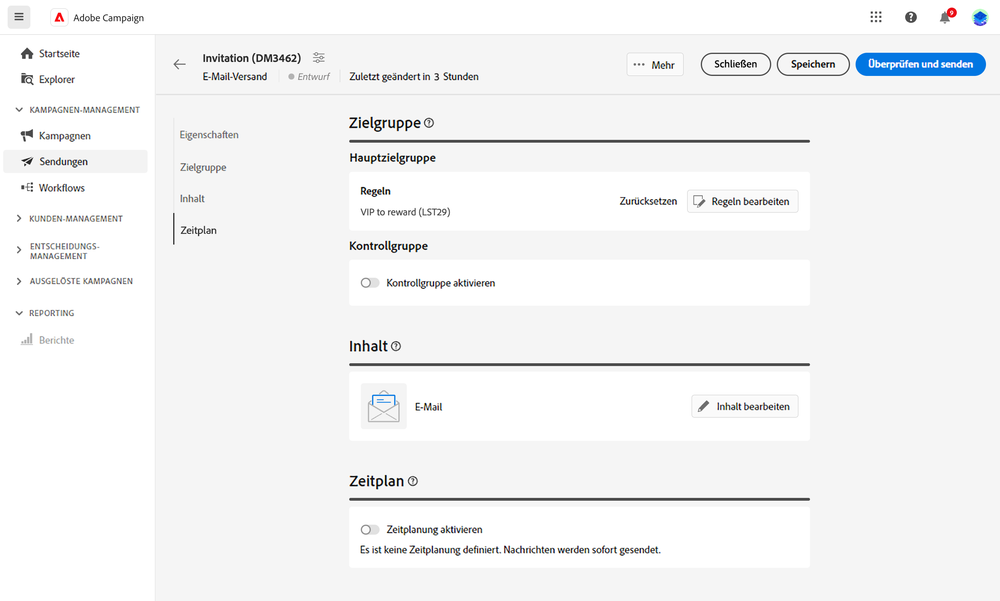

# Erste Schritte mit Zielgruppen {#about-audiences}

<!--
Audience only created for the delivery, not available later-->

<!--
Three ways:
* existing audience

Campaign or AEP Audiences

* create new on the fly

query like AEP segment builder (same component with campaign data)

* import from file

show use case with a new audience creation (or import from file?)

control groups like acc: exract, random, based on attribute
-->

Die Zielgruppe ist das wichtigste Ziel Ihres Versands: die Empfängerinnen und Empfänger, die die Nachrichten erhalten. Der Zielgruppentyp hängt vom in der Versandvorlage definierten Zielgruppen-Mapping ab. [In diesem Abschnitt](../msg/delivery-template.md) erfahren Sie, was eine Versandvorlage ist.

Zur Definition der Zielgruppenpopulation haben Sie folgende Möglichkeiten:

* Erstellen und kombinieren Sie Zielgruppen. [Weitere Informationen](create-audience.md)
* Wählen Sie eine vorhandene Zielgruppe aus, die als Liste in der Client-Konsole erstellt wurde. [Weitere Informationen](add-audience.md)
* Wählen Sie eine Adobe Experience Platform-Zielgruppe aus. [Weitere Informationen](aep-audience.md)
* Erstellen Sie mit dem Regel-Builder eine neue Zielgruppe, indem Sie Filterkriterien definieren und kombinieren. [Weitere Informationen](segment-builder.md)
* Verwenden Sie eine Zielgruppe aus einer externen Datei: Diese Option steht nur für eigenständige E-Mail-Sendungen zur Verfügung und kann nicht in Kampagnensendungen verwendet werden. [Weitere Informationen](file-audience.md)

Beim Versand von Nachrichten im Rahmen eines Kampagnen-Workflows wird die Zielgruppe in der bestimmten Workflow-Aktivität **Zielgruppe lesen** definiert. In diesem Zusammenhang ist es nicht möglich, eine Zielgruppe aus einer Datei für einen E-Mail-Versand zu laden. Die Zielgruppe wird nur in dieser dedizierten Aktivität definiert. [In diesem Abschnitt](../workflows/orchestrate-activities.md) erfahren Sie, wie Sie die Zielgruppe Ihres Versands in einem Kampagnen-Workflow definieren.

Darüber hinaus können Sie Kontrollgruppen definieren, um einen Teil Ihrer Audience vom Versand von Nachrichten auszuschließen und so die Wirkung Ihrer Kampagnen zu messen. [Weitere Informationen](control-group.md)

