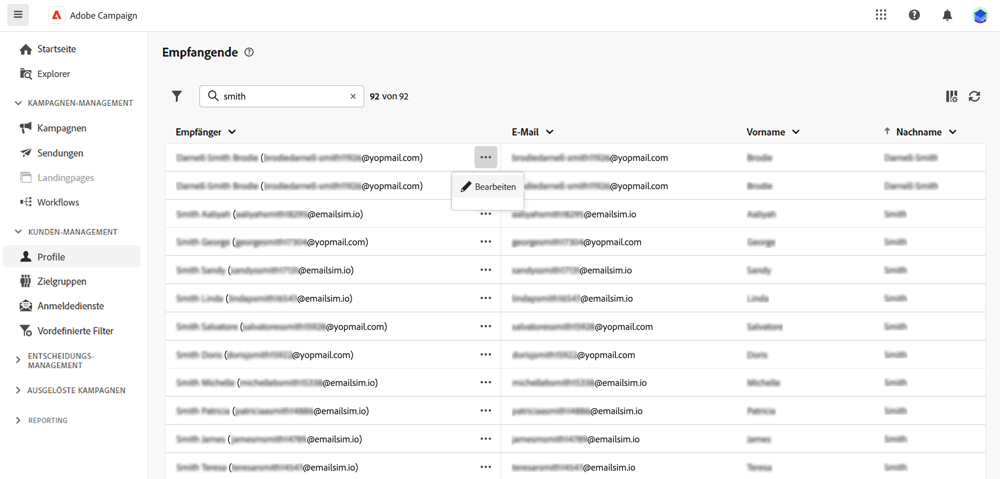
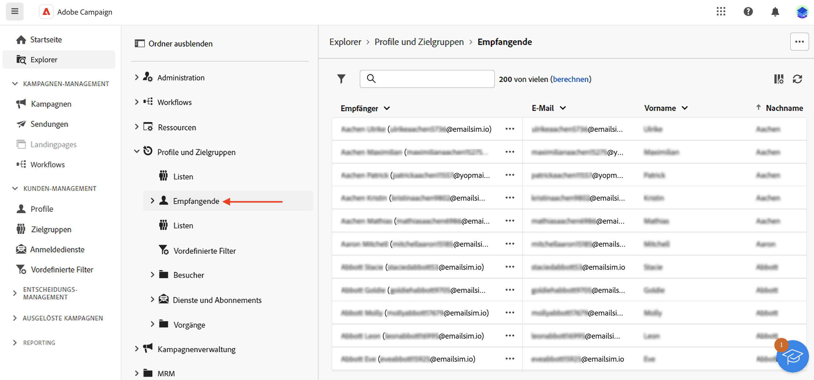

# Arbeiten mit Empfängern und Zielgruppen {#about-recipients}

In Adobe Campaign ist die Zielpopulation eines Versands eine Zielgruppe. Eine Zielgruppe aus Personen, die ähnliche Verhaltensweisen und/oder Merkmale aufweisen. Diese Personengruppe kann entweder generiert, ausgewählt oder geladen werden [wie unten beschrieben](#audiences). In den meisten Fällen besteht die Audience aus Profilen, die als [Empfänger](#recipients) in Adobe Campaign. Sie können auch mit anderen Zielgruppen-Mappings arbeiten, indem Sie die Dimension wie beschrieben ändern [in diesem Abschnitt](#targeting-dimensions).

## Was sind Empfänger? {#recipients}

>[!CONTEXTUALHELP]
>id="acw_recipients_list"
>title="Empfänger"
>abstract="Ein Empfänger ist ein Profil, das für den Empfang von Nachrichten bestimmt ist, die von Adobe Campaign gesendet werden. In Adobe Campaign sind Empfänger die Standardprofile für den Versand von Nachrichten (E-Mails, SMS). In dieser Liste können Sie das Empfängerprofil anhand Ihrer Berechtigungen anzeigen. Verwenden Sie die Filteroptionen, um diese Liste zu durchsuchen. Sie können eine kleine Gruppe von Empfängerattributen bearbeiten und aktualisieren."

Ein Empfänger ist ein Profil, das für den Empfang von Nachrichten bestimmt ist, die von Adobe Campaign gesendet werden. In Adobe Campaign sind die Standardprofile für Sendungen (E-Mails, SMS usw.) die Empfänger. Die in der Datenbank gespeicherten Empfängerdaten ermöglichen die Erstellung von Audiences, die einen bestimmten Versand erhalten, sowie das Hinzufügen von Personalisierungsdaten zu den Versandinhalten. Andere Typen von Profilen werden in der Datenbank gespeichert. Sie sind für unterschiedliche Verwendungszwecke konzipiert: Beispielsweise werden Testprofile erstellt, um Ihre Sendungen zu testen, bevor sie an die endgültige Audience gesendet werden.

Empfänger können nur über die Campaign-Clientkonsole hinzugefügt werden. Sie sind jedoch im Campaign-Web über die **Empfänger** Eintrag der linken Navigationsleiste. Sie können die Attribute des Empfängers auch von diesem Bildschirm aus bearbeiten.

Um die Empfängerdaten zu bearbeiten, klicken Sie auf die drei Punkte neben ihrem Namen und wählen Sie **Bearbeiten...**.

Sie können eine begrenzte Anzahl von Attributen aktualisieren, nämlich: Vorname, Nachname, E-Mail-Adresse und Telefonnummer.

>[!NOTE]
>
>Dieses eingeschränkte Formular zur Profilbearbeitung wird nur für Beta-Programmtests bereitgestellt. Sie wird in der zukünftigen Version verbessert. Dadurch kann der Benutzer jedem Profil schnell eine E-Mail-Adresse und eine Telefonnummer hinzufügen, damit er die E-Mail- und SMS-Kanäle testen und die gesendeten Nachrichten empfangen kann.

Sie können die Empfänger mithilfe des Suchfelds über das **Filter anzeigen** Schaltfläche.

Empfänger können auch über die **Explorer** Anzeigen, Durchsuchen und Erstellen von Ordnern und Unterordnern sowie Überprüfen der zugehörigen Berechtigungen.

>[!NOTE]
>
>Abhängig von Ihren Berechtigungen haben Sie möglicherweise keinen Zugriff auf die vollständige Liste der in der Datenbank gespeicherten Empfänger. Weiterführende Informationen zu Berechtigungen finden Sie in [diesem Abschnitt](../get-started/permissions.md).

Darüber hinaus können Sie die An- und Abmeldung Ihrer Empfänger für Dienste wie Newsletter verwalten. [Erfahren Sie, wie Sie mit Abonnementdiensten arbeiten können.](manage-services.md)

Sie können Workflows erstellen, um Profile zu deduplizieren, anzureichern, zu kombinieren und Audiences zu erstellen. Weiterführende Informationen finden Sie in [diesem Abschnitt](../workflows/gs-workflows.md).

## Was sind Zielgruppen? {#audiences}

Die Zielgruppe ist das wichtigste Ziel Ihres Versands: die Empfängerinnen und Empfänger, die die Nachrichten erhalten. Der Zielgruppentyp hängt vom in der Versandvorlage definierten Zielgruppen-Mapping ab. [Versandvorlage erfahren](../msg/delivery-template.md).

Zur Bestimmung der Audience-Population haben Sie folgende Möglichkeiten:

* [Neue Zielgruppen erstellen](create-audience.md) aus dem **[!UICONTROL Zielgruppen]** Menü,
* [Existierende Zielgruppe auswählen](add-audience.md) als Liste in der Clientkonsole erstellt wurde,
* [Wählen Sie eine Adobe Experience Platform-Zielgruppe aus](aep-audience.md),
* [Erstellen Sie mit dem Regel-Builder eine neue Zielgruppe, indem Sie Filterkriterien definieren und kombinieren,](segment-builder.md)
* [Verwenden einer Audience aus einer externen Datei](file-audience.md). Diese Option ist nur für Einzelsendungen von E-Mails verfügbar und kann nicht in Kampagnensendungen verwendet werden.

Beim Targeting einer Audience können Sie auch **Kontrollgruppen** um zu vermeiden, dass Nachrichten an einen Teil Ihrer Audience gesendet werden, und messen Sie die Wirkung Ihrer Kampagnen. [Erfahren Sie, wie Sie eine Kontrollgruppe festlegen.](control-group.md)

>[!NOTE]
>
>Beim Versand von Nachrichten im Rahmen eines Kampagnen-Workflows wird die Audience in einem bestimmten **Audience erstellen** Workflow-Aktivität. In diesem Zusammenhang ist es nicht möglich, eine Zielgruppe aus einer Datei für einen E-Mail-Versand zu laden. Die Zielgruppe wird nur in dieser dedizierten Aktivität definiert. [In diesem Abschnitt](../workflows/activities/build-audience.md) erfahren Sie, wie Sie die Zielgruppe Ihres Versands in einem Kampagnen-Workflow definieren

## Zielgruppendimensionen {#targeting-dimensions}

Die Zielgruppendimension, auch bekannt als Zielgruppen-Mapping ist der Datentyp, den ein Vorgang verarbeitet. Sie ermöglicht die Bestimmung der Zielpopulation: Empfänger, Vertragsempfänger, Benutzer, Abonnenten etc.

Die Zielgruppendimension eines Workflows wird durch die erste **[!UICONTROL Audience erstellen]** und wird bis zum Ende des Workflows für alle weiteren Aktivitäten verwendet. Wenn Sie beispielsweise eine Abfrage an die aus der Datenbank stammenden Empfänger durchführen, enthält die ausgehende Transition Daten vom Typ Empfänger und wird an die nächste Aktivität übermittelt.

Beachten Sie, dass Sie die Zielgruppendimension in einem Workflow mithilfe einer **[!UICONTROL Dimensionsänderung]** -Aktivität. [Weitere Informationen](../workflows/activities/change-dimension.md). Auf diese Weise können Sie beispielsweise die Datenbank in einer bestimmten Tabelle (z. B. bei Käufen oder Abonnements) abfragen und die Zielgruppendimension in Empfänger ändern, um Sendungen an die entsprechenden Empfänger durchzuführen.

Standardmäßig haben die E-Mail- und SMS-Versandvorlagen **[!UICONTROL Empfänger]** als Zielgruppe. Ihre Zieldimension verwendet daher die Felder der **nms:recipient** Tabelle. Für Push-Benachrichtigungen lautet die standardmäßige Zieldimension **Abonnentenanwendungen nms:appSubscriptionRcp**, der mit der Empfängertabelle verknüpft ist.

Sie können auch andere integrierte Zielgruppen-Mappings in Ihren Workflows und Sendungen verwenden, die unten aufgeführt sind:

| Name | Verwendung Verwendungszweck | Schema |
|---|---|---|
| Empfänger | Versand an Empfänger (integrierte Empfängertabelle) | nms:recipient |
| Besucher | Versand an Besucher, deren Profile beispielsweise über Empfehlungen (Viral Marketing) erfasst wurden. | mns:visitor |
| Abonnements  | Versand richtet sich an Abonnenten eines Informationsdienstes wie z. B. einen Newsletter | nms:subscription |
| Besucher-Abonnements | Versand richtet sich an Besucher, die einen Informationsdienst beziehen | nms:visitorSub |
| Benutzer | Versand richtet sich an Adobe-Campaign-Benutzer | nms:operator |
| Externe Datei | Versand basiert auf einer Datei, die alle notwendigen Informationen enthält | Ohne Schema oder Zielgruppe |
| Abonnierte Anwendungen | Versand an Empfänger, die eine Anwendung abonniert haben | nms:appSubscriptionRcp |

Zusätzlich können Sie je nach Bedarf ein neues Zielgruppen-Mapping erstellen. Dies erfolgt über die Clientkonsole. Weitere Informationen finden Sie in der [Dokumentation zu Campaign v8 (Client-Konsole)](https://experienceleague.adobe.com/docs/campaign/campaign-v8/audience/add-profiles/target-mappings.html#new-mapping){target="_blank"}.
