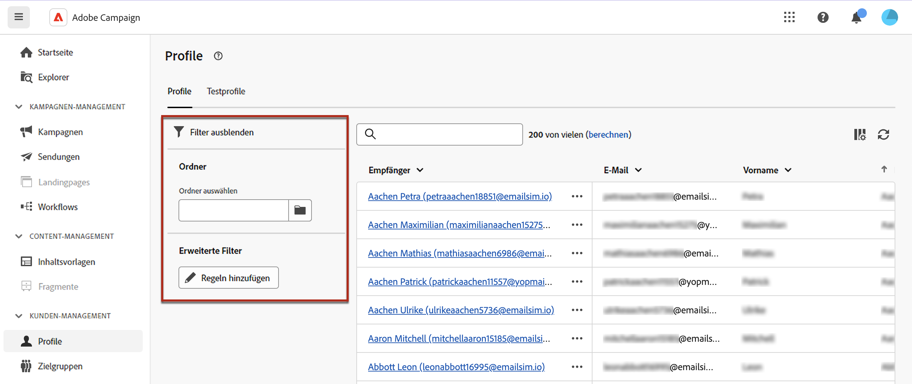

# Erste Schritte mit Profilen {#profiles}

>[!CONTEXTUALHELP]
>id="acw_homepage_welcome_rn4"
>title="360-Grad-Ansicht Ihrer Profile"
>abstract="Erstellen Sie neue Profile und überwachen Sie sie mithilfe leistungsstarker Berichte und Tools. Greifen Sie auf die Attribute, Interaktionen und Protokolle Ihrer Profile zu. Verwenden Sie die Filteroptionen, um die Profilliste zu durchsuchen und ihr Profil zu bearbeiten und zu aktualisieren."
>additional-url="https://experienceleague.adobe.com/docs/campaign-web/v8/whats-new.html?lang=de" text="Siehe Versionshinweise"

<!--TO REMOVE BELOW-->
>[!CONTEXTUALHELP]
>id="acw_homepage_rn4"
>title="360-Grad-Ansicht Ihrer Profile"
>abstract="Erstellen Sie neue Profile und überwachen Sie sie mithilfe leistungsstarker Berichte und Tools. Greifen Sie auf die Attribute, Interaktionen und Protokolle Ihrer Profile zu. Verwenden Sie die Filteroptionen, um die Profilliste zu durchsuchen und ihr Profil zu bearbeiten und zu aktualisieren."
>additional-url="https://experienceleague.adobe.com/docs/campaign-web/v8/whats-new.html?lang=de" text="Siehe Versionshinweise"

<!--TO REMOVE ABOVE-->

>[!CONTEXTUALHELP]
>id="acw_recipients_list"
>title="Profile"
>abstract="Ein Profil ist ein Kontakt, der gezielt Nachrichten von Adobe Campaign erhält. In dieser Liste können die Details der Profile anhand der Berechtigungen angezeigt werden. Verwenden Sie die Filteroptionen, um diese Liste zu durchsuchen. Eine kleine Gruppe von Profilattributen kann bearbeitet und aktualisiert werden."

## Was ist ein Profil? {#what}

Ein Profil in Adobe Campaign Web ist eine in der Datenbank gespeicherte Person, die als Schlüsselkomponente zum [Erstellen von Zielgruppen](create-audience.md) für Sendungen und zum [Hinzufügen von Personalisierungsdaten](../personalization/personalize.md) zu Ihren Inhalten dient.

Mit Adobe Campaign können Sie Ihre Profile direkt über die Benutzeroberfläche erstellen und überwachen. Dort können Sie Profile erstellen, auf eine detaillierte Ansicht Ihrer Profile zugreifen und sie bearbeiten.

Es werden auch andere Profiltypen in der Datenbank gespeichert, z. B. **[!UICONTROL Testprofile]**, mit denen Sie Ihre Sendungen testen können, bevor sie an die endgültige Zielgruppe gesendet werden. [Erfahren Sie, wie Sie mit Testprofilen arbeiten.](test-profiles.md)

## Auf die Profilliste zugreifen {#access}

Die Profile können im Adobe Campaign Web über die **[!UICONTROL Kundenverwaltung]** > **Profile** in der linken Navigationsleiste.

Sie können auch über die **[!UICONTROL Explorer]** Ansicht aus der **[!UICONTROL Profile und Zielgruppen]** > **[!UICONTROL Empfänger]** Knoten. Dort können Sie Ordner oder Unterordner durchsuchen, erstellen und verwalten sowie die zugehörigen Berechtigungen überprüfen. [Erfahren Sie, wie Sie Ordner erstellen](../get-started/permissions.md#folders)

>[!NOTE]
>
>Je nach Ihren Berechtigungen haben Sie möglicherweise keinen Zugriff auf die vollständige Liste der in der Datenbank gespeicherten Profile. [Erfahren Sie mehr über Berechtigungen](../get-started/permissions.md).

Sie können die Liste der **[!UICONTROL Profile]** mit dem Suchfeld oder den unter **Filter anzeigen** verfügbaren Filtern durchsuchen. Sie können die Ergebnisse über die Dropdown-Liste auf einen bestimmten [Ordner](../get-started/permissions.md#folders) beschränken oder mithilfe des [Abfrage-Modelers](../query/query-modeler-overview.md) Regeln hinzufügen.

Um auf die Details eines Profils zuzugreifen, klicken Sie in der Liste auf dessen Namen. Eine detaillierte Ansicht des Profils wird geöffnet, in der Sie seine Attribute und die Dienste, die er abonniert hat, einsehen können. [Erfahren Sie, wie Sie die Profildetails durchsuchen können.](create-profile.md)

Um ein Profil zu löschen, wählen Sie die entsprechende Option im Menü **[!UICONTROL Mehr Aktionen]**.
