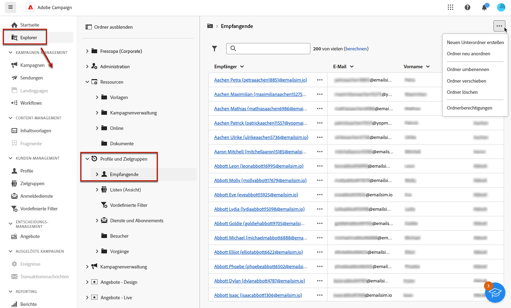
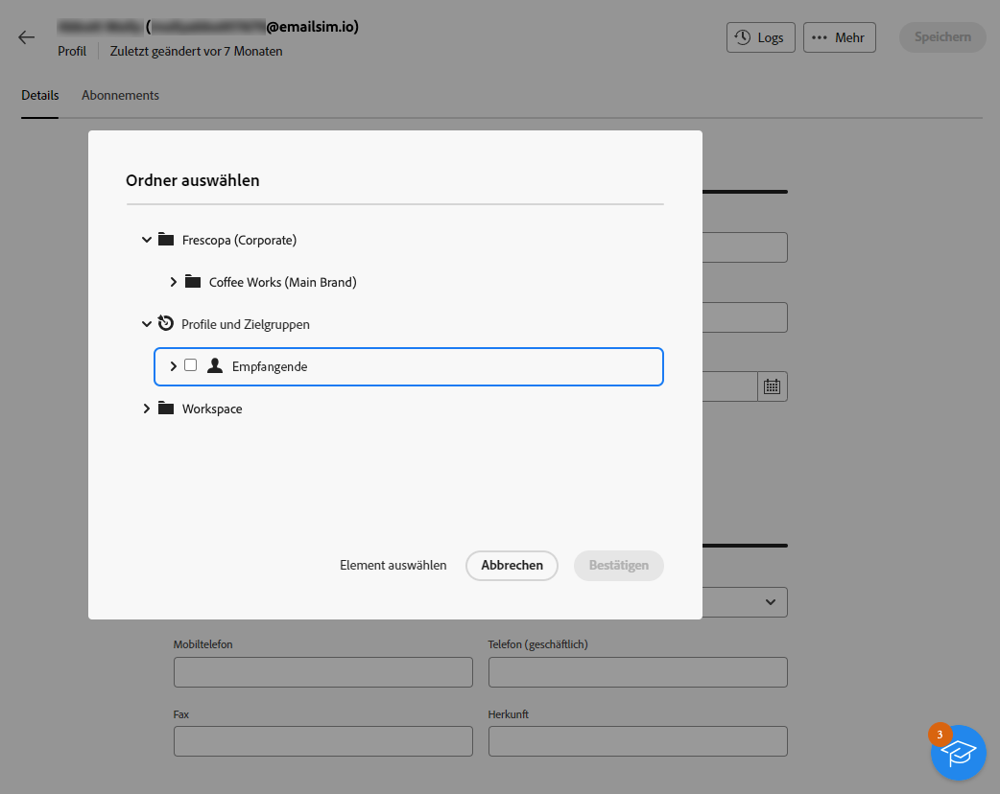
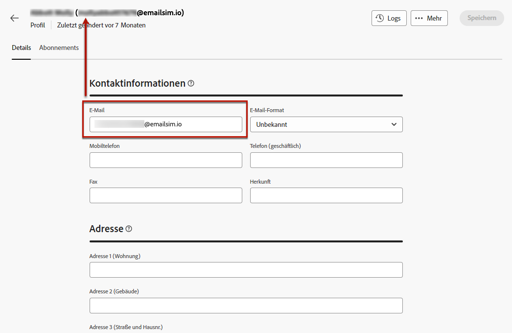

# Profile überwachen und bearbeiten {#profiles}

>[!CONTEXTUALHELP]
>id="acw_homepage_rn4"
>title="360-Grad-Ansicht Ihrer Profile"
>abstract="Erstellen Sie neue Profile und überwachen Sie sie mithilfe leistungsstarker Berichte und Tools. Greifen Sie auf die Attribute, Interaktionen und Protokolle Ihrer Profile zu. Verwenden Sie die Filteroptionen, um die Profilliste zu durchsuchen, ihr Profil zu bearbeiten und zu aktualisieren."
>additional-url="https://experienceleague.adobe.com/docs/campaign-web/v8/whats-new.html" text="Siehe Versionshinweise"

>[!CONTEXTUALHELP]
>id="acw_recipients_list"
>title="Profile"
>abstract="Ein Profil ist ein Kontakt, der mit den von Adobe Campaign gesendeten Nachrichten angesprochen wird. In dieser Liste können Sie die Details der Profile anhand Ihrer Berechtigungen anzeigen. Die Filteroptionen verwenden, um diese Liste zu durchsuchen. Sie können eine kleine Gruppe von Profilattributen bearbeiten und aktualisieren."

## Erste Schritte mit Profilen {#gs}

Ein Profil im Adobe Campaign Web ist eine in der Datenbank gespeicherte Person, die als Schlüsselkomponente dient, um Zielgruppen für Sendungen zu erstellen und Ihrem Inhalt Personalisierungsdaten hinzuzufügen.

Andere Profiltypen werden in der Datenbank gespeichert, z. B. **[!UICONTROL Testprofile]**, mit denen Ihre Sendungen getestet werden können, bevor sie an die endgültige Audience gesendet werden. [Erfahren Sie, wie Sie mit Testprofilen arbeiten.](test-profiles.md)

Profile können nur über die Adobe Campaign-Clientkonsole erstellt werden - [lernen](https://experienceleague.adobe.com/docs/campaign/campaign-v8/audience/add-profiles/create-profiles.html){target="_blank"}. Sie können jedoch über die **[!UICONTROL Kundenverwaltung]** > **Profile** in der linken Navigationsleiste.

>[!NOTE]
>
>Abhängig von Ihren Berechtigungen haben Sie möglicherweise keinen Zugriff auf die vollständige Liste der in der Datenbank gespeicherten Profile. Weiterführende Informationen zu Berechtigungen finden Sie in [diesem Abschnitt](../get-started/permissions.md).

* Sie können **[!UICONTROL Profile]** Liste mit dem Suchfeld oder den in der **Filter anzeigen** Schaltfläche. Sie können die Ergebnisse auf einen bestimmten [Ordner](../get-started/permissions.md#folders) über die Dropdown-Liste oder fügen Sie mithilfe der [Abfragemodellierung](../query/query-modeler-overview.md).

  

* Um ein Profil zu löschen, wählen Sie die entsprechende Option aus dem **[!UICONTROL Mehr Aktionen]** Menü.

* Um ein Profil zu bearbeiten, klicken Sie in der Liste auf das gewünschte Element. [Weitere Informationen](#access)

Der Zugriff auf Profile erfolgt auch über die **[!UICONTROL Explorer]** Ansicht aus der **[!UICONTROL Profile und Zielgruppen]** > **[!UICONTROL Empfänger]** Knoten.

Dort können Sie Ordner oder Unterordner durchsuchen, erstellen und verwalten sowie die zugehörigen Berechtigungen überprüfen. [Erfahren Sie, wie Sie Ordner erstellen](../get-started/permissions.md#folders)

Aus dem **[!UICONTROL Explorer]** Sie können auch filtern, löschen und [edit](#access) Profile.

## Profilattribute aufrufen und bearbeiten {#access}

>[!CONTEXTUALHELP]
>id="acw_recipients_creation_details"
>title="Grundlegende Details"
>abstract="Dieser Abschnitt bietet Einblicke in die grundlegenden Details des Profils. Um Informationen zu ändern, nehmen Sie die gewünschten Änderungen direkt im entsprechenden Feld vor und klicken Sie auf **Speichern** -Schaltfläche in der oberen rechten Ecke des Bildschirms."

>[!CONTEXTUALHELP]
>id="acw_recipients_creation_contactinformation"
>title="Kontaktinformationen"
>abstract="Dieser Abschnitt bietet Einblicke in die Kontaktinformationen des Profils. Um Informationen zu ändern, nehmen Sie die gewünschten Änderungen direkt im entsprechenden Feld vor und klicken Sie auf **Speichern** -Schaltfläche in der oberen rechten Ecke des Bildschirms."

>[!CONTEXTUALHELP]
>id="acw_recipients_creation_address"
>title="Adresse"
>abstract="Dieser Abschnitt bietet Einblicke in die Postanschrift des Profils und die Adressenqualität. Um Informationen zu ändern, nehmen Sie die gewünschten Änderungen direkt im entsprechenden Feld vor und klicken Sie auf **Speichern** -Schaltfläche in der oberen rechten Ecke des Bildschirms."

>[!CONTEXTUALHELP]
>id="acw_recipients_creation_account"
>title="Kontodetails"
>abstract="Dieser Abschnitt bietet Einblicke in die Kontodetails des Profils. Um Informationen zu ändern, nehmen Sie die gewünschten Änderungen direkt im entsprechenden Feld vor und klicken Sie auf **Speichern** -Schaltfläche in der oberen rechten Ecke des Bildschirms."

>[!CONTEXTUALHELP]
>id="acw_recipients_creation_nolongercontact"
>title="Empfänger – Nicht mehr kontaktieren"
>abstract="Dieser Abschnitt bietet Einblicke in die Kontakteinstellungen des Profils. Um Informationen zu ändern, nehmen Sie die gewünschten Änderungen direkt im entsprechenden Feld vor und klicken Sie auf **Speichern** -Schaltfläche in der oberen rechten Ecke des Bildschirms."

>[!CONTEXTUALHELP]
>id="acw_recipients_creation_customfields"
>title="Benutzerdefinierte Felder"
>abstract="Benutzerdefinierte Felder sind spezifische Attribute, die auf Ihre Anforderungen zugeschnitten sind und für Ihre Instanz konfiguriert wurden. Um Informationen zu ändern, nehmen Sie die gewünschten Änderungen direkt im entsprechenden Feld vor und klicken Sie auf **Speichern** -Schaltfläche in der oberen rechten Ecke des Bildschirms."

>[!CONTEXTUALHELP]
>id="acw_recipients_creation_othersfields"
>title="Sonstige"
>abstract="Dieser Abschnitt enthält zusätzliche integrierte Attribute. Um Informationen zu ändern, nehmen Sie die gewünschten Änderungen direkt im entsprechenden Feld vor und klicken Sie auf **Speichern** -Schaltfläche in der oberen rechten Ecke des Bildschirms."

>[!CONTEXTUALHELP]
>id="acw_recipients_subscription_list"
>title="Emfänger – Abonnementliste"
>abstract="Auf diesem Tab werden alle Dienste aufgelistet, für die das Profil angemeldet ist."

Gehen Sie wie folgt vor, um auf die Details eines Profils zuzugreifen und sie zu bearbeiten.

1. Navigieren Sie zu **[!UICONTROL Kundenverwaltung]** > **[!UICONTROL Profile]**.

1. Klicken Sie auf das gewünschte Element aus der **[!UICONTROL Profile]** Liste. Die detaillierten Informationen zum Profil werden angezeigt.

   

1. Die **[!UICONTROL Details]** -Registerkarte können Sie die integrierten und benutzerdefinierten Attribute des Profils durchsuchen. Um ein Attribut zu bearbeiten, nehmen Sie Änderungen im gewünschten Feld vor und klicken Sie auf die Schaltfläche **[!UICONTROL Speichern]** Schaltfläche.

   1. Standardmäßig werden Profile im **[!UICONTROL Empfänger]** Ordner. Sie können sie ändern, indem Sie zur gewünschten Position navigieren. [Informationen zum Arbeiten mit Ordnern](../get-started/permissions.md#folders)

      

   1. Im **[!UICONTROL Kontaktangaben]** können Sie die E-Mail-Adresse und andere relevante Daten aktualisieren. Die E-Mail-Adresse wird in Klammern hinter dem Profiltitel angezeigt.

      

   1. Überprüfen Sie die **[!UICONTROL No longer contact]** und aktualisieren Sie sie bei Bedarf. Wenn eine dieser Optionen ausgewählt ist, befindet sich das Profil auf der Blockierungsliste. Diese Informationen werden den Kontaktdaten hinzugefügt, wenn der Empfänger beispielsweise auf einen Abmelde-Link in einem Newsletter geklickt hat. Ein solcher Empfänger ist nicht mehr auf die ausgewählten Kanäle ausgerichtet. [Weitere Informationen](https://experienceleague.adobe.com/docs/campaign/campaign-v8/send/failures/quarantines.html){target="_blank"}

      

   1. Wenn **[!UICONTROL Benutzerdefinierte Felder]** können Sie ihre Werte nach Bedarf aktualisieren. Benutzerdefinierte Felder sind zusätzliche Attribute, die zum **[!UICONTROL Profile]** Schema über die Adobe Campaign-Konsole. [Weitere Informationen](https://experienceleague.adobe.com/docs/campaign/campaign-v8/developer/shemas-forms/extend-schema.html){target="_blank"}

      

1. Klicken Sie auf **[!UICONTROL Abonnements]** -Tab, um auf Informationen zu den Diensten zuzugreifen, für die das Profil angemeldet ist. [Erfahren Sie, wie Sie mit Anmeldediensten arbeiten können](manage-services.md)

1. Klicken Sie auf **[!UICONTROL Protokolle]** in der rechten oberen Ecke des Bildschirms, um den Verlauf der Interaktionen des Profils durch Versand-, Ausschluss- und Trackinglogs sowie die dem Profil unterbreiteten Angebote anzuzeigen. [Weitere Informationen zu Versandlogs](../monitor/delivery-logs.md)

   
