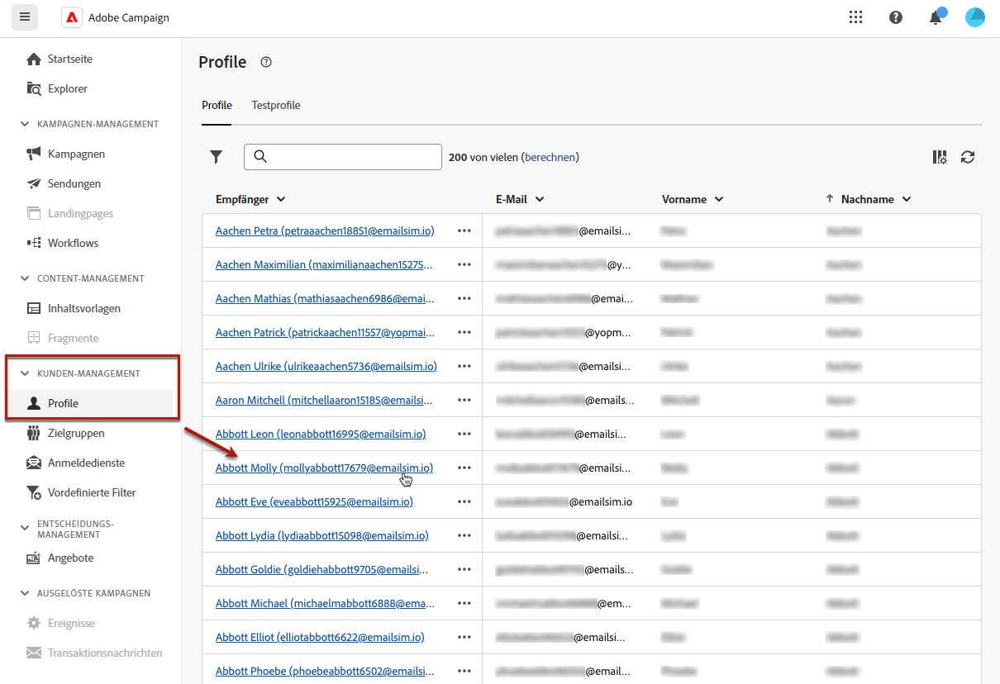

# Profile überwachen und verwalten {#profiles}

>[!CONTEXTUALHELP]
>id="acw_homepage_welcome_rn4"
>title="360-Grad-Ansicht Ihrer Profile"
>abstract="Erstellen Sie neue Profile und überwachen Sie sie mithilfe leistungsstarker Berichte und Tools. Greifen Sie auf die Attribute, Interaktionen und Protokolle Ihrer Profile zu. Verwenden Sie die Filteroptionen, um die Profilliste zu durchsuchen und ihr Profil zu bearbeiten und zu aktualisieren."
>additional-url="https://experienceleague.adobe.com/docs/campaign-web/v8/whats-new.html?lang=de" text="Siehe Versionshinweise"

<!--TO REMOVE BELOW-->
>[!CONTEXTUALHELP]
>id="acw_homepage_rn4"
>title="360-Grad-Ansicht Ihrer Profile"
>abstract="Erstellen Sie neue Profile und überwachen Sie sie mithilfe leistungsstarker Berichte und Tools. Greifen Sie auf die Attribute, Interaktionen und Protokolle Ihrer Profile zu. Verwenden Sie die Filteroptionen, um die Profilliste zu durchsuchen und ihr Profil zu bearbeiten und zu aktualisieren."
>additional-url="https://experienceleague.adobe.com/docs/campaign-web/v8/whats-new.html?lang=de" text="Siehe Versionshinweise"

<!--TO REMOVE ABOVE-->

>[!CONTEXTUALHELP]
>id="acw_recipients_list"
>title="Profile"
>abstract="Ein Profil ist eine Person, die für den Empfang von Nachrichten durch Adobe Campaign ausgewählt wurde. In dieser Liste können Sie je nach Ihren Berechtigungen die Details der Profile anzeigen. Verwenden Sie die Filteroptionen, um diese Liste zu durchsuchen. Sie können eine kleine Gruppe von Profilattributen bearbeiten und aktualisieren."

## Erste Schritte mit Profilen {#gs}

Ein Profil in Adobe Campaign Web ist eine in der Datenbank gespeicherte Person, die als Schlüsselkomponente zum [Erstellen von Zielgruppen](create-audience.md) für Sendungen und zum [Hinzufügen von Personalisierungsdaten](../personalization/personalize.md) zu Ihren Inhalten dient.

Es werden auch andere Profiltypen in der Datenbank gespeichert, z. B. **[!UICONTROL Testprofile]**, mit denen Sie Ihre Sendungen testen können, bevor sie an die endgültige Zielgruppe gesendet werden. [Weitere Informationen](test-profiles.md)

Profile können nur über die Adobe Campaign Client-Konsole erstellt werden – [hier erfahren Sie, wie](https://experienceleague.adobe.com/docs/campaign/campaign-v8/audience/add-profiles/create-profiles.html?lang=de){target="_blank"}. Sie sind jedoch in Adobe Campaign Web über **[!UICONTROL Kunden-Management]** > **Profile** in der linken Navigationsleiste verfügbar und bearbeitbar.

>[!NOTE]
>
>Je nach Ihren Berechtigungen haben Sie möglicherweise keinen Zugriff auf die vollständige Liste der in der Datenbank gespeicherten Profile. [Erfahren Sie mehr über Berechtigungen](../get-started/permissions.md).

* Sie können die Liste der **[!UICONTROL Profile]** mit dem Suchfeld oder den unter **Filter anzeigen** verfügbaren Filtern durchsuchen. Sie können die Ergebnisse über die Dropdown-Liste auf einen bestimmten [Ordner](../get-started/permissions.md#folders) beschränken oder mithilfe des [Abfrage-Modelers](../query/query-modeler-overview.md) Regeln hinzufügen.

  

* Um ein Profil zu löschen, wählen Sie die entsprechende Option im Menü **[!UICONTROL Mehr Aktionen]**.

* Klicken Sie in der Liste auf das gewünschte Element, um ein Profil zu bearbeiten. [Weitere Informationen](#access)

Der Zugriff auf Profile kann auch mithilfe der **[!UICONTROL Explorer]**-Ansicht über den Knoten **[!UICONTROL Profile und Zielgruppen]** > **[!UICONTROL Empfänger]** erfolgen.

Dort können Sie Ordner oder Unterordner durchsuchen, erstellen und verwalten sowie die zugehörigen Berechtigungen überprüfen. [Erfahren Sie, wie Sie Ordner erstellen](../get-started/permissions.md#folders)

Über die **[!UICONTROL Explorer]**-Ansicht können Sie Profile auch filtern, löschen und [bearbeiten](#access).

## Profilattribute aufrufen und bearbeiten {#access}

>[!CONTEXTUALHELP]
>id="acw_recipients_creation_details"
>title="Grundlegende Details"
>abstract="Dieser Abschnitt bietet Einblicke in die grundlegenden Profildetails. Um Informationen zu ändern, nehmen Sie die gewünschten Änderungen direkt im entsprechenden Feld vor und klicken Sie auf **Speichern** oben rechts im Bildschirm."

>[!CONTEXTUALHELP]
>id="acw_recipients_creation_contactinformation"
>title="Kontaktinformationen"
>abstract="Dieser Abschnitt bietet Einblicke in die Kontaktinformationen des Profils. Um Informationen zu ändern, nehmen Sie die gewünschten Änderungen direkt im entsprechenden Feld vor und klicken Sie auf **Speichern** oben rechts im Bildschirm."

>[!CONTEXTUALHELP]
>id="acw_recipients_creation_address"
>title="Adresse"
>abstract="Dieser Abschnitt bietet Einblicke in die Postanschrift und die Adressenqualität des Profils. Um Informationen zu ändern, nehmen Sie die gewünschten Änderungen direkt im entsprechenden Feld vor und klicken Sie auf **Speichern** oben rechts im Bildschirm."

>[!CONTEXTUALHELP]
>id="acw_recipients_creation_account"
>title="Kontodetails"
>abstract="Dieser Abschnitt bietet Einblicke in die Kontodetails des Profils. Um Informationen zu ändern, nehmen Sie die gewünschten Änderungen direkt im entsprechenden Feld vor und klicken Sie auf **Speichern** oben rechts im Bildschirm."

>[!CONTEXTUALHELP]
>id="acw_recipients_creation_nolongercontact"
>title="Empfänger – Nicht mehr kontaktieren"
>abstract="Dieser Abschnitt bietet Einblicke in die Kontaktvoreinstellungen des Profils. Um Informationen zu ändern, nehmen Sie die gewünschten Änderungen direkt im entsprechenden Feld vor und klicken Sie auf **Speichern** oben rechts im Bildschirm."

>[!CONTEXTUALHELP]
>id="acw_recipients_creation_customfields"
>title="Benutzerdefinierte Felder"
>abstract="Benutzerdefinierte Felder sind spezifische Attribute, die auf Ihre Anforderungen zugeschnitten sind und für Ihre Instanz konfiguriert wurden. Um Informationen zu ändern, nehmen Sie die gewünschten Änderungen direkt im entsprechenden Feld vor und klicken Sie auf **Speichern** oben rechts im Bildschirm."

>[!CONTEXTUALHELP]
>id="acw_recipients_creation_othersfields"
>title="Sonstige"
>abstract="Dieser Abschnitt enthält zusätzliche integrierte Attribute. Um Informationen zu ändern, nehmen Sie die gewünschten Änderungen direkt im entsprechenden Feld vor und klicken Sie auf **Speichern** oben rechts im Bildschirm."

>[!CONTEXTUALHELP]
>id="acw_recipients_subscription_list"
>title="Emfänger – Abonnementliste"
>abstract="In dieser Registerkarte sind alle Dienste aufgelistet, für die das Profil angemeldet ist."

Gehen Sie wie folgt vor, um auf die Details eines Profils zuzugreifen und sie zu bearbeiten.

1. Navigieren Sie zu **[!UICONTROL Kunden-Management]** > **[!UICONTROL Profile]** und klicken Sie auf das gewünschte Element in der Liste **[!UICONTROL Profile]**.

   

1. Es werden die detaillierten Informationen zum Profil angezeigt.

   Über die Registerkarte **[!UICONTROL Details]** können Sie nach den integrierten und benutzerdefinierten Attributen des Profils suchen. Um ein Attribut zu bearbeiten, nehmen Sie Änderungen im gewünschten Feld vor und klicken Sie auf **[!UICONTROL Speichern]**.

   

   1. Standardmäßig werden Profile im Ordner **[!UICONTROL Empfänger]** gespeichert. Sie können ihn ändern, indem Sie zum gewünschten Speicherort navigieren. [Erfahren Sie mehr über die Arbeit mit Ordnern](../get-started/permissions.md#folders)

      

   1. Im Abschnitt **[!UICONTROL Kontaktinformationen]** können Sie die E-Mail-Adresse und andere relevante Daten aktualisieren. Die E-Mail-Adresse wird in Klammern hinter der Profilbezeichnung angezeigt.

      

   1. Überprüfen Sie die Optionen unter **[!UICONTROL Nicht mehr kontaktieren]** und aktualisieren Sie sie bei Bedarf. Wenn eine dieser Optionen ausgewählt ist, befindet sich das Profil auf der Blockierungsliste. Wenn die Empfängerin bzw. der Empfänger beispielsweise in einem Newsletter auf einen Abmelde-Link geklickt hat, werden diese Informationen zu den Kontaktdaten hinzugefügt. Eine solche Person gehört nicht mehr zur Zielgruppe für die ausgewählten Kanäle. [Weitere Informationen](https://experienceleague.adobe.com/docs/campaign/campaign-v8/send/failures/quarantines.html?lang=de){target="_blank"}

      

   1. Wenn **[!UICONTROL benutzerdefinierte Felder]** vorhanden sind, können Sie ihre Werte nach Bedarf aktualisieren. Benutzerdefinierte Felder sind zusätzliche Attribute, die über die Adobe Campaign-Konsole zum Schema **[!UICONTROL Profile]** hinzugefügt werden. [Weitere Informationen](https://experienceleague.adobe.com/docs/campaign/campaign-v8/developer/shemas-forms/extend-schema.html?lang=de){target="_blank"}

      

1. Öffnen Sie die Registerkarte **[!UICONTROL Abonnements]**, um auf Informationen zu den Diensten zuzugreifen, für die das Profil angemeldet ist. [Erfahren Sie mehr über Abonnementdienste](manage-services.md)

   

1. Klicken Sie auf **[!UICONTROL Protokolle]** oben rechts im Bildschirm, um den Verlauf der Interaktionen des Profils in Form von Versand-, Ausschluss- und Nachverfolgungsprotokollen anzuzeigen. [Erfahren Sie mehr über Versandprotokolle](../monitor/delivery-logs.md)

   In der Registerkarte **[!UICONTROL Vorschläge]** können Sie auch sehen, welche Angebote dem Profil unterbreitet wurden. [Erfahren Sie mehr über Angebote](../msg/offers.md)

   
