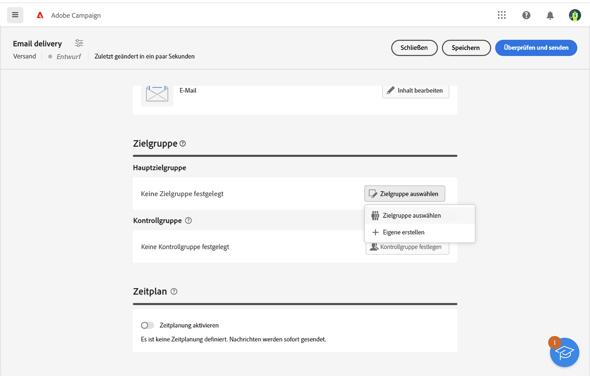
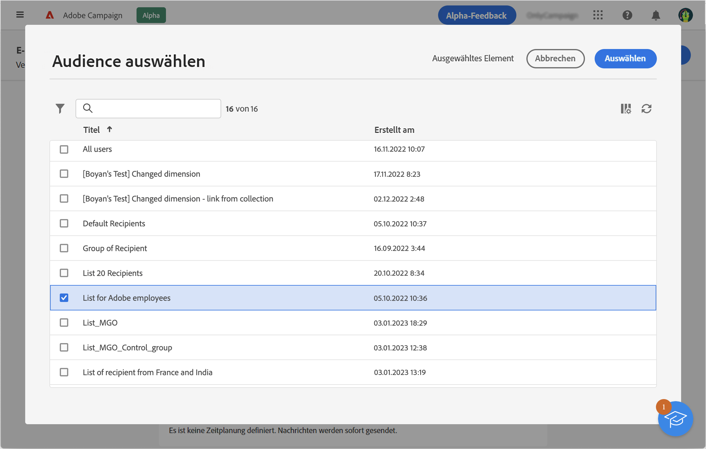
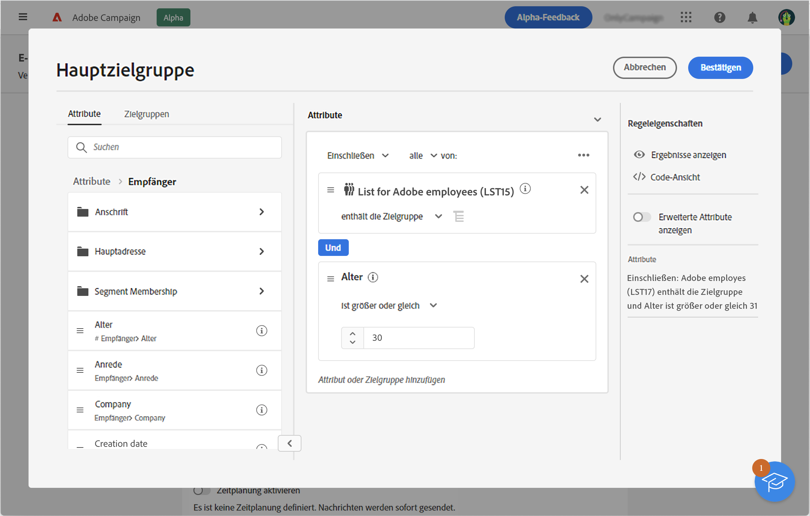

# Auswählen einer bestehenden Zielgruppe {#add-audience}

>[!CONTEXTUALHELP]
>id="acw_deliveries_email_audience_select"
>title="Auswählen einer bestehenden Zielgruppe"
>abstract="Durchsuchen Sie die Liste, um eine vorhandene Zielgruppe auszuwählen. Verwenden Sie das Symbol Filter anzeigen , um die Liste zu filtern, oder wählen Sie einen bestimmten Ordner aus."

In diesem Abschnitt wird beschrieben, wie Sie bei der Definition der Zielgruppe eines E-Mail-Versands eine bestehende Audience auswählen.

Außerdem haben Sie folgende Möglichkeiten:

* Erstellen Sie eine neue Zielgruppe. [Weitere Informationen](segment-builder.md)
* Laden Sie eine Audience aus einer externen Datei (nur für E-Mails). [Weitere Informationen](file-audience.md)
* Verwenden Sie eine Adobe Experience Platform-Audience. [Weitere Informationen](aep-audience.md).

Gehen Sie wie folgt vor, um eine vorhandene Audience für Ihre Nachricht auszuwählen:

1. Klicken Sie im Abschnitt **Audience** des Assistenten zur Versanderstellung auf die Schaltfläche **[!UICONTROL Audience auswählen]**.

   

1. Klicken Sie auf **[!UICONTROL Audience auswählen]**, um eine bestehende Audience zu verwenden. Um eine neue Audience zu erstellen, die in dieser E-Mail verwendet werden soll, wählen Sie **Eigene erstellen**. Näheres dazu finden Sie in [diesem Abschnitt](segment-builder.md).

   Auf diesem Bildschirm werden alle vorhandenen Zielgruppen für den aktuellen Ordner angezeigt.

   

   Zielgruppen werden aus dem **Zielgruppe** Menü links. Sie können auch in der Client-Konsole erstellt werden.

   Um Adobe Experience Platform-Zielgruppen zu verwenden, müssen Sie die Integration mit Zielen konfigurieren. Siehe Abschnitt [Dokumentation zu Adobe Experience Platform-Zielen](https://experienceleague.adobe.com/docs/experience-platform/destinations/home.html?lang=de){target="_blank"}.

1. Wählen Sie eine Audience aus und klicken Sie auf **Auswählen**.
1. Verwenden Sie die **Filter anzeigen** -Symbol, um Filteroptionen anzuzeigen. Klicks **Regeln hinzufügen** Zugriff auf den Regel-Builder: Mithilfe des Regel-Builders können Sie erweiterte Filter für die Liste der Zielgruppen erstellen. In diesem Abschnitt erfahren Sie, wie Sie den Regel-Builder verwenden. [Abschnitt](segment-builder.md).

   

1. Klicken Sie auf **Speichern**.

Sie können auch eine Kontrollgruppe einrichten, um die Wirkung Ihrer Kampagnen zu messen. Die Kontrollgruppe erhält die Nachricht nicht. Dadurch lässt sich das Verhalten der Population, die die Nachricht erhalten hat, mit dem Verhalten der Kontakte vergleichen, die die Nachricht nicht erhalten haben. Weiterführende Informationen finden Sie in [diesem Abschnitt](control-group.md).