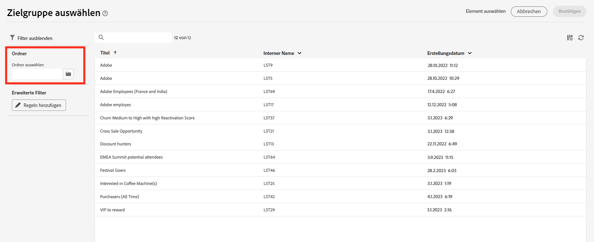
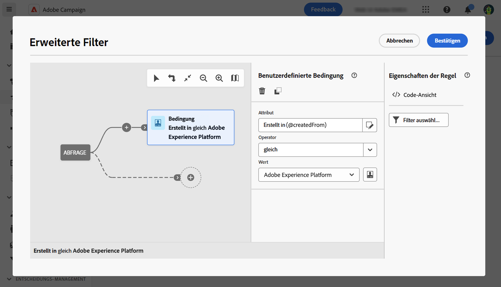

# Auswählen einer bestehenden Zielgruppe {#add-audience}

>[!CONTEXTUALHELP]
>id="acw_deliveries_email_audience_select"
>title="Auswählen einer bestehenden Zielgruppe"
>abstract="Durchsuchen Sie die Liste, um eine vorhandene Zielgruppe auszuwählen. Verwenden Sie das Symbol „Filter anzeigen“, um die Liste zu filtern, oder wählen Sie einen bestimmten Ordner aus."

In diesem Abschnitt wird beschrieben, wie Sie bei der Definition der Zielgruppe eines E-Mail-Versands eine bestehende Zielgruppe auswählen. Bei der Bestimmung der Hauptzielgruppe eines Versands haben Sie außerdem folgende Möglichkeiten:
* [Erstellen einer einmaligen Zielgruppe](one-time-audience.md) mithilfe des Abfrage-Modelers.
* [Laden einer Zielgruppe aus einer externen Datei](file-audience.md) (nur für E-Mails).

Auf Zielgruppen, die in Sendungen ausgewählt werden können, kann über das Menü **Zielgruppen** links zugegriffen werden. Sie stammen aus verschiedenen Quellen, wie z. B. der Client-Konsole, den Zielgruppen-Workflows für Campaign Web oder Adobe Experience Platform. [Weitere Informationen zu Zielgruppen](manage-audience.md)

Gehen Sie wie folgt vor, um eine vorhandene Zielgruppe für Ihre Nachricht auszuwählen:

1. Klicken Sie im Abschnitt **Zielgruppe** des Assistenten zur Versanderstellung auf die Schaltfläche **[!UICONTROL Zielgruppe auswählen]** und wählen Sie dann **[!UICONTROL Zielgruppe auswählen]**.

   {zoomable=&quot;yes&quot;}

1. Auf diesem Bildschirm werden alle vorhandenen Zielgruppen für den aktuellen Ordner angezeigt.

   {zoomable=&quot;yes&quot;}

   Um eine Zielgruppe aus Adobe Experience Platform auszuwählen, suchen Sie im Abschnitt „Filter“ des Bildschirms nach `AEP Audiences folder`. [Weitere Informationen zu Adobe Experience Platform-Zielgruppen](manage-audience.md#monitor)

   {zoomable=&quot;yes&quot;}

1. Im Filterbereich können Sie auf Filteroptionen zugreifen, um die Zielgruppenliste zu präzisieren. Klicken Sie auf **Regeln hinzufügen**, um auf den Abfrage-Modeler zuzugreifen, mit dem Sie erweiterte Filter für die Liste der Zielgruppen erstellen können. [So verwenden Sie den Abfrage-Modeler](../query/query-modeler-overview.md)

   Sie können z. B. eine Regel definieren, um nach der Herkunft der Zielgruppen zu filtern, wie unten dargestellt:

   {zoomable=&quot;yes&quot;}

1. Klicken Sie auf **Bestätigen**, um Ihre Zielgruppe als Hauptzielgruppe des Versands hinzuzufügen. Danach können Sie die Zielgruppe mit dem Abfrage-Modeler weiter einschränken, indem Sie auf die Schaltfläche **Regeln bearbeiten** klicken.

   {zoomable=&quot;yes&quot;}

   Sie können auch eine Kontrollgruppe einrichten, um die Wirkung Ihrer Kampagnen zu messen. Die Kontrollgruppe erhält die Nachricht nicht. Dadurch lässt sich das Verhalten der Population, die die Nachricht erhalten hat, mit dem Verhalten der Kontakte vergleichen, die die Nachricht nicht erhalten haben. [Weitere Informationen](control-group.md)
