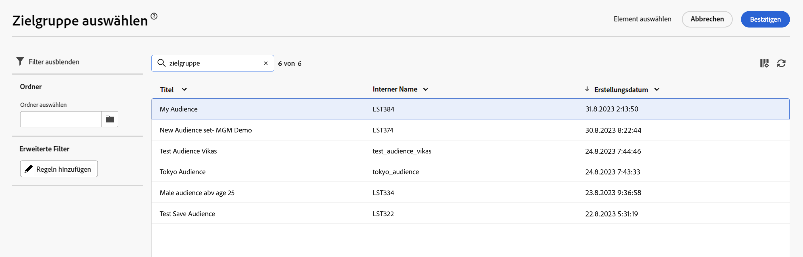

# Auswählen einer bestehenden Audience {#add-audience}

>[!CONTEXTUALHELP]
>id="acw_deliveries_email_audience_select"
>title="Auswählen einer bestehenden Audience"
>abstract="Die Audiences werden in der Adobe Campaign v8-Konsole definiert. Wenn Sie über eine Adobe Experience Platform-Integration verfügen, sollten Sie auch in Platform definierte Audiences anzeigen können."

In diesem Abschnitt wird beschrieben, wie Sie bei der Definition der Zielgruppe eines E-Mail-Versands eine bestehende Audience auswählen.

Außerdem haben Sie folgende Möglichkeiten:

* Erstellen Sie eine neue Audience. [Weitere Informationen](segment-builder.md)
* Importieren Sie eine Audience aus einer Datei. [Weitere Informationen](import-audience.md)
* Verwenden Sie eine Adobe Experience Platform-Audience. [Weitere Informationen](aep-audience.md).

Gehen Sie wie folgt vor, um eine vorhandene Audience für Ihre Nachricht auszuwählen:

1. Klicken Sie im Abschnitt **Audience** des Assistenten zur Versanderstellung auf die Schaltfläche **[!UICONTROL Audience auswählen]**.

   

1. Klicken Sie auf **[!UICONTROL Audience auswählen]**, um eine bestehende Audience zu verwenden. Um eine neue Audience zu erstellen, die in dieser E-Mail verwendet werden soll, wählen Sie **Eigene erstellen**. Näheres dazu finden Sie in [diesem Abschnitt](segment-builder.md).

   Auf diesem Bildschirm werden alle bestehenden Audiences angezeigt, die in der Adobe Campaign-Konsole oder durch Adobe Experience Platform definiert sind.

   

   >[!NOTE]
   >
   >Um Adobe Experience Platform-Audiences zu nutzen, müssen Sie die Integration mit Zielen konfigurieren. Weiterführende Informationen finden Sie in der [Dokumentation zu Zielen](https://experienceleague.adobe.com/docs/experience-platform/destinations/home.html?lang=de){target="_blank"}.

1. Wählen Sie eine Audience aus und klicken Sie auf **Auswählen**.

1. Klicken Sie auf **Regeln bearbeiten**, wenn Sie Ihre Audience einschränken möchten.

   

1. Mit dem Regel-Builder können Sie Ihre Audience mit zusätzlichen Filtern oder durch die Kombination verschiedener Audiences anreichern. Weitere Informationen finden Sie in [diesem Abschnitt](segment-builder.md).

   

1. Klicken Sie auf **Speichern**.

Sie können auch eine Kontrollgruppe einrichten, um die Wirkung Ihrer Kampagnen zu messen. Die Kontrollgruppe erhält die Nachricht nicht. Dadurch lässt sich das Verhalten der Population, die die Nachricht erhalten hat, mit dem Verhalten der Kontakte vergleichen, die die Nachricht nicht erhalten haben. Siehe [diesen Abschnitt](control-group.md).