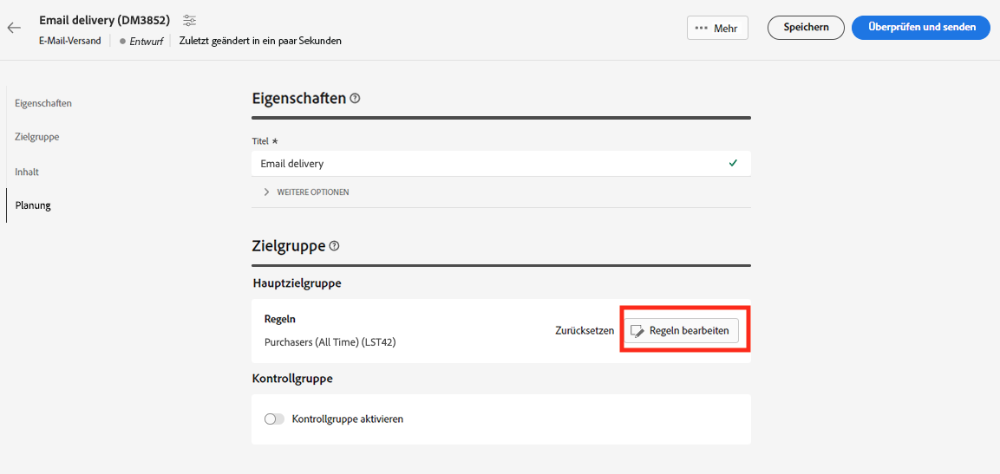

# Verwenden einer Adobe Experience Platform-Audience{#aep-audience}

Die Ziel- und Quell-Connectoren für Adobe Campaign Managed Cloud Service ermöglichen eine nahtlose Integration zwischen Adobe Campaign und Adobe Experience Platform.

Nachdem Sie eine Adobe Experience Platform-Audience erstellt haben und diese in der Clientkonsole verfügbar ist, können Sie sie auf die gleiche Weise wie für eine Campaign-Audience verwenden, um Nachrichten zu personalisieren und zu senden.

>[!NOTE]
>
>Um Adobe Experience Platform-Zielgruppen in Campaign verwenden zu können, müssen Sie die Integration mit Adobe-Quellen und -Zielen konfigurieren. Siehe [Dokumentation zu Campaign v8 (Konsole)](https://experienceleague.adobe.com/docs/campaign/campaign-v8/connect/ac-aep.html?lang=de){target="_blank"}.

Zur Auswahl der Zielgruppe eines Versands haben Sie außerdem folgende Möglichkeiten:

* Erstellen Sie eine neue Zielgruppe. [Weitere Informationen](segment-builder.md)
* Laden einer Audience aus einer externen Datei. [Weitere Informationen](file-audience.md)
* Verwenden Sie eine vorhandene Campaign-Zielgruppe. [Weitere Informationen](add-audience.md).

Gehen Sie wie folgt vor, um eine Adobe Experience Platform-Audience für Ihren Versand auszuwählen:

1. Klicken Sie im Abschnitt **Audience** des Assistenten zur Versanderstellung auf die Schaltfläche **[!UICONTROL Audience auswählen]**.

   

1. Klicken Sie auf **[!UICONTROL Audience auswählen]**, um eine bestehende Audience zu verwenden. Um eine neue Audience zu erstellen, die in dieser E-Mail verwendet werden soll, wählen Sie **Eigene erstellen**. Näheres dazu finden Sie in [diesem Abschnitt](segment-builder.md).

   In diesem Bildschirm werden alle in der Adobe Campaign-Clientkonsole definierten Zielgruppen für den aktuellen Ordner angezeigt. Um eine Zielgruppe aus Adobe Experience Platform auszuwählen, navigieren Sie zum `AEP Audiences folder` aus dem Filterbereich des Bildschirms.

   

   Sie können auch eine Regel definieren, um nach der Herkunft der Zielgruppen zu filtern, wie unten dargestellt:

   

1. Wählen Sie eine Audience aus und klicken Sie auf **Auswählen**.

1. Klicken Sie auf **Regeln bearbeiten**, wenn Sie Ihre Audience einschränken möchten.

   

1. Mit dem Regel-Builder können Sie Ihre Audience mit zusätzlichen Filtern oder durch die Kombination verschiedener Audiences anreichern. Weitere Informationen finden Sie in [diesem Abschnitt](segment-builder.md).

1. Klicken Sie auf **Speichern**.

