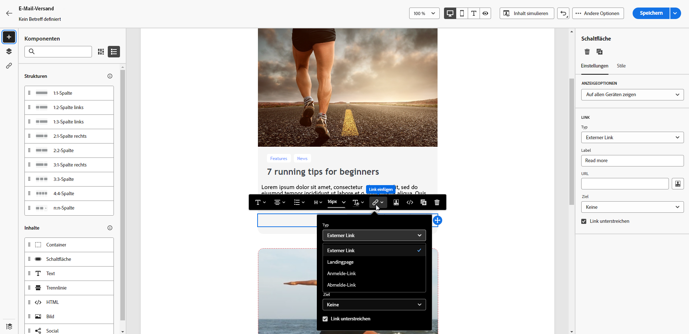
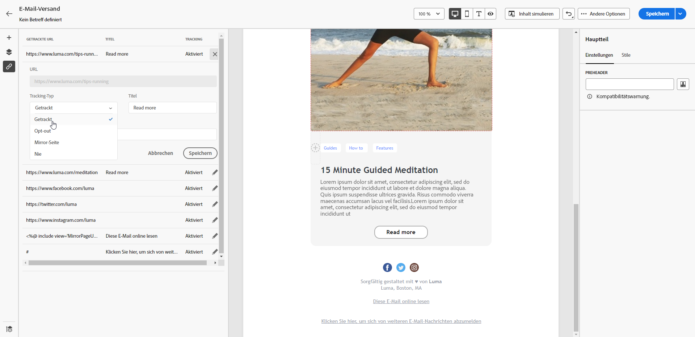
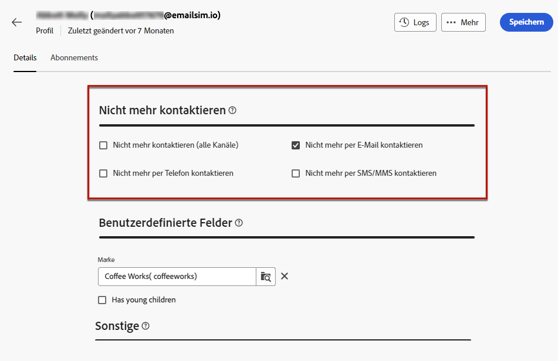

# Einverständnisverwaltung {#manage-consent}

## Allgemeine Empfehlungen {#general-recommendations}

Mit Adobe Campaign können Sie Daten, einschließlich personenbezogener und vertraulicher Daten, erfassen. Es ist wichtig, die Einwilligung der Empfänger in Übereinstimmung mit den Datenschutzbestimmungen wie der DSGVO (Datenschutz-Grundverordnung) und anderen geltenden Datenschutzgesetzen einzuholen und zu überwachen.

* Unterlassen Sie zunächst den Versand von unerwünschten E-Mails, Push-Benachrichtigungen und SMS-Nachrichten („Spam„). Adobe unterstützt nachdrücklich die Grundsätze des Permission Marketing, um den Kundenlebenszeitwert und die Kundentreue zu fördern. Adobe verbietet strikt die Verwendung von Adobe Campaign zum Senden von unerwünschten Nachrichten. [Weitere Informationen](#denylisted-profiles)

* Stellen Sie immer sicher, dass Empfänger dem Empfang von Nachrichten zustimmen, indem Sie ihnen die Möglichkeit bieten, sich von Ihren Sendungen abzumelden<!-- and keep honoring opt-out requests as quickly as possible-->. [Weitere Informationen](#opt-out)

* Verwenden Sie den Abonnementverwaltungsprozess, um die Voreinstellungen der Empfänger zu verwalten und zu verfolgen, welche Empfänger sich für bestimmte Abonnementtypen entschieden haben. [Weitere Informationen](../../delivery/using/about-services-and-subscriptions.md)

## Verwalten des Opt-out {#opt-out}

Es ist gesetzlich vorgeschrieben, Empfängern die Möglichkeit zu geben, sich vom Erhalt von Mitteilungen einer Marke abzumelden. Es muss auch sichergestellt werden, dass diese Entscheidung respektiert wird. <!--Learn more about the applicable legislation in the [Adobe Campaign Classic v7 documentation](https://experienceleague.adobe.com/docs/campaign-classic/using/getting-started/privacy/privacy-and-recommendations.html#privacy-regulations){target="_blank"}.-->

**Warum ist das wichtig?**

* Die Nichteinhaltung dieser Vorschriften führt zu rechtlichen Risiken für Ihre Marke.
* So wird verhindert, dass unerwünschte Nachrichten an Empfänger gesendet werden, die Ihre Nachrichten als Spam kennzeichnen und Ihrem Ruf schaden könnten.

Stellen Sie beim Versand von Nachrichten über Adobe Campaign Web sicher, dass sich Kunden von zukünftigen Nachrichten abmelden können. Nach der Abmeldung werden Profile automatisch aus der Audience künftiger Marketing-Nachrichten entfernt.

### E-Mail-Opt-out {#email-opt-out}

Damit sich Empfänger vom Erhalt von E-Mail-Nachrichten abmelden können, fügen Sie in jede E **Mail, die an Empfänger gesendet wird, einen** Abmelde-Link) ein.

Gehen Sie dazu wie folgt vor:

1. Erstellen Sie eine externe Landingpage und hosten Sie sie auf dem Drittanbietersystem Ihrer Wahl.

1. Erstellen Sie einen E-Mail-Versand.  [Weitere Informationen dazu](../email/create-email.md)

1. Fügen Sie einen Link in Ihren E-Mail-Inhalt ein. [Weitere Informationen](../email/message-tracking.md#insert-links)

   

1. Fügen Sie den Link zu Ihrer Drittanbieter-Landingpage im Feld **[!UICONTROL URL]** ein.

1. Klicken Sie auf **[!UICONTROL Links]** im linken Bereich, um die Liste aller URLs in Ihrem zu trackenden Inhalt anzuzeigen.

1. Klicken Sie auf das Stiftsymbol neben dem neuen Link, um ihn zu bearbeiten.

1. Ändern Sie den **[!UICONTROL Tracking-Typ]** und setzen Sie ihn auf **[!UICONTROL Opt-out]**.

   

1. Klicken Sie auf **[!UICONTROL Speichern]** und senden Sie die Nachricht ab. [Weitere Informationen](../monitor/prepare-send.md)

1. Wenn die Empfängerin bzw. der Empfänger nach Erhalt der Nachricht auf den Abmelde-Link klickt, wird die Landingpage angezeigt.

1. Wenn die Empfängerin bzw. der Empfänger das Landingpage-Formular sendet, werden die Profildaten aktualisiert. [Weitere Informationen](#denylisted-profiles)

<!--Any other option available such as one-click opt-out link or List-Unsubscribe (to include an unsubscribe link in the email header) to enable opt-out in a delivery?-->

## Profile, die auf die Blockierungsliste gesetzt wurden {#denylisted-profiles}

Nach einer Abmeldung (Opt-out) werden Profile der **Blockierungsliste** für einen bestimmten Kanal hinzugefügt. Das bedeutet, dass sie nicht mehr in den Versand eingeschlossen sind.

>[!NOTE]
>
>Wenn ein Profil auf der Blockierungsliste für den E-Mail-Kanal zwei E-Mail-Adressen hat, werden beide Adressen vom Versand ausgeschlossen.

Im Abschnitt **[!UICONTROL Nicht mehr kontaktieren]** auf der Registerkarte **[!UICONTROL Details]** des Profils können Sie überprüfen, ob sich ein Profil für einen oder mehrere Kanäle auf der Blockierungsliste befindet. [Weitere Informationen](../audience/about-recipients.md#access)

<!--Denylisted status on quarantine list

Additionally, when recipients report your message as spam, or reply to an SMS message with a keyword such as "STOP", their address or phone number is quarantined with the **[!UICONTROL Denylisted]** status. Their profile is updated accordingly.

QUESTION: When a user marks an email as spam, is the profile's No longer contact section also updated? Apparently no (not the same = quarantine vs denylist)

>[!NOTE]
>
>The **[!UICONTROL Denylisted]** status refers to the address only, the profile is not on the denylist, so that the user continues receiving SMS messages and push notifications.

Learn more about Feedback loops in the [Delivery Best Practices Guide](https://experienceleague.adobe.com/docs/deliverability-learn/deliverability-best-practice-guide/transition-process/infrastructure.html#feedback-loops){target="_blank"}.

Learn more on quarantine in the [Campaign v8 (client console) documentation](https://experienceleague.adobe.com/docs/campaign/campaign-v8/send/failures/quarantines.html#non-deliverable-bounces){target="_blank"}.-->