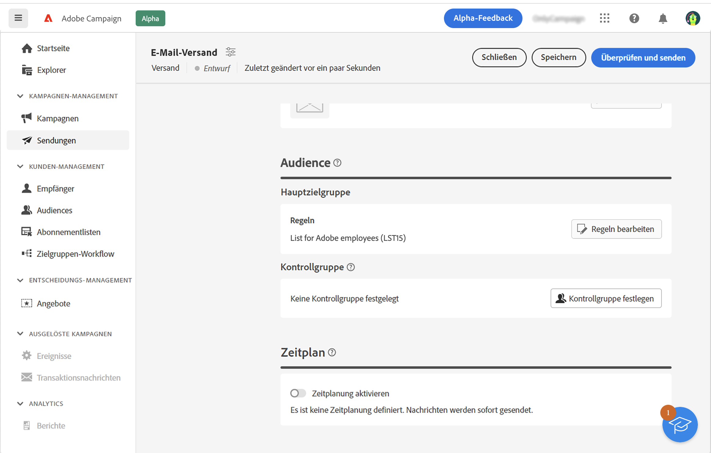
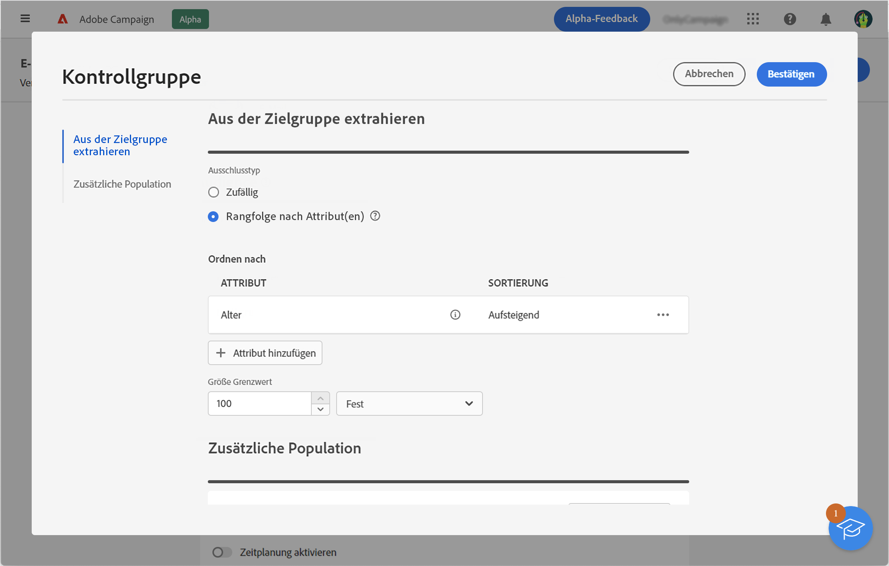
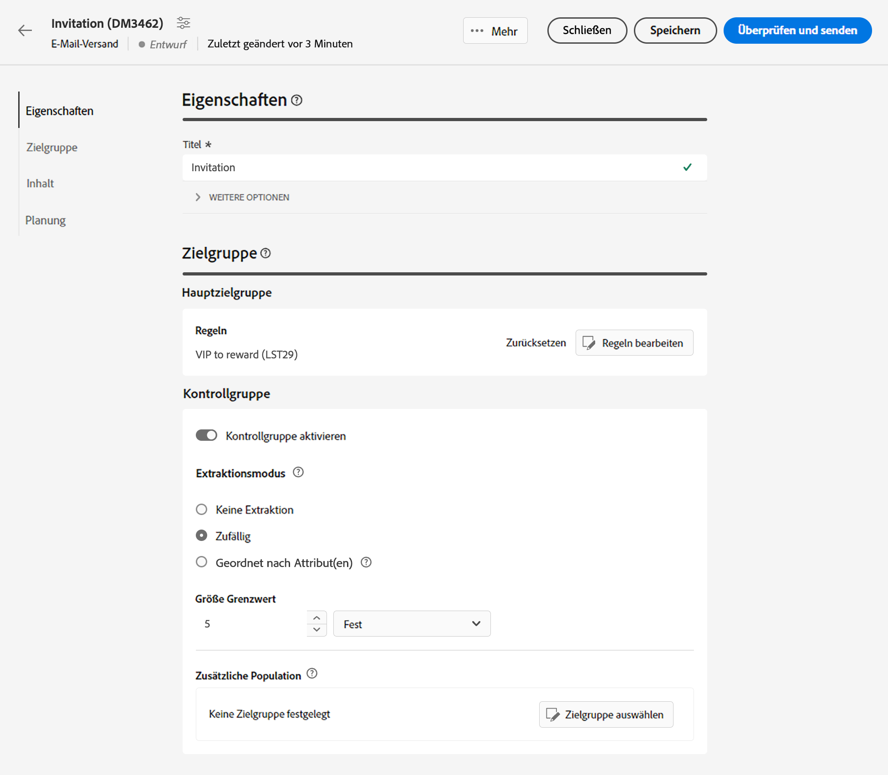
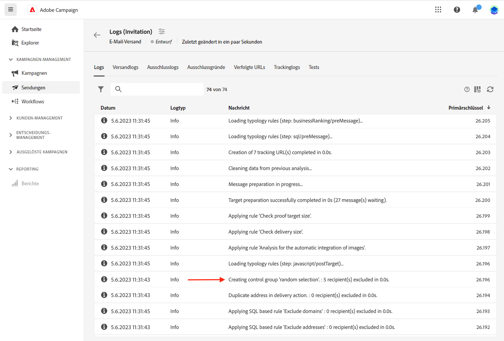
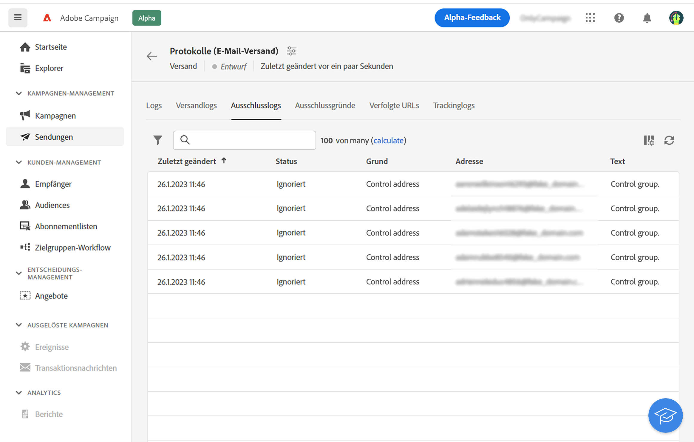
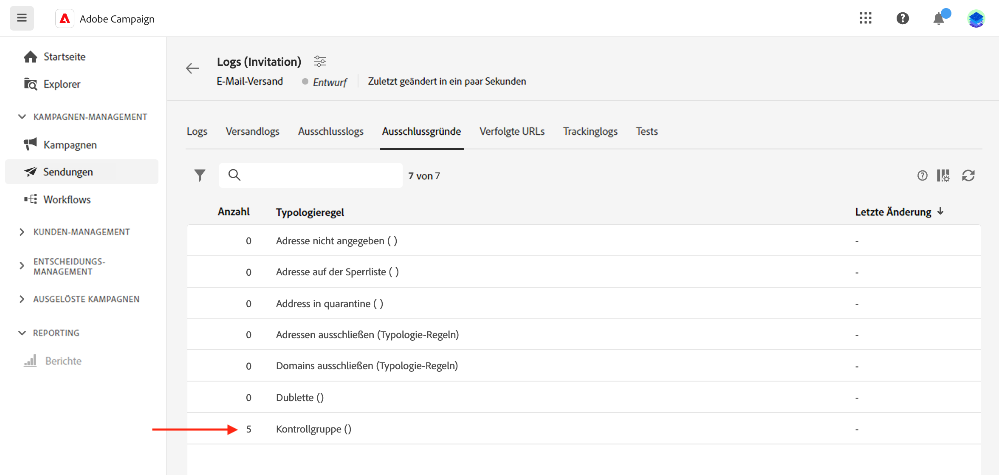
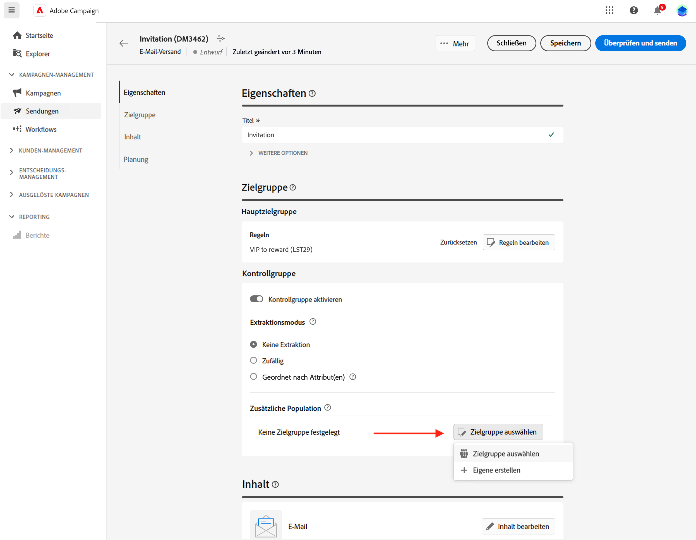

# Festlegen einer Kontrollgruppe {#control-group}

Eine Kontrollgruppe ist eine vom Versand ausgeschlossene Unterpopulation. Sie können eine Kontrollgruppe definieren, um zu verhindern, dass Nachrichten an einen Teil Ihrer Audience gesendet werden, und das Verhalten nach dem Versand mit der Hauptzielgruppe vergleichen. Mit dieser Option können Sie die Wirkung Ihrer Kampagne messen.

## Kontrollgruppe aktivieren{#add-a-control-group}

Um eine Kontrollgruppe hinzuzufügen, aktivieren Sie die Option bei der Definition der Zielgruppe Ihres Versands. Die Kontrollgruppe kann nach dem Zufallsprinzip aus der Hauptzielgruppe extrahiert und/oder aus einer bestimmten Population ausgewählt werden. Daher gibt es zwei Möglichkeiten, eine Kontrollgruppe zu definieren:

* Extrahieren Sie eine Reihe von Profilen aus der Hauptzielgruppe.
* Schließen Sie einige Profile aus einer Liste oder basierend auf in einer Abfrage definierten Kriterien aus.

Beim Definieren einer Kontrollgruppe können Sie beide Methoden kombinieren.

Alle Profile, die bei der Versandvorbereitung zur Kontrollgruppe gehören, werden aus der Hauptzielgruppe entfernt. Sie erhalten die Nachricht nicht.

>[!CAUTION]
>
>Sie können keine Kontrollgruppen verwenden, wenn Sie die Zielgruppen-Population [aus einer externen Datei](file-audience.md) laden.

Um einem Versand eine Kontrollgruppe hinzuzufügen, aktivieren Sie die **[!UICONTROL Kontrollgruppe aktivieren]** Umschalten von der **Zielgruppe** im Bereich der Versanderstellung.

## Aus Zielgruppe extrahieren {#extract-target}

>[!CONTEXTUALHELP]
>id="acw_deliveries_email_controlgroup_target"
>title="Extraktionsmodus"
>abstract="Um eine Kontrollgruppe zu definieren, können Sie nach dem Zufallsprinzip oder basierend auf einer Sortierung einen Prozentsatz oder eine feste Anzahl von Profilen aus der Zielgruppenpopulation extrahieren."

### Kontrollgruppe erstellen {#build-extract-target}

Um eine Kontrollgruppe zu definieren, können Sie nach dem Zufallsprinzip oder basierend auf einer Sortierung einen Prozentsatz oder eine feste Anzahl von Profilen aus der Zielgruppenpopulation extrahieren. Wenn Sie eine zusätzliche Population hinzufügen möchten, wählen Sie die **Keine Extraktion** und wählen Sie die zusätzliche Population aus [wie hier beschrieben](#extra-population).

Definieren Sie zunächst, wie die Profile aus der Zielgruppe extrahiert werden: zufällig oder basierend auf einer Sortierung.

Unter dem **Kontrollgruppe** wählen Sie eine **Extraktionsmodus**:

* **Zufällig**: Bei der Versandvorbereitung extrahiert Adobe Campaign nach dem Zufallsprinzip eine gewisse Anzahl von Profilen, die dem Prozentsatz oder der maximalen Anzahl entspricht, die als Größenbegrenzung festgelegt wurde.

* **Nach Attribut(en) sortiert**: Mit dieser Option können Sie anhand bestimmter Attribute in einer bestimmten Reihenfolge eine Gruppe von Profilen ausschließen.

Verwenden Sie dann die **Größenbeschränkung** um die Anzahl der Profile festzulegen, die aus der Hauptzielgruppe extrahiert werden sollen. Dabei kann es sich um eine Rohanzahl (z. B. 50 Profile, die ausgeschlossen werden sollen) oder einen Prozentsatz der ursprünglichen Zielgruppe handeln (z. B. 5 % der Hauptzielgruppe).

### Beispiel einer Kontrollgruppe{#control-group-sample}

Gehen Sie wie folgt vor, um beispielsweise eine Kontrollgruppe mit den 100 neuen jüngsten Empfängern zu erstellen:

1. Wählen Sie das Feld **Alter** als Sortierkriterium aus. Lassen Sie die **Aufsteigend** Sortieroption.
1. Fügen Sie die **Erstellungsdatum** -Feld. Änderung an **Absteigend** Sortieroption.
1. Definieren Sie 100 als Schwellenwert im **Größenbeschränkung** Abschnitt.

   

Diese 100 neuen jüngsten Empfänger werden dann von der Hauptzielgruppe ausgeschlossen.

### Kontrollgruppe überprüfen {#check-control-group}

Sie können die Protokolle anzeigen, um die ausgeschlossenen Profile zu überprüfen und zu identifizieren. Nehmen wir als Beispiel einen zufälligen Ausschluss von fünf Profilen.

Nach der Versandvorbereitung können Sie überprüfen, wie die Ausschlüsse angewendet wurden:

* Aktivieren Sie im Versand-Dashboard vor dem Versand die Option **Ausschließen** KPI.

  

* In den Versandlogs wird im Tab Logs der Ausschlussschritt angezeigt.

  
<!--

 * The **Exclusion logs** tab displays each profile and the related exclusion **Reason**.

    
-->

* Die **Ausschlussgründe** zeigt die Anzahl der ausgeschlossenen Profile für jede Typologieregel an.

  

Weitere Informationen über Versandlogs finden Sie in [diesem Abschnitt](../monitor/delivery-logs.md).

## Zusätzliche Population hinzufügen {#extra-population}

>[!CONTEXTUALHELP]
>id="acw_deliveries_email_controlgroup_extra"
>title="Zusätzliche Population"
>abstract="Sie können eine bestimmte Population aus der Versand-Audience ausschließen, indem Sie eine existierende Audience auswählen oder eine Abfrage definieren."

Eine andere Möglichkeit, eine Kontrollgruppe zu definieren, besteht darin, eine bestimmte Population in einer existierenden Audience auszuwählen oder eine Abfrage zu definieren.

Klicken Sie im Abschnitt **Zusätzliche Population** des Definitionsbildschirms der **Kontrollgruppe** auf die Schaltfläche **[!UICONTROL Audience auswählen]**.

* Um eine vorhandene Audience zu verwenden, klicken Sie auf **Audience auswählen**. Weiterführende Informationen finden Sie in [diesem Abschnitt](add-audience.md).

* Um eine neue Abfrage zu definieren, wählen Sie **Eigene erstellen** aus und definieren Sie die Ausschlusskriterien mit dem Regel-Builder. Weiterführende Informationen finden Sie in [diesem Abschnitt](segment-builder.md).

Die in der Audience enthaltenen Profile oder die Ergebnisse der Abfrage entsprechen dem **ausgeschlossen** aus der Versandzielgruppe: sie keine Nachricht erhalten.

## Ergebnisse vergleichen{#control-group-results}

Nach dem Versand können Sie die Versandlogs extrahieren, um das Verhalten zwischen den Profilen, die die Nachricht nicht erhalten haben, und der tatsächlichen Zielgruppe zu vergleichen. Sie können auch die Versandlogs verwenden, um eine neue Zielgruppe zu erstellen.

Um zu sehen, welche Profile aus der Zielgruppe entfernt wurden, überprüfen Sie die **Versandlogs**. Weitere Informationen finden Sie in [diesem Abschnitt](#check-control-group).

