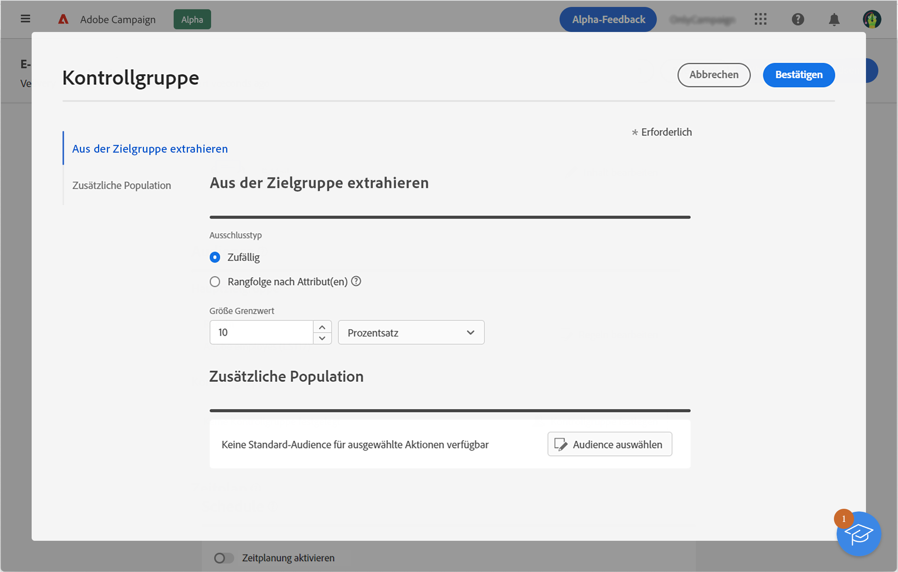

# Einrichten einer Kontrollgruppe {#control-group}

Mithilfe von Kontrollgruppen können Sie vermeiden, dass Nachrichten an einen Teil Ihrer Audience gesendet werden, um die Wirkung Ihrer Kampagnen zu messen.

Erstellen Sie dazu eine Kontrollgruppe, wenn Sie die Audience Ihres Versands definieren. Profile werden der Kontrollgruppe nach dem Zufallsprinzip hinzugefügt, gefiltert oder ungefiltert oder auf der Grundlage von Kriterien. Anschließend können Sie das Verhalten der Zielpopulation, die die Nachricht erhalten hat, mit dem Verhalten der Kontakte vergleichen, die nicht in die Zielgruppe aufgenommen wurden.

Die Kontrollgruppe kann nach dem Zufallsprinzip aus der Hauptzielgruppe extrahiert und/oder aus einer bestimmten Population ausgewählt werden. Daher gibt es zwei Möglichkeiten, eine Kontrollgruppe zu definieren:

* Extrahieren Sie eine Reihe von Profilen aus der Hauptzielgruppe.
* Schließen Sie einige Profile basierend auf in einer Abfrage definierten Kriterien aus.

Beim Definieren einer Kontrollgruppe können Sie beide Methoden verwenden.

Alle Profile, die bei der Versandvorbereitung zur Kontrollgruppe gehören, werden aus der Hauptzielgruppe entfernt. Sie erhalten die Nachricht nicht.

Um eine Kontrollgruppe zu erstellen, klicken Sie im Abschnitt **Audience** des Assistenten zur Versanderstellung auf die Schaltfläche **[!UICONTROL Kontrollgruppe festlegen]**.

## Aus Zielgruppe extrahieren {#extract-target}

>[!CONTEXTUALHELP]
>id="acw_deliveries_email_controlgroup_target"
>title="Aus Zielgruppe extrahieren"
>abstract="TBC"

Um eine Kontrollgruppe zu definieren, können Sie nach dem Zufallsprinzip oder basierend auf einer Sortierung einen Prozentsatz oder eine feste Anzahl von Profilen aus der Zielgruppe extrahieren.

Definieren Sie zunächst, wie die Profile aus der Zielgruppe extrahiert werden: zufällig oder basierend auf einer Sortierung.

Wählen Sie im Abschnitt **Aus Zielgruppe extrahieren** einen **Ausschlusstyp**:

* **Random**: Bei der Versandvorbereitung extrahiert Adobe Campaign zufällig eine Anzahl von Profilen, die dem Prozentsatz oder der Maximalzahl entsprechen, der als Größenbeschränkung festgelegt wird.

   

* **Nach Attribut(en) sortiert**: Mit dieser Option können Sie anhand bestimmter Attribute in einer bestimmten Reihenfolge eine Gruppe von Profilen ausschließen.

   

Definieren Sie dann die **Größenbeschränkung**: Hierzu müssen Sie festlegen, wie Sie die Anzahl der Profile begrenzen, die Sie aus der Hauptzielgruppe extrahieren.

**Beispiel**

Sie können die Protokolle anzeigen, um die ausgeschlossenen Profile zu überprüfen und zu identifizieren. Nehmen wir als Beispiel einen zufälligen Ausschluss von fünf Profilen.

Nach der Versandvorbereitung können Sie die Ausschlüsse auf den folgenden Bildschirmen anzeigen:

* Die KPI **Ausschließen** im Versand-Dashboard vor dem Versand.

   

* Die **Ausschlusslogs** jedes Profil und den zugehörigen Ausschluss anzeigen **Grund**.

   

* Die **Ausschlussgründe** die Anzahl der ausgeschlossenen Profile für jede Typologieregel anzeigen.

   

Weitere Informationen über Versandlogs finden Sie in [diesem Abschnitt](../monitor/delivery-logs.md).

## Zusätzliche Population {#extra-population}

>[!CONTEXTUALHELP]
>id="acw_deliveries_email_controlgroup_extra"
>title="Zusätzliche Population"
>abstract="TBC"

Eine andere Möglichkeit, eine Kontrollgruppe zu definieren, besteht darin, eine bestimmte Population mithilfe einer bestehenden Audience oder durch Definieren einer Abfrage aus der Zielgruppe auszuschließen.

Klicken Sie im Abschnitt **Zusätzliche Population** des Definitionsbildschirms der **Kontrollgruppe** auf die Schaltfläche **[!UICONTROL Audience auswählen]**.

* Um eine vorhandene Audience zu verwenden, klicken Sie auf **Audience auswählen**. Näheres dazu finden Sie in [diesem Abschnitt](add-audience.md).

* Um eine neue Abfrage zu definieren, wählen Sie **Eigene erstellen** aus und definieren Sie die Ausschlusskriterien mit  dem Regel-Builder. Näheres dazu finden Sie in [diesem Abschnitt](segment-builder.md).

Die in der Audience enthaltenen oder mit dem Abfrageergebnis übereinstimmenden Profile werden aus der Zielgruppe ausgeschlossen.