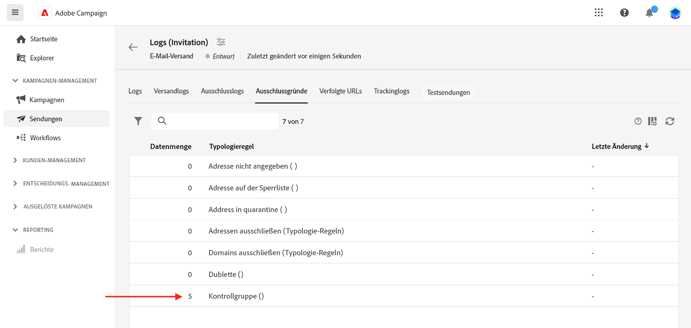

# Festlegen einer Kontrollgruppe {#control-group}

Eine Kontrollgruppe ist eine vom Versand ausgeschlossene Unterpopulation. Sie können eine Kontrollgruppe definieren, um zu verhindern, dass Nachrichten an einen Teil Ihrer Zielgruppe gesendet werden, und das Verhalten nach dem Versand mit der Hauptzielgruppe vergleichen. Mit dieser Option können Sie die Wirkung Ihrer Kampagne messen.

➡️ [Entdecken Sie diese Funktion im Video](create-audience.md#video)

## Aktivieren einer Kontrollgruppe {#add-a-control-group}

Um eine Kontrollgruppe hinzuzufügen, aktivieren Sie die entsprechende Option, wenn Sie die Zielgruppe Ihres Versands definieren. Die Kontrollgruppe kann nach dem Zufallsprinzip aus der Hauptzielgruppe extrahiert oder aus einer bestimmten Population ausgewählt werden. Daher gibt es zwei Möglichkeiten, eine Kontrollgruppe zu definieren:

* Extrahieren Sie eine Reihe von Profilen aus der Hauptzielgruppe.
* Schließen Sie einige Profile aus einer Liste oder basierend auf in einer Abfrage definierten Kriterien aus.

Beim Definieren einer Kontrollgruppe können Sie beide Methoden kombinieren.

Alle Profile, die bei der Versandvorbereitung zur Kontrollgruppe gehören, werden aus der Hauptzielgruppe entfernt. Sie erhalten die Nachricht nicht.

>[!CAUTION]
>
>Sie können keine Kontrollgruppen verwenden, wenn Sie die Zielgruppen-Population [aus einer externen Datei](file-audience.md) laden.

Um eine Kontrollgruppe zu einem Versand hinzuzufügen, aktivieren Sie im Abschnitt **Zielgruppe** des Bildschirms für die Versanderstellung den Umschalter **[!UICONTROL Kontrollgruppe aktivieren]**.

## Aus Zielgruppe extrahieren {#extract-target}

>[!CONTEXTUALHELP]
>id="acw_deliveries_email_controlgroup_target"
>title="Extraktionsmodus"
>abstract="Eine Kontrollgruppe ist ein Satz von Profilen, die vom Versand ausgeschlossen sind. Um eine Kontrollgruppe zu definieren, können Sie nach dem Zufallsprinzip oder basierend auf einer Sortierung einen Prozentsatz oder eine feste Anzahl von Profilen aus der Zielgruppenpopulation extrahieren."

### Erstellen einer Kontrollgruppe {#build-extract-target}

Um eine Kontrollgruppe zu definieren, extrahieren Sie nach dem Zufallsprinzip oder basierend auf einer Sortierung einen Prozentsatz oder eine feste Anzahl von Profilen aus der Zielpopulation. Wenn Sie eine zusätzliche Population hinzufügen, wählen Sie die Option **Keine Extraktion** und dann die zusätzliche Population aus, [wie hier beschrieben](#extra-population).

Legen Sie zunächst fest, wie die Profile aus der Zielgruppe extrahiert werden sollen: zufällig oder auf Grundlage einer Sortierung.

Wählen Sie unter dem Abschnitt **Kontrollgruppe** einen **Extraktionsmodus**:

* **Zufällig**: Bei der Versandvorbereitung extrahiert Adobe Campaign nach dem Zufallsprinzip eine gewisse Anzahl von Profilen, die dem Prozentsatz oder der maximalen Anzahl entspricht, die als maximale Größe festgelegt wurde.
* **Rangfolge nach Attribut(en)**: Mit dieser Option wird anhand bestimmter Attribute in einer bestimmten Reihenfolge eine Gruppe von Profilen ausgeschlossen.

Verwenden Sie dann den Abschnitt **Maximale Größe**, um die Anzahl der Profile festzulegen, die aus der Hauptzielgruppe extrahiert werden sollen. Dabei kann es sich um eine Rohanzahl (z. B. 50 Profile, die ausgeschlossen werden sollen) oder einen Prozentsatz der ursprünglichen Zielgruppe (z. B. 5 % der Hauptzielgruppe) handeln.

### Beispiel einer Kontrollgruppe {#control-group-sample}

Gehen Sie wie folgt vor, um beispielsweise eine Kontrollgruppe mit den 100 jüngsten Profilen zu erstellen:

1. Wählen Sie das Feld **Alter** als Sortierkriterium aus. Lassen Sie die Sortieroption **Aufsteigend**.
1. Fügen Sie das Feld **Erstellungsdatum** hinzu. Wechseln Sie zur Sortieroption **Absteigend**.
1. Definieren Sie 100 als Schwellenwert im Abschnitt **Größenbeschränkung**.

   {zoomable="yes"}

Diese 100 jüngsten Profile werden dann aus der Hauptzielgruppe ausgeschlossen.

### Überprüfen Sie Ihre Kontrollgruppe {#check-control-group}

Zeigen Sie die Protokolle an, um die ausgeschlossenen Profile zu überprüfen und zu identifizieren. Ziehen Sie beispielsweise einen zufälligen Ausschluss von fünf Profilen in Betracht.

{zoomable="yes"}

Überprüfen Sie nach der Versandvorbereitung, wie die Ausschlüsse angewendet wurden:

* Aktivieren Sie im Versand-Dashboard vor dem Versand den KPI **Auszuschließen**.

  {zoomable="yes"}

* In den Versandlogs wird in der Registerkarte „Logs“ der Ausschlussschritt angezeigt.

  {zoomable="yes"}

<!--

 * The **Exclusion logs** tab displays each profile and the related exclusion **Reason**.

    {zoomable="yes"}

-->

* Auf der Registerkarte **Ausschlussgründe** wird für jede Typologieregel die Anzahl der ausgeschlossenen Profile angegeben.

  {zoomable="yes"}

Weitere Informationen über Versandlogs finden Sie in [diesem Abschnitt](../monitor/delivery-logs.md).

## Hinzufügen einer zusätzlichen Population {#extra-population}

>[!CONTEXTUALHELP]
>id="acw_deliveries_email_controlgroup_extra"
>title="Zusätzliche Population"
>abstract="Eine Kontrollgruppe ist ein Satz von Profilen, die vom Versand ausgeschlossen sind. Sie können eine bestimmte Population aus der Versand-Zielgruppe ausschließen, indem Sie eine existierende Zielgruppe auswählen oder eine Abfrage definieren."

Eine andere Möglichkeit, eine Kontrollgruppe zu definieren, ist die Auswahl einer bestimmten Population in einer bestehenden Zielgruppe oder die Definition einer Abfrage.

Klicken Sie im Abschnitt **Zusätzliche Population** des Definitionsbildschirms der **Kontrollgruppe** auf die Schaltfläche **[!UICONTROL Zielgruppe auswählen]**.

{zoomable="yes"}

* Um eine vorhandene Zielgruppe zu verwenden, klicken Sie auf **Zielgruppe auswählen**. Weiterführende Informationen finden Sie in [diesem Abschnitt](add-audience.md).
* Um eine neue Abfrage zu definieren, wählen Sie **Eigene erstellen** und definieren Sie die Ausschlusskriterien mithilfe des Abfrage-Modelers. Weiterführende Informationen finden Sie in [diesem Abschnitt](../query/query-modeler-overview.md).

Die Profile, die in der Zielgruppe enthalten sind oder mit dem Ergebnis der Abfrage übereinstimmen, werden aus der Versandzielgruppe **ausgeschlossen**. Sie erhalten keine Nachrichten

## Vergleichen der Ergebnisse {#control-group-results}

Nach dem Versand extrahieren Sie die Versandlogs, um das Verhalten zwischen den Profilen, die die Nachricht nicht erhalten haben, und der tatsächlichen Zielgruppe zu vergleichen. Verwenden Sie die Versandlogs für eine neue Zielgruppenbestimmung.

Um zu sehen, welche Profile aus der Zielgruppe entfernt wurden, überprüfen Sie die **Versandlogs**. Weitere Informationen finden Sie in [diesem Abschnitt](#check-control-group).