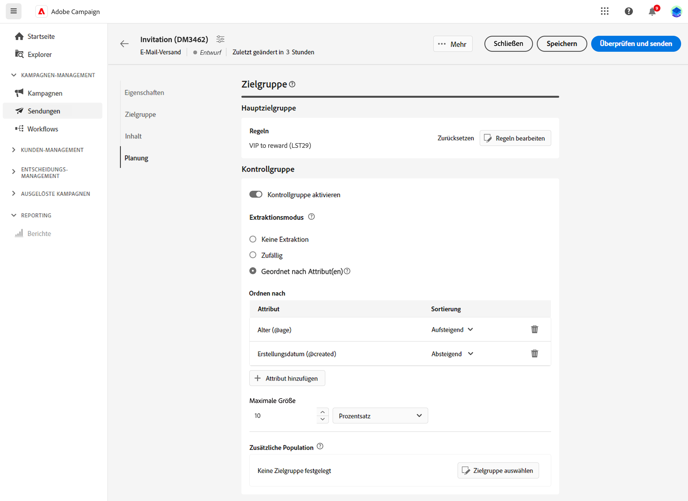

# Einrichten einer Kontrollgruppe {#control-group}

Mithilfe von Kontrollgruppen können Sie vermeiden, dass Nachrichten an einen Teil Ihrer Audience gesendet werden, um die Wirkung Ihrer Kampagnen zu messen.

Erstellen Sie dazu eine Kontrollgruppe, wenn Sie die Audience Ihres Versands definieren. Profile werden der Kontrollgruppe nach dem Zufallsprinzip hinzugefügt, gefiltert oder ungefiltert oder auf der Grundlage von Kriterien. Sie können dann das Verhalten der Zielgruppen-Population, die die Nachricht erhalten hat, mit dem Verhalten der Kontakte vergleichen, die nicht angesprochen wurden.

Die Kontrollgruppe kann nach dem Zufallsprinzip aus der Hauptzielgruppe extrahiert und/oder aus einer bestimmten Population ausgewählt werden. Daher gibt es zwei Möglichkeiten, eine Kontrollgruppe zu definieren:

* Extrahieren Sie eine Reihe von Profilen aus der Hauptzielgruppe.
* Schließen Sie einige Profile basierend auf in einer Abfrage definierten Kriterien aus.

Beim Definieren einer Kontrollgruppe können Sie beide Methoden verwenden.

Alle Profile, die bei der Versandvorbereitung zur Kontrollgruppe gehören, werden aus der Hauptzielgruppe entfernt. Sie erhalten die Nachricht nicht.

Um eine Kontrollgruppe zu erstellen, klicken Sie im Abschnitt **Audience** des Assistenten zur Versanderstellung auf die Schaltfläche **[!UICONTROL Kontrollgruppe festlegen]**.

## Aus Zielgruppe extrahieren {#extract-target}

>[!CONTEXTUALHELP]
>id="acw_deliveries_email_controlgroup_target"
>title="Aus Zielgruppe extrahieren"
>abstract="Um eine Kontrollgruppe zu definieren, können Sie nach dem Zufallsprinzip oder basierend auf einer Sortierung einen Prozentsatz oder eine feste Anzahl von Profilen aus der Zielgruppenpopulation extrahieren."

Um eine Kontrollgruppe zu definieren, können Sie nach dem Zufallsprinzip oder basierend auf einer Sortierung einen Prozentsatz oder eine feste Anzahl von Profilen aus der Zielgruppenpopulation extrahieren.

Legen Sie zunächst fest, wie die Profile aus der Zielgruppe extrahiert werden sollen: zufällig oder auf der Grundlage einer Sortierung.

Wählen Sie im Abschnitt **Aus Zielgruppe extrahieren** einen **Ausschlusstyp**:

* **Zufällig**: Bei der Versandvorbereitung extrahiert Adobe Campaign nach dem Zufallsprinzip eine gewisse Anzahl von Profilen, die dem Prozentsatz oder der maximalen Anzahl entspricht, die als Größenbegrenzung festgelegt wurde.

   

* **Nach Attribut(en) sortiert**: Mit dieser Option können Sie anhand bestimmter Attribute in einer bestimmten Reihenfolge eine Gruppe von Profilen ausschließen.

   

Definieren Sie dann die **Größenbeschränkung**: Hierzu müssen Sie festlegen, wie Sie die Anzahl der Profile begrenzen, die Sie aus der Hauptzielgruppe extrahieren.

**Beispiel**

Sie können die Protokolle anzeigen, um die ausgeschlossenen Profile zu überprüfen und zu identifizieren. Nehmen wir als Beispiel einen zufälligen Ausschluss von fünf Profilen.

Nach der Versandvorbereitung können Sie die Ausschlüsse auf den folgenden Bildschirmen anzeigen:

* Die KPI **Ausschließen** im Versand-Dashboard vor dem Versand.

   

* Die **Ausschlusslogs** zeigen die einzelnen Profile und den zugehörigen **Ausschlussgrund** an.

   

* In den **Ausschlussgründen** wird für jede Typologieregel die Anzahl der ausgeschlossenen Profile angegeben.

   

Weitere Informationen über Versandlogs finden Sie in [diesem Abschnitt](../monitor/delivery-logs.md).

## Zusätzliche Population {#extra-population}

>[!CONTEXTUALHELP]
>id="acw_deliveries_email_controlgroup_extra"
>title="Zusätzliche Population"
>abstract="Eine andere Möglichkeit, eine Kontrollgruppe zu definieren, besteht darin, eine bestimmte Population mithilfe einer bestehenden Audience oder durch Definition einer Abfrage aus der Zielgruppe auszuschließen."

Eine andere Möglichkeit, eine Kontrollgruppe zu definieren, besteht darin, eine bestimmte Population mithilfe einer bestehenden Audience oder durch Definition einer Abfrage aus der Zielgruppe auszuschließen.

Klicken Sie im Abschnitt **Zusätzliche Population** des Definitionsbildschirms der **Kontrollgruppe** auf die Schaltfläche **[!UICONTROL Audience auswählen]**.

* Um eine vorhandene Audience zu verwenden, klicken Sie auf **Audience auswählen**. Näheres dazu finden Sie in [diesem Abschnitt](add-audience.md).

* Um eine neue Abfrage zu definieren, wählen Sie **Eigene erstellen** aus und definieren Sie die Ausschlusskriterien mit dem Regel-Builder. Näheres dazu finden Sie in [diesem Abschnitt](segment-builder.md).

Die Profile, die in der Audience enthalten sind oder mit dem Ergebnis der Abfrage übereinstimmen, werden aus der Zielgruppe ausgeschlossen.