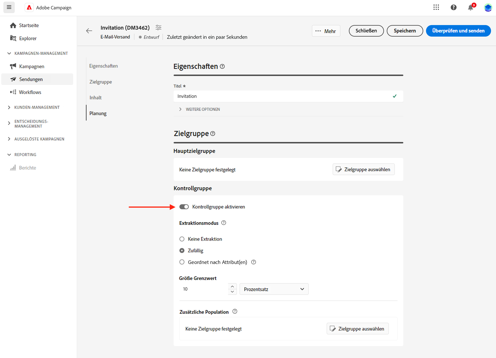

# Einrichten einer Kontrollgruppe {#control-group}

>[!NOTE]
>
>Diese Dokumentation wird derzeit erstellt und häufig aktualisiert. Die endgültige Version dieses Inhalts wird im Januar 2023 vorliegen.

Mithilfe von Kontrollgruppen können Sie vermeiden, dass Nachrichten an einen Teil Ihrer Audience gesendet werden, um die Wirkung Ihrer Kampagnen zu messen.

Erstellen Sie dazu eine Kontrollgruppe, wenn Sie die Audience Ihres Versands definieren. Profile werden der Kontrollgruppe nach dem Zufallsprinzip hinzugefügt, gefiltert oder ungefiltert oder auf der Grundlage von Kriterien. Sie können dann das Verhalten der Zielgruppe, die die Nachricht erhalten hat, mit dem Verhalten der Kontakte vergleichen, die nicht in der Zielgruppe enthalten waren.

Die Kontrollgruppe kann nach dem Zufallsprinzip aus der Hauptzielgruppe extrahiert und/oder aus einer bestimmten Population ausgewählt werden. Daher gibt es zwei Möglichkeiten, eine Kontrollgruppe zu definieren:

* Extrahieren Sie eine Reihe von Profilen aus der Hauptzielgruppe.
* Schließen Sie einige Profile basierend auf in einer Abfrage definierten Kriterien aus.

Beim Definieren einer Kontrollgruppe können Sie beide Methoden verwenden.

Alle Profile, die bei der Vorbereitung des Versands in die Kontrollgruppe eingehen, werden aus der Hauptzielgruppe entfernt. Sie erhalten die Nachricht nicht, nachdem diese gesendet wurde.

Um eine Kontrollgruppe zu erstellen, klicken Sie im Abschnitt **Audience** des Assistenten zur Versanderstellung auf die Schaltfläche **[!UICONTROL Kontrollgruppe festlegen]**.

## Aus Zielgruppe extrahieren {#extract-target}

>[!CONTEXTUALHELP]
>id="acw_deliveries_email_controlgroup_target"
>title="Aus Zielgruppe extrahieren"
>abstract="TBC"

Um eine Kontrollgruppe zu definieren, können Sie nach dem Zufallsprinzip oder basierend auf einer Sortierung einen Prozentsatz oder eine feste Anzahl von Profilen aus der Zielgruppe extrahieren.

Definieren Sie zunächst, wie die Profile aus der Zielgruppe extrahiert werden: zufällig oder basierend auf einer Sortierung.

Wählen Sie im Abschnitt **Aus Zielgruppe extrahieren** einen **Ausschlusstyp**:

* **Zufällige Auswahl**:: Beim Vorbereiten des Versands extrahiert Adobe Campaign nach dem Zufallsprinzip eine Anzahl von Profilen, die dem Prozentwert oder der maximalen Anzahl entsprechen, die Sie als Größenbeschränkung festlegen.

   

* **Nach Attribut(en) sortiert**: Mit dieser Option können Sie eine Gruppe von Profilen ausschließen, die auf bestimmten Attributen in einer bestimmten Sortierreihenfolge basieren.

   

Definieren Sie dann die **Größenbeschränkung**: Hierzu müssen Sie festlegen, wie Sie die Anzahl der Profile begrenzen, die Sie aus der Hauptzielgruppe extrahieren.

## Zusätzliche Population {#extra-population}

>[!CONTEXTUALHELP]
>id="acw_deliveries_email_controlgroup_extra"
>title="Zusätzliche Population"
>abstract="TBC"

Eine andere Möglichkeit, eine Kontrollgruppe zu definieren, besteht darin, eine bestimmte Population mithilfe einer bestehenden Audience oder durch Definieren einer Abfrage aus der Zielgruppe auszuschließen.

Klicken Sie im Abschnitt **Zusätzliche Population** des Definitionsbildschirms der **Kontrollgruppe** auf die Schaltfläche **[!UICONTROL Audience auswählen]**.

* Um eine vorhandene Audience zu verwenden, klicken Sie auf **Audience auswählen**. Näheres dazu finden Sie in [diesem Abschnitt](add-audience.md).

* Um eine neue Abfrage zu definieren, wählen Sie **Eigene erstellen** und definieren Sie die Ausschlusskriterien mithilfe von Segment Builder. Näheres dazu finden Sie in [diesem Abschnitt](segment-builder.md).

Die in der Audience enthaltenen oder dem Ergebnis der Abfrage entsprechenden Profile werden aus der Zielgruppe ausgeschlossen.