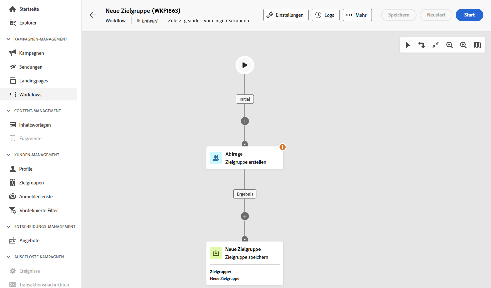
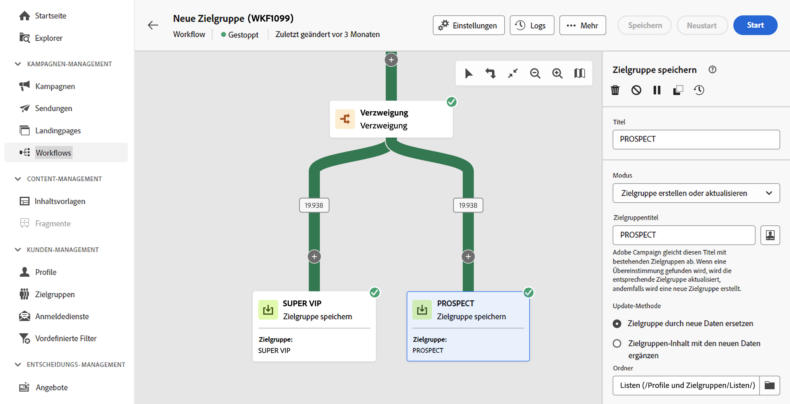

# Erstellen von Zielgruppen {#create-audiences}

>[!CONTEXTUALHELP]
>id="acw_audiences_list"
>title="Zielgruppen"
>abstract="Auf diesem Bildschirm kann die Liste aller Zielgruppen aufgerufen werden, die in Workflows oder eigenständigen Sendungen ausgewählt werden können. Klicken Sie auf **Erstellen**, um eine neue Zielgruppe in einer visuellen Arbeitsfläche zu erstellen.  Sie können nicht nur von Grund auf eine neue einfache Zielgruppe erstellen, sondern auch Workflow-Aktivitäten nutzen, um Ihre Zielgruppe genauer zu bestimmen. Sie können beispielsweise mehrere Zielgruppen zu einer einzigen zusammenfassen, Ihre Zielgruppe mit externen Attributen anreichern oder eine Zielgruppe basierend auf Regeln Ihrer Wahl in mehrere Zielgruppen unterteilen."

<!--
[!CONTEXTUALHELP]
>id="acw_audiences_create_settings"
>title="Audience settings"
>abstract="Enter the name of the audience and additional options, then click the **Create Audience** button."-->

Mit Campaign Web können Sie neue Zielgruppen in einer visuellen Workflow-Arbeitsfläche erstellen. Sie können nicht nur von Grund auf eine einfache Zielgruppe erstellen, sondern auch Workflow-Aktivitäten nutzen, um Ihre Zielgruppe zu präzisieren. Sie können beispielsweise mehrere Zielgruppen zu einer einzigen zusammenfassen, Ihre Zielgruppe mit externen Attributen anreichern oder eine Zielgruppe basierend auf Regeln Ihrer Wahl in mehrere Zielgruppen unterteilen.

Nachdem Sie Ihren Workflow erstellt haben, werden die resultierenden Zielgruppen automatisch in der Campaign-Datenbank zusammen mit den bereits vorhandenen Zielgruppen gespeichert. Diese Zielgruppen können dann in Workflows oder in eigenständigen Sendungen ausgewählt werden.

Die Spalte **[!UICONTROL Herkunft]** gibt die Herkunft der Zielgruppen an: **[!UICONTROL Adobe Campaign]**-Zielgruppen werden in der Adobe Campaign v8-Konsole oder der Web-Benutzeroberfläche erstellt, während **[!UICONTROL Adobe Experience Platform]**-Zielgruppen in Adobe Experience Platform erstellt und durch Integration von Adobe-Quellen und -Zielen in Campaign integriert werden.

➡️ [Entdecken Sie diese Funktion im Video](#video)

## Erstellen Ihrer ersten Zielgruppe {#create}

Gehen Sie wie folgt vor, um eine Zielgruppe zu erstellen:

1. Navigieren Sie zum Menü **[!UICONTROL Zielgruppen]** und klicken Sie oben rechts auf die Schaltfläche **[!UICONTROL Zielgruppe erstellen]**.

1. Es wird automatisch ein neuer Workflow erstellt, der es Ihnen ermöglicht, Aktivitäten zu kombinieren, um Ihre Zielgruppe zu generieren. Standardmäßig enthält die Arbeitsfläche zwei Hauptaktivitäten:

   * Die Aktivität **[!UICONTROL Zielgruppe erstellen]** von „Abfrage“ ist der Ausgangspunkt Ihres Workflows. Damit können Sie eine Zielgruppe erstellen und als Grundlage für Ihren Workflow verwenden.

   * Die Aktivität **[!UICONTROL Zielgruppe speichern]** von „Neue Zielgruppe“ ist der letzte Schritt in Ihrem Workflow. Mit diesem können Sie die Workflow-Ergebnisse als neue Zielgruppe speichern.

   {zoomable="yes"}

   >[!IMPORTANT]
   >
   >Zielgruppen-Workflows werden im Menü **Workflows** neben Ihren anderen Kampagnen-Workflows gespeichert. Sie sind speziell für den Aufbau einer Zielgruppe konzipiert und können an ihrer vertikalen Arbeitsfläche identifiziert werden.

1. Ändern Sie zugunsten einer besseren Lesbarkeit den Namen des Workflows in den Workflow-Einstellungen im Feld **Label**. [Erfahren Sie, wie Sie Workflow-Einstellungen konfigurieren](../workflows/workflow-settings.md)

1. Öffnen Sie die Aktivität **[!UICONTROL Zielgruppe erstellen]** und verwenden Sie den Abfrage-Modeler, um die Population zu definieren, die in Ihre Zielgruppe aufgenommen werden soll, indem Sie die in der Datenbank enthaltenen Daten filtern. [Erfahren Sie, wie Sie die Aktivität „Zielgruppe erstellen“ konfigurieren können](../workflows/activities/build-audience.md)

1. Wenn Sie mit dem Workflow zusätzliche Vorgänge für die Zielpopulation durchführen möchten, fügen Sie so viele Aktivitäten wie erforderlich hinzu und verbinden Sie sie miteinander. Weitere Informationen zur Konfiguration von Workflow-Aktivitäten finden Sie in der [Dokumentation zu Workflows](../workflows/activities/about-activities.md).

   >[!NOTE]
   >
   >Kanalaktivitäten stehen nicht zur Verwendung in Zielgruppen-Workflows zur Verfügung.

   {zoomable="yes"}

1. Konfigurieren Sie die Aktivität **[!UICONTROL Zielgruppe speichern]**, um anzugeben, wie die zuvor im Workflow berechnete Population gespeichert werden soll. [Erfahren Sie, wie Sie eine Aktivität „Zielgruppe speichern“ konfigurieren können](../workflows/activities/save-audience.md)

1. Wenn Ihr Workflow bereit ist, klicken Sie auf **[!UICONTROL Starten]**, um ihn auszuführen.

Der Workflow wird in der Liste **[!UICONTROL Workflows]** gespeichert, während die resultierende(n) Zielgruppe(n) in der Liste **[!UICONTROL Zielgruppen]** unter dem in der Aktivität **Zielgruppe speichern** definierten Titel zugänglich sind. Erfahren Sie [in diesem Abschnitt](manage-audience.md), wie Sie Zielgruppen überwachen und verwalten.

Jetzt können Sie diese Zielgruppe als Hauptzielgruppe eines Versands verwenden. [Weitere Informationen](add-audience.md)

## Beispiel für einen Zielgruppen-Workflow {#example}

Das folgende Beispiel zeigt einen Zielgruppen-Workflow, der so konfiguriert ist, dass Kundinnen, die in New York leben, ausgewählt werden und je nach ihrem letzten Kauf (Joga- oder Laufkleidung) zwei neue Zielgruppen erstellt werden.

{zoomable="yes"}

1. Die Aktivität **[!UICONTROL Zielgruppe erstellen]** richtet sich an alle in New York lebenden weiblichen Profile.
1. Die Aktivität **[!UICONTROL Anreicherung]** erweitert die Zielgruppe um Informationen aus der Tabelle „Käufe“, um zu ermitteln, welcher Produkttyp von den Kundinnen gekauft wurde.
1. Die Aktivität **[!UICONTROL Aufspaltung]** unterteilt den Workflow in zwei Pfade, die auf dem aktuellen Kauf der Kundinnen basieren.
1. Die Aktivitäten **[!UICONTROL Zielgruppe speichern]** am Ende jedes Pfads erstellen zwei neue Zielgruppen in der Datenbank, einschließlich der in jedem Pfad berechneten Population.

## Bearbeiten einer Zielgruppe {#edit}

Sie können eine aus einem Workflow generierte Zielgruppe bei Bedarf ändern, indem Sie den entsprechenden Workflow erneut ausführen. So können Sie die Daten der Zielgruppe aktualisieren oder die Zielgruppe verfeinern, indem Sie die Abfrage an Ihre Bedürfnisse anpassen.

1. Navigieren Sie zum Menü **Zielgruppen** und öffnen Sie die Zielgruppe, die Sie bearbeiten möchten.
1. Auf der Registerkarte **Übersicht** enthält der Abschnitt **Letzter Workflow** einen Link zu dem Workflow, der zur Erstellung der Zielgruppe verwendet wurde. Klicken Sie darauf, um auf den Workflow zuzugreifen.
1. Nehmen Sie die gewünschten Änderungen vor und klicken Sie auf die Schaltfläche **Start**, um den Workflow erneut auszuführen. Nach Abschluss des Workflows wird die Zielgruppe automatisch mit den neuesten Ergebnissen des Workflows aktualisiert.

Standardmäßig wird bei der erneuten Ausführung eines Zielgruppen-Workflows der gesamte Inhalt der Zielgruppe durch neue Daten ersetzt, was zum Verlust der vorherigen Daten führt.

Wenn Sie die vorherigen Zielgruppenergebnisse nicht ersetzen möchten, konfigurieren Sie die Aktivitäten **Zielgruppe speichern** entsprechend dementsprechend. Sie können beispielsweise das Feld **Zielgruppen-Label** ändern, um die neuen Ergebnisse in einer neuen Zielgruppe zu speichern, oder die neuen Ergebnisse zu den bestehenden Zielgruppeninhalten hinzufügen, ohne die vorherigen Daten zu löschen. [Erfahren Sie, wie Sie eine Aktivität „Zielgruppe speichern“ konfigurieren können](../workflows/activities/save-audience.md)

{zoomable="yes"}

## Anleitungsvideo {#video}

Erfahren Sie, wie Sie Zielgruppen erstellen und verwalten, wie Sie Zielgruppen für einen Versand auswählen und Kontrollgruppen definieren.

>[!VIDEO](https://video.tv.adobe.com/v/3453211?quality=12&captions=ger)