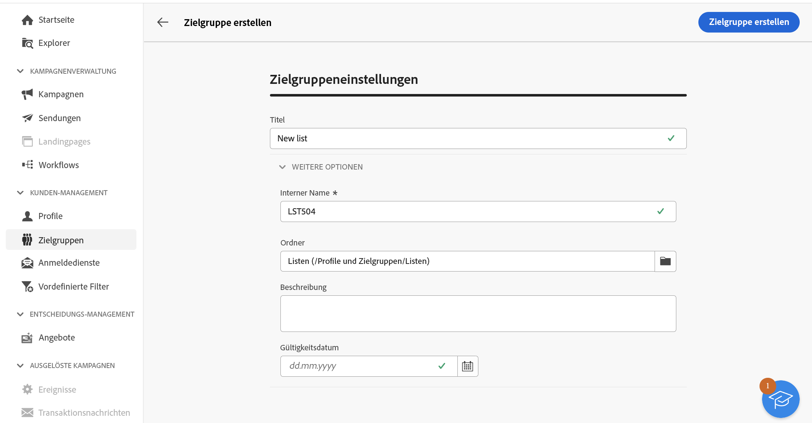
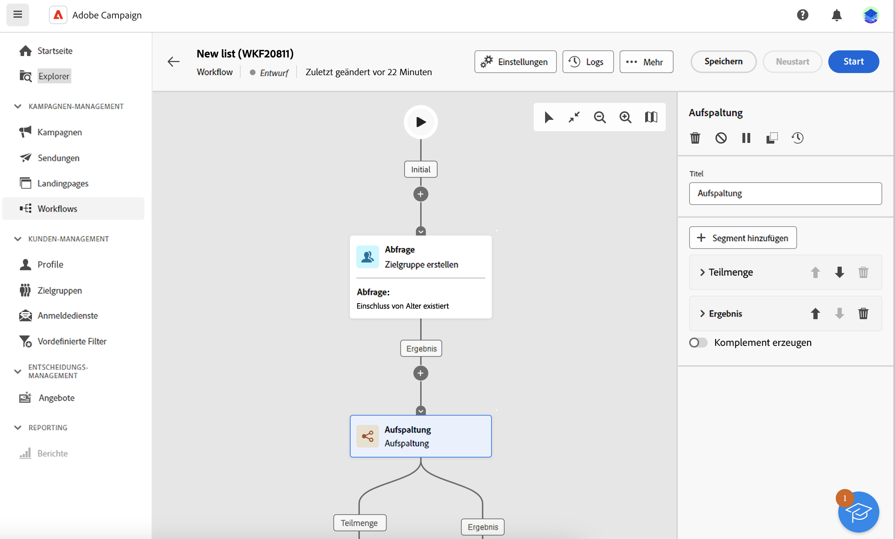
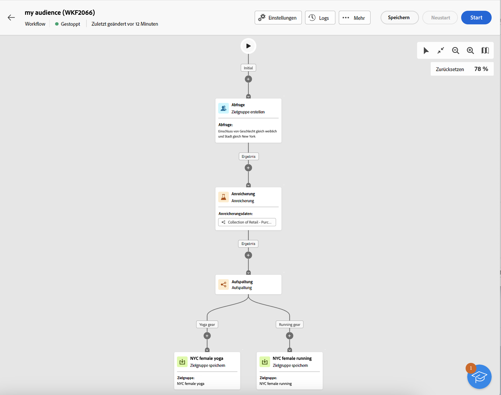

# Erstellen von Zielgruppen {#create-audiences}

>[!CONTEXTUALHELP]
>id="acw_audiences_list"
>title="Zielgruppen"
>abstract="Auf diesem Bildschirm kann die Liste aller Zielgruppen aufgerufen werden, die in Ihren Sendungen ausgewählt werden können. Auf **Erstellen** klicken, um mithilfe verschiedener Workflow-Aktivitäten, wie z. B. **Aufspaltung** oder **Ausschließen**, neue Zielgruppen zu erstellen."

>[!CONTEXTUALHELP]
>id="acw_audiences_create_settings"
>title="Zielgruppeneinstellungen"
>abstract="Geben Sie den Namen der Zielgruppe und weitere Optionen ein und klicken Sie auf die Schaltfläche **Zielgruppe erstellen**."

Mit Campaign Web können Sie neue Zielgruppen in einer visuellen Workflow-Arbeitsfläche erstellen. Sie können nicht nur von Grund auf eine einfache Zielgruppe erstellen, sondern auch Workflow-Aktivitäten nutzen, um Ihre Zielgruppe zu präzisieren. Sie können beispielsweise mehrere Zielgruppen zu einer einzigen zusammenfassen, Ihre Zielgruppe mit externen Attributen anreichern oder eine Zielgruppe basierend auf Regeln Ihrer Wahl in mehrere Zielgruppen unterteilen.

Nachdem Sie Ihren Workflow erstellt haben, werden die resultierenden Zielgruppen automatisch in der Campaign-Datenbank zusammen mit den bereits vorhandenen Zielgruppen gespeichert. Diese Zielgruppen können dann in Workflows oder in eigenständigen Sendungen ausgewählt werden.

## Erstellen Ihrer ersten Zielgruppe {#create}

Gehen Sie wie folgt vor, um eine Zielgruppe zu erstellen:

1. Navigieren Sie zum Menü **[!UICONTROL Zielgruppen]** und klicken Sie auf die Schaltfläche **[!UICONTROL Zielgruppe erstellen]** oben rechts.
1. Geben Sie einen Titel für Ihre Zielgruppe an.
1. Erweitern Sie den Abschnitt **[!UICONTROL Zusätzliche Optionen]**, um die erweiterten Zielgruppenparameter zu konfigurieren.

   Standardmäßig werden Zielgruppen im Explorer-Menü **[!UICONTROL Profile und Zielgruppen]**/**[!UICONTROL Listen]** erstellt. Sie können den standardmäßigen Speicherort mithilfe des Feldes **[!UICONTROL Ordner]** ändern.

   

1. Nachdem Sie die Zielgruppeneinstellungen konfiguriert haben, klicken Sie auf die Schaltfläche **[!UICONTROL Zielgruppe erstellen]**. Es wird eine Workflow-Arbeitsfläche mit zwei Standardaktivitäten angezeigt:

   * **[!UICONTROL Zielgruppe erstellen]**: Dies ist der Ausgangspunkt Ihres Workflows, mit dem Sie eine Zielgruppe erstellen und als Grundlage für Ihren Workflow verwenden können.

   * **[!UICONTROL Zielgruppe speichern]**: Dies ist der letzte Schritt in Ihrem Workflow, mit dem Sie die Workflow-Ergebnisse als neue Zielgruppe speichern können.

1. Öffnen Sie die Aktivität **[!UICONTROL Zielgruppe erstellen]** und verwenden Sie den Regel-Builder, um die Population zu definieren, die in Ihre Zielgruppe aufgenommen werden soll, indem Sie die in der Datenbank enthaltenen Daten filtern. [Erfahren Sie, wie Sie eine Aktivität „Zielgruppe erstellen“ konfigurieren können](../workflows/activities/build-audience.md)

1. Wenn Sie mit dem Workflow zusätzliche Vorgänge für die Zielpopulation durchführen möchten, fügen Sie so viele Aktivitäten wie erforderlich hinzu und verbinden Sie sie miteinander. Weiterführende Informationen zur Konfiguration von Workflow-Aktivitäten finden Sie in der [Dokumentation zu Workflows](../workflows/activities/about-activities.md).

   >[!NOTE]
   >
   >Kanalaktivitäten stehen nicht zur Verwendung in Zielgruppen-Workflows zur Verfügung.

   

1. Konfigurieren Sie die Aktivität **[!UICONTROL Zielgruppe speichern]**, um anzugeben, wie die zuvor im Workflow berechnete Population gespeichert werden soll. [Erfahren Sie, wie Sie eine Aktivität „Zielgruppe speichern“ konfigurieren können](../workflows/activities/save-audience.md)

1. Wenn Ihr Workflow bereit ist, klicken Sie auf **[!UICONTROL Starten]**, um ihn auszuführen.

Der Workflow wird in der Liste **[!UICONTROL Workflows]** gespeichert, während die resultierenden Zielgruppen in der Liste **[!UICONTROL Zielgruppen]** gespeichert werden. [Erfahren Sie, wie Sie Zielgruppen überwachen und verwalten](manage-audience.md)

Jetzt können Sie diese Zielgruppe als Hauptzielgruppe eines Versands verwenden. [Weitere Informationen](add-audience.md)

## Beispiel für einen Zielgruppen-Workflow {#example}

Das folgende Beispiel zeigt einen Zielgruppen-Workflow, der so konfiguriert ist, dass Kundinnen, die in New York leben, ausgewählt werden und je nach ihrem letzten Kauf (Joga- oder Laufkleidung) zwei neue Zielgruppen erstellt werden.

1. Die Aktivität **[!UICONTROL Zielgruppe erstellen]** richtet sich an alle in New York lebenden weiblichen Profile.
1. Die Aktivität **[!UICONTROL Anreicherung]** erweitert die Zielgruppe um Informationen aus der Tabelle „Käufe“, um zu ermitteln, welcher Produkttyp von den Kundinnen gekauft wurde.
1. Die Aktivität **[!UICONTROL Aufspaltung]** unterteilt den Workflow in zwei Pfade, die auf dem aktuellen Kauf der Kundinnen basieren.
1. Die Aktivitäten **[!UICONTROL Zielgruppe speichern]** am Ende jedes Pfads erstellen zwei neue Zielgruppen in der Datenbank, einschließlich der in jedem Pfad berechneten Population.
