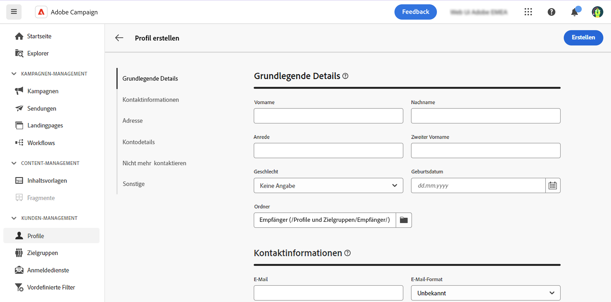

# Erstellen eines Profils {#profiles}

>[!CONTEXTUALHELP]
>id="acw_recipients_creation_details"
>title="Grundlegende Details"
>abstract="Dieser Abschnitt bietet Einblicke in die grundlegenden Profildetails. Um Informationen zu ändern, die gewünschten Änderungen direkt im entsprechenden Feld vornehmen und auf die **Speichern** -Schaltfläche in der oberen rechten Ecke des Bildschirms klicken."

>[!CONTEXTUALHELP]
>id="acw_recipients_creation_contactinformation"
>title="Kontaktinformationen"
>abstract="Dieser Abschnitt bietet Einblicke in die Kontaktinformationen des Profils. Um Informationen zu ändern, die gewünschten Änderungen direkt im entsprechenden Feld vornehmen und auf die **Speichern** -Schaltfläche in der oberen rechten Ecke des Bildschirms klicken."

>[!CONTEXTUALHELP]
>id="acw_recipients_creation_address"
>title="Adresse"
>abstract="Dieser Abschnitt bietet Einblicke in die Postanschrift und die Adressenqualität des Profils. Um Informationen zu ändern, die gewünschten Änderungen direkt im entsprechenden Feld vornehmen und auf die **Speichern** -Schaltfläche in der oberen rechten Ecke des Bildschirms klicken."

>[!CONTEXTUALHELP]
>id="acw_recipients_creation_account"
>title="Kontodetails"
>abstract="Dieser Abschnitt bietet Einblicke in die Kontodetails des Profils. Um Informationen zu ändern, die gewünschten Änderungen direkt im entsprechenden Feld vornehmen und auf die **Speichern** -Schaltfläche in der oberen rechten Ecke des Bildschirms klicken."

>[!CONTEXTUALHELP]
>id="acw_recipients_creation_nolongercontact"
>title="Empfänger – Nicht mehr kontaktieren"
>abstract="Dieser Abschnitt bietet Einblicke in die Kontaktvoreinstellungen des Profils. Um Informationen zu ändern, die gewünschten Änderungen direkt im entsprechenden Feld vornehmen und auf die **Speichern** -Schaltfläche in der oberen rechten Ecke des Bildschirms klicken."

>[!CONTEXTUALHELP]
>id="acw_recipients_creation_customfields"
>title="Benutzerdefinierte Felder"
>abstract="Benutzerdefinierte Felder sind spezifische Attribute, die auf Ihre Anforderungen zugeschnitten sind und für Ihre Instanz konfiguriert wurden. Um Informationen zu ändern, die gewünschten Änderungen direkt im entsprechenden Feld vornehmen und auf die **Speichern** -Schaltfläche in der oberen rechten Ecke des Bildschirms klicken."

>[!CONTEXTUALHELP]
>id="acw_recipients_creation_othersfields"
>title="Sonstige"
>abstract="Dieser Abschnitt enthält zusätzliche integrierte Attribute. Um Informationen zu ändern, die gewünschten Änderungen direkt im entsprechenden Feld vornehmen und auf die **Speichern** -Schaltfläche in der oberen rechten Ecke des Bildschirms klicken."

Gehen Sie wie folgt vor, um ein Profil zu erstellen:

1. Navigieren Sie zu **[!UICONTROL Kundenverwaltung]** > **[!UICONTROL Profile]** und klicken Sie auf **[!UICONTROL Profil erstellen]** in der oberen rechten Ecke des Bildschirms.

1. Die Liste der für die Profilanzeige verfügbaren Attribute, die in verschiedene Abschnitte unterteilt sind, die in der folgenden Tabelle beschrieben sind.

   

   | Abschnitt &quot;Attribute&quot; | Beschreibung |
   |  ---  |  ---  |
   | **Grundlegende Details** | Grundlegende Informationen zum Profil, z. B. Name oder Geburtsdatum. Standardmäßig werden Profile im **[!UICONTROL Empfänger]** Ordner. Sie können ihn ändern, indem Sie zum gewünschten Speicherort navigieren. [Erfahren Sie mehr über die Arbeit mit Ordnern](../get-started/permissions.md#folders) |
   | **Kontaktangaben** | Die Kontaktinformationen des Profils, z. B. die E-Mail-Adresse oder Telefonnummer. |
   | **Adresse** | Postanschrift des Profils. Dieser Abschnitt enthält auch eine Bewertung der Adressqualität. Die Adresse eines Profils gilt als gültig, wenn die Felder &quot;Nachname&quot;, &quot;Stadt&quot;und &quot;Postleitzahl&quot;angegeben sind. |
   | **Kontodetails** | Informationen zum Konto des Profils, z. B. dessen Status oder Kontonummer. |
   | **No longer contact** | Die Kontakteinstellungen des Profils. Wenn eine dieser Optionen ausgewählt ist, befindet sich das Profil auf der Blockierungsliste. Wenn der Empfänger beispielsweise in einem Newsletter auf einen Abmelde-Link geklickt hat, werden diese Informationen zu den Kontaktdaten hinzugefügt. Eine solche Person gehört nicht mehr zur Zielgruppe für die ausgewählten Kanäle. Weitere Informationen zur Quarantäneverwaltung in [Dokumentation zu Adobe Campaign v8](https://experienceleague.adobe.com/docs/campaign/campaign-v8/send/failures/quarantines.html?lang=de){target="_blank"} |
   | **Benutzerdefinierte Felder** | Wenn benutzerdefinierte Felder konfiguriert wurden, werden sie in diesem Abschnitt angezeigt. Benutzerdefinierte Felder sind zusätzliche Attribute, die über die Adobe Campaign-Konsole zum Schema **[!UICONTROL Profile]** hinzugefügt werden. Weitere Informationen finden Sie unter [Dokumentation zu Adobe Campaign v8](https://experienceleague.adobe.com/docs/campaign/campaign-v8/developer/shemas-forms/extend-schema.html?lang=de){target="_blank"} |
   | **Sonstige** | Zusätzliche integrierte Attribute. |

1. Nachdem Sie das Profil konfiguriert haben, klicken Sie auf **[!UICONTROL Erstellen]** , um sie in der Datenbank zu speichern.

   Danach können Sie das Profil jederzeit bearbeiten, indem Sie es in der Profilliste öffnen. [Erfahren Sie, wie Sie die Profildetails durchsuchen können.](profile-view.md)
