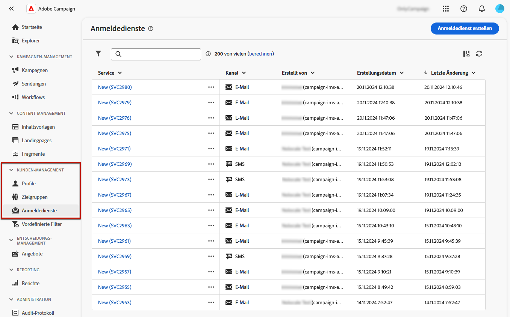

# Arbeiten mit Abonnementdiensten {#create-services}

>[!CONTEXTUALHELP]
>id="acw_subscription_services_read_only"
>title="Dieser Service ist schreibgeschützt"
>abstract="Keine Berechtigung, diesen Service zu bearbeiten. Bei Bedarf Admin kontaktieren, um Zugriff zu erhalten."

Verwenden Sie Adobe Campaign, um Ihre Dienste wie z. B. Newsletter zu erstellen und zu überwachen und die An- und Abmeldungen dieser Dienste zu überprüfen. Abonnements gelten nur für E-Mail- und SMS-Sendungen.

Es können mehrere Dienste parallel definiert werden, z. B. Newsletter für bestimmte Produktkategorien, Themen oder Bereiche einer Website, Abonnements für verschiedene Arten von Warnhinweisen und Echtzeit-Benachrichtigungen.

Weiterführende Informationen zur Verwaltung von An- und Abmeldungen finden Sie im Abschnitt [Dokumentation zu Campaign v8 (Clientkonsole)](https://experienceleague.adobe.com/docs/campaign/campaign-v8/audience/subscriptions.html){target="_blank"}.

## Anmeldedienste aufrufen {#access-services}

Um auf die für Ihre Plattform verfügbaren Anmeldedienste zuzugreifen, navigieren Sie zu **[!UICONTROL Abonnementdienste]** in der linken Navigationsleiste.

Die Liste aller vorhandenen Anmeldedienste wird angezeigt. Sie können die Dienste durchsuchen und nach Kanal, Ordner oder erweiterten Filtern filtern.

## Erstellen des ersten Abonnementdienstes {#create-service}

Gehen Sie wie folgt vor, um einen Abonnementdienst zu erstellen:

1. Wählen Sie die **[!UICONTROL Abonnement-Dienst erstellen]** Schaltfläche.

   

1. Wählen Sie einen Kanal aus. **[!UICONTROL Email]** und **[!UICONTROL SMS]** verfügbar sind.

1. Geben Sie in den Diensteigenschaften einen Titel ein und definieren Sie bei Bedarf zusätzliche Optionen.

   

1. Wählen Sie die Bestätigungsnachrichten aus.

   

1. Klicks **[!UICONTROL Speichern und überprüfen]**.

