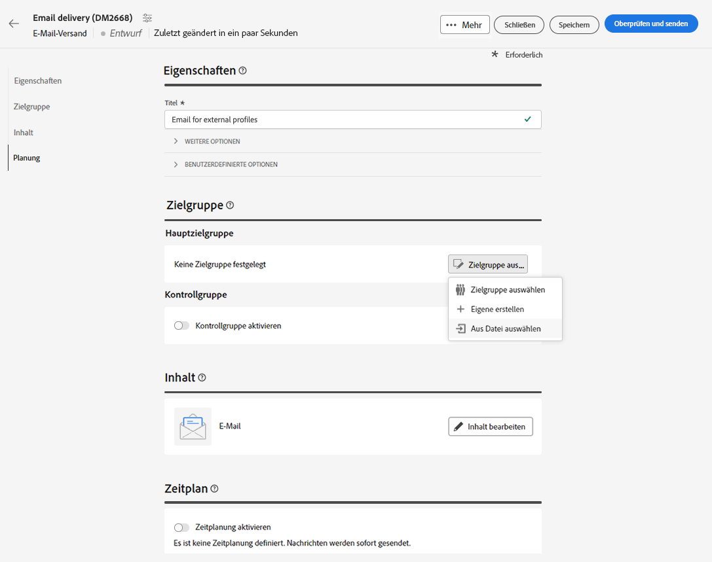
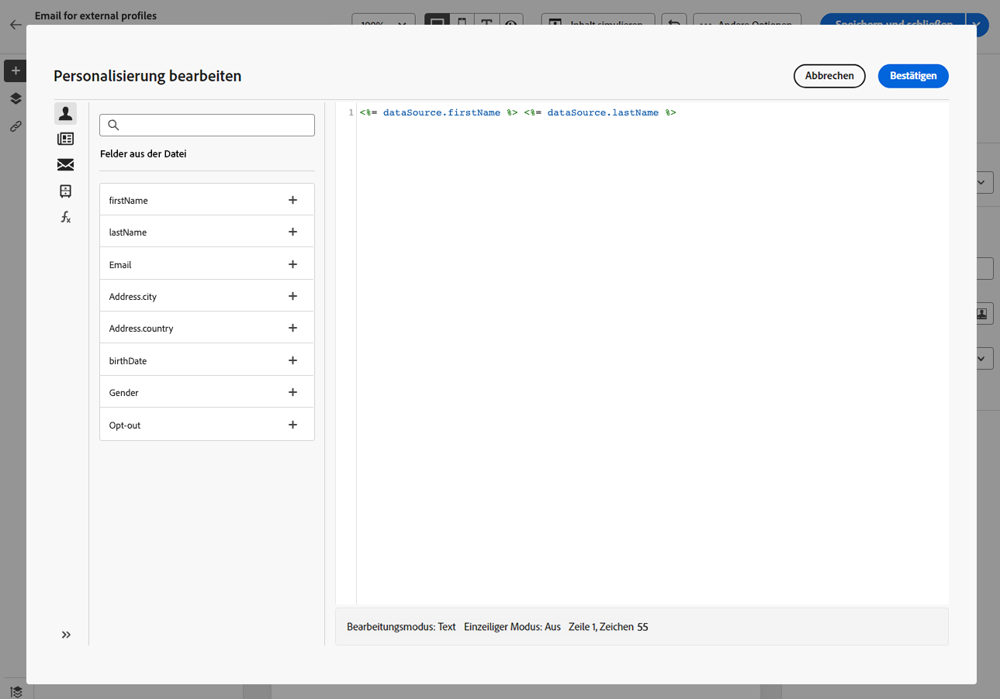

# E-Mail-Audience aus einer Datei laden {#audience-from-file}

>[!CONTEXTUALHELP]
>id="acw_audience_fromfile_select"
>title="Datei auswählen"
>abstract="Wählen Sie die hochzuladende lokale Datei aus. Unterstützte Formate sind TXT und CSV. Passen Sie Ihr Dateiformat an die unten verlinkte Beispieldatei an."

>[!CONTEXTUALHELP]
>id="acw_audience_fromfile_columns"
>title="Spaltendefinition"
>abstract="Überprüfen Sie das Format der Spalten, die aus Ihrer lokalen Datei eingefügt werden sollen."

>[!CONTEXTUALHELP]
>id="acw_audience_fromfile_formatting"
>title="Formatierungsparameter"
>abstract="Überprüfen Sie die Formatierungsparameter für Ihre Datei."

Sie können Kontakte aus einer externen Datei hochladen. Profile werden nicht zur Datenbank hinzugefügt, aber alle Felder in der Eingabedatei stehen zur Verfügung für [Personalisierung](../personalization/gs-personalization.md). Unterstützte Dateiformate sind: Text (TXT) und kommagetrennte Werte (CSV).

>[!CAUTION]
>
>* Diese Funktion ist nur verfügbar für **Einzelne E-Mail-Sendungen**. Sie kann nicht in Workflows oder in SMS- oder Push-Sendungen verwendet werden.
>
>* Sie können [Kontrollgruppen](control-group.md) beim Laden der Zielpopulation aus einer externen Datei.


Gehen Sie wie folgt vor, um Profile aus einer lokalen Datei direkt über die E-Mail-Oberfläche auszuwählen:

1. Öffnen Sie einen vorhandenen E-Mail-Versand oder [Erstellen eines neuen E-Mail-Versands](../email/create-email.md).
1. Wählen Sie im Fenster zur Erstellung des E-Mail-Versands im **Zielgruppe** klicken Sie auf die **Zielgruppe auswählen** und wählen Sie die **Aus Datei auswählen** -Option.

   

1. Wählen Sie die hochzuladende lokale Datei aus. Das Format muss mit der [Beispieldatei](#sample-file).
1. Im mittleren Bereich des Bildschirms können Sie eine Vorschau der Daten anzeigen und deren Zuordnung überprüfen.
1. Wählen Sie die Spalte aus, die die E-Mail-Adresse enthält. **Adressfeld** Dropdown-Liste. Sie können auch die Spalte Blockierungsliste auswählen, wenn diese Informationen in der Eingabedatei enthalten sind.
1. Passen Sie die Spalteneinstellungen an und wie Daten aus den verfügbaren Optionen formatiert werden.
1. Klicken Sie auf **Bestätigen**, wenn die Einstellungen korrekt sind.

Bei der Erstellung und Personalisierung des Nachrichteninhalts können Sie Felder aus der Eingabedatei im [Personalisierungseditor](../personalization/gs-personalization.md).




## Beispieldatei {#sample-file}

>[!CONTEXTUALHELP]
>id="acw_audience_fromfile_samplefile"
>title="Beispieldatei"
>abstract="Unterstützte Dateiformate: txt, csv. Erste Zeile für Spaltentitel verwenden."

Unterstützte Formate sind TXT und CSV. Die erste Zeile ist die Spaltenüberschrift.

Passen Sie Ihr Dateiformat an die folgende Beispieldatei an:

```javascript
{
lastname,firstname,city,birthdate,email,denylist
Smith,Hayden,Paris,23/05/1985,hayden.smith@example.com,0
Mars,Daniel,London,17/11/1999,danny.mars@example.com,0
Smith,Clara,Roma,08/02/1979,clara.smith@example.com,0
Durance,Allison,San Francisco,15/12/2000,allison.durance@example.com,1
}
```
