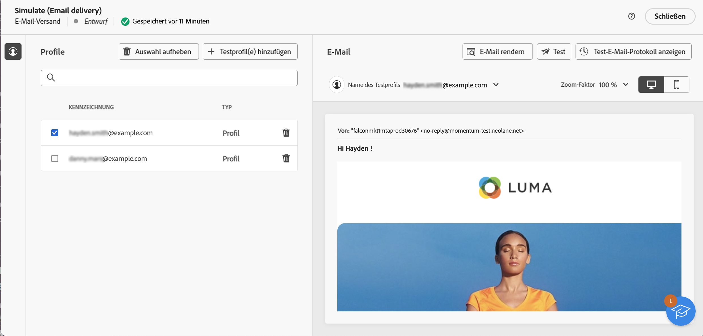
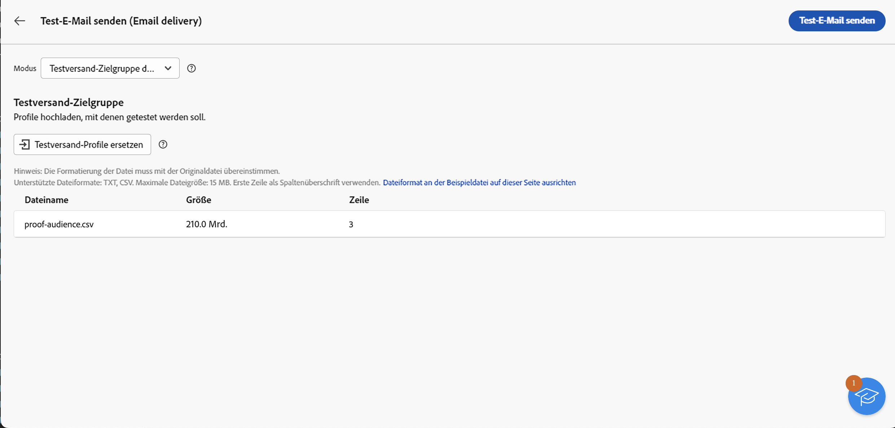

# Laden einer E-Mail-Zielgruppe aus einer Datei {#audience-from-file}

>[!CONTEXTUALHELP]
>id="acw_audience_fromfile_select"
>title="Auswahl der Datei"
>abstract="Wählen Sie die hochzuladende lokale Datei aus. Unterstützte Formate sind TXT und CSV. Richten Sie Ihr Dateiformat an der unten verlinkten Beispieldatei aus."

>[!CONTEXTUALHELP]
>id="acw_audience_fromfile_columns"
>title="Spaltendefinition"
>abstract="Überprüfen Sie das Spaltenformat der externen Datei."

>[!CONTEXTUALHELP]
>id="acw_audience_fromfile_formatting"
>title="Formatierungsparameter"
>abstract="Definieren Sie das Format der externen Datei, sodass die Daten korrekt importiert werden können."

>[!CONTEXTUALHELP]
>id="acw_audience_fromfile_preview"
>title="Anzeige der Datei in der Vorschau"
>abstract="Überprüfen Sie die Spaltenvorschau der externen Datei. Dieser Bildschirm zeigt nur maximal 30 Einträge an."

Zielprofile können auch in einer externen Datei gespeichert werden. Profile werden nicht zur Datenbank hinzugefügt, aber alle Felder in der Eingabedatei können [personalisiert](../personalization/gs-personalization.md) werden. Unterstützte Dateiformate sind: Text (TXT) und kommagetrennte Werte (CSV). In diesem Artikel wird beschrieben, wie Sie beim Erstellen eines eigenständigen E-Mail-Versands ein externes Profil laden. Informationen zum Laden von Daten aus einer Datei in einen Workflow finden Sie auf [dieser Seite](../workflows/activities/load-file.md).

>[!CAUTION]
>
>* Diese Funktion ist nur für den **E-Mail-Versand** verfügbar. Sie kann nicht bei SMS- oder Push-Sendungen verwendet werden.
>
>* Sie können keine [Kontrollgruppen](control-group.md) verwenden, wenn Sie die Zielgruppenpopulation aus einer externen Datei laden.
>
>* Profile werden nicht zur Datenbank hinzugefügt, sondern werden geladen und sind nur für diesen speziellen E-Mail-Versand verfügbar.

## Auswählen und Konfigurieren der Datei {#upload}

Gehen Sie wie folgt vor, um Profile aus einer lokalen Datei direkt über die E-Mail-Benutzeroberfläche anzuvisieren:

1. Öffnen Sie einen vorhandenen E-Mail-Versand oder [erstellen Sie einen neuen](../email/create-email.md).
1. Klicken Sie im Fenster zur Erstellung des E-Mail-Versands im Abschnitt **Zielgruppe** auf die Schaltfläche **Zielgruppe auswählen** und wählen Sie die Option **Aus Datei auswählen** aus.

   {zoomable=&quot;yes&quot;}

1. Wählen Sie die zu verwendende lokale Datei aus. Das Format muss der [Beispieldatei](#sample-file) entsprechen.
1. Im mittleren Abschnitt des Bildschirms können Sie eine Vorschau der Datenzuordnung anzeigen, um sie zu überprüfen.
1. Wählen Sie in der Dropdown-Liste **Adressfeld** die Spalte aus, die die E-Mail-Adresse enthält. Sie können auch die Spalte „Blockierungsliste“ auswählen, wenn diese Informationen in der Eingabedatei enthalten sind.
1. Passen Sie die Spalteneinstellungen an und wählen Sie aus den verfügbaren Optionen aus, wie Daten formatiert werden.
1. Klicken Sie auf **Bestätigen**, wenn die Einstellungen korrekt sind.

Bei der Erstellung und Personalisierung des Nachrichteninhalts können Sie im [Personalisierungseditor](../personalization/gs-personalization.md) Felder aus der Eingabedatei auswählen.

{zoomable=&quot;yes&quot;}

## Beispieldatei {#sample-file}

>[!CONTEXTUALHELP]
>id="acw_audience_fromfile_samplefile"
>title="Laden einer Zielgruppe aus einer Datei"
>abstract="Unterstützte Dateiformate sind TXT und CSV. Erste Zeile für Spaltentitel verwenden. Dateiformat an die Beispieldatei anpassen, die im folgenden Link bereitgestellt wird."

Unterstützte Formate sind TXT und CSV. Die erste Zeile ist die Spaltenüberschrift.

Passen Sie Ihr Dateiformat an die unten stehende Beispieldatei an:

```javascript
{
lastname,firstname,city,birthdate,email,denylist
Smith,Hayden,Paris,23/05/1985,hayden.smith@example.com,0
Mars,Daniel,London,17/11/1999,danny.mars@example.com,0
Smith,Clara,Roma,08/02/1979,clara.smith@example.com,0
Durance,Allison,San Francisco,15/12/2000,allison.durance@example.com,1
}
```

## Erstellen einer E-Mail-Vorschau und Testen einer E-Mail {#test}

Campaign Web ermöglicht Ihnen die Vorschau und das Versenden von Testsendungen, wenn Sie eine Zielgruppe verwenden, die aus einer Datei hochgeladen wurde. Gehen Sie dazu wie folgt vor:

1. Klicken Sie auf die **[!UICONTROL Schaltfläche „Inhalt simulieren“]** im Bearbeitungsbildschirm des Versandinhalts und klicken Sie dann auf die Schaltfläche **[!UICONTROL Testprofil(e) hinzufügen]**.

1. Die in der hochgeladenen Datei enthaltenen Profile werden angezeigt. Wählen Sie die Profile aus, die Sie für die Vorschau Ihres Inhalts verwenden möchten, und klicken Sie auf **[!UICONTROL Auswählen]**.

1. Eine Vorschau des Versandinhalts wird im rechten Bereich des Bildschirms angezeigt. Personalisierte Elemente werden durch die Daten aus dem Profil ersetzt, das im linken Bereich ausgewählt wurde. [Weitere Informationen zur Inhaltsvorschau eines Versands](../preview-test/preview-content.md)

   {zoomable=&quot;yes&quot;}

1. Um Testsendungen durchzuführen, klicken Sie auf die Schaltfläche **[!UICONTROL Testsendung durchführen]**.

1. Klicken Sie auf die Schaltfläche **[!UICONTROL Testprofile hochladen]** und wählen Sie die TXT- oder CSV-Datei aus, die Ihre Testversand-Empfängerinnen und -Empfänger enthält.

   >[!CAUTION]
   >
   >Stellen Sie sicher, dass das Dateiformat mit dem Format übereinstimmt, das für das Hochladen Ihrer Zielgruppe verwendet wird. Bei Formatfehlern wird ein Warnhinweis angezeigt.

1. Wenn die Testversand-Profile hinzugefügt wurden und Sie bereit sind, die Testsendungen durchzuführen, klicken Sie auf die Schaltfläche **[!UICONTROL Testversand durchführen]** und bestätigen dann das Senden.

   {zoomable=&quot;yes&quot;}

1. Sie können den Versand der Testsendung jederzeit mithilfe der Schaltfläche **[!UICONTROL Testsendung anzeigen]** überwachen. [Weitere Informationen zur Überwachung von Testsendungen](../preview-test/test-deliveries.md#access-test-deliveries)
