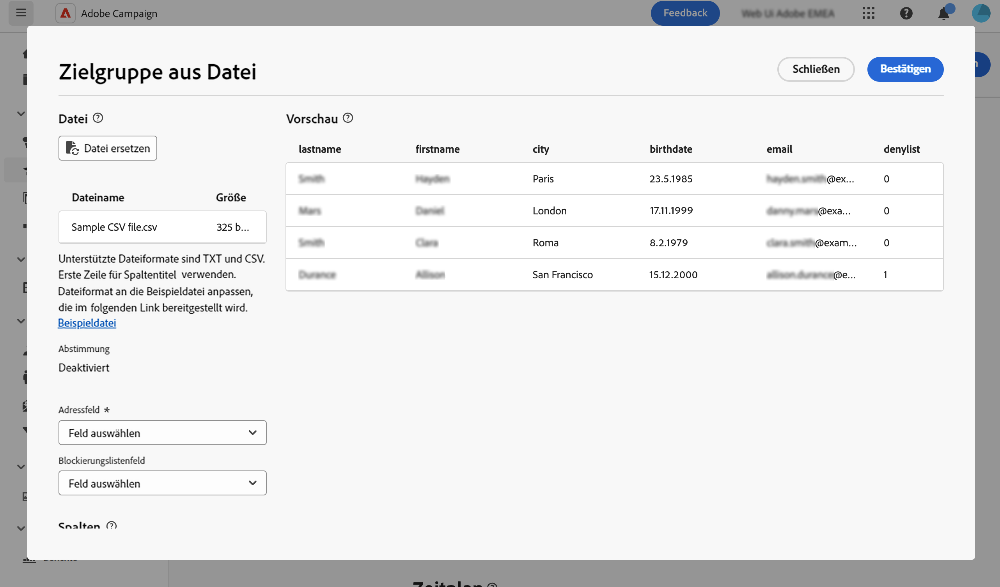

# Laden einer E-Mail-Zielgruppe aus einer Datei {#audience-from-file}

>[!CONTEXTUALHELP]
>id="acw_audience_fromfile_select"
>title="Auswahl der Datei"
>abstract="Die hochzuladende lokale Datei auswählen. Unterstützte Formate sind TXT und CSV. Das Dateiformat an die unten verlinkte Beispieldatei anpassen."

>[!CONTEXTUALHELP]
>id="acw_audience_fromfile_columns"
>title="Spaltendefinition"
>abstract="Überprüfen Sie das Spaltenformat der externen Datei."

>[!CONTEXTUALHELP]
>id="acw_audience_fromfile_formatting"
>title="Formatierungsparameter"
>abstract="Definieren Sie das Format der externen Datei, sodass die Daten korrekt importiert werden können."

>[!CONTEXTUALHELP]
>id="acw_audience_fromfile_preview"
>title="Anzeige der Datei in der Vorschau"
>abstract="Die Spaltenvorschau der externen Datei überprüfen. Dieser Bildschirm zeigt nur maximal 30 Einträge an."

Über die Web-Benutzeroberfläche von Adobe Campaign können Sie in einer externen Datei gespeicherte Zielprofile verwenden. Sobald die Profile geladen wurden, können alle Felder aus der Eingabedatei zur Personalisierung Ihres Versands verwendet werden [Erfahren Sie, wie Sie Ihren Inhalt personalisieren können](../personalization/personalize.md).

Die Profile aus der Eingabedatei werden nicht in die Datenbank aufgenommen. Sie werden geladen und sind nur für diesen speziellen, eigenständigen E-Mail-Versand verfügbar.

>[!NOTE]
>
>Auf dieser Seite wird beschrieben, wie Sie beim Erstellen eines eigenständigen E-Mail-Versands ein externes Profil laden. Informationen zum Laden von Daten aus einer Datei im Kontext eines Workflows finden Sie auf [dieser Seite](../workflows/activities/load-file.md).

## Wichtige Informationen {#must-read}

* Diese Funktion ist nur für **E-Mail-Sendungen** verfügbar. 
* Unterstützte Dateiformate sind: Text (TXT) und kommagetrennte Werte (CSV).
* Sie können keine [Kontrollgruppen](control-group.md) verwenden, wenn Sie die Zielgruppenpopulation aus einer externen Datei laden.

## Auswählen und Konfigurieren der Eingabedatei {#upload}

Gehen Sie folgendermaßen vor, um Profile aus einer Datei in Ihre E-Mails aufzunehmen:

1. Öffnen Sie einen vorhandenen E-Mail-Versand oder [erstellen Sie einen neuen E-Mail-Versand](../email/create-email.md).
1. Klicken Sie im Abschnitt **Audience** auf die Schaltfläche **Audience auswählen** und wählen Sie dann **Aus Datei auswählen**.

   {zoomable="yes"}

1. Wählen Sie die zu ladende lokale Datei aus. Das Dateiformat muss dem der [Beispieldatei](#sample-file) entsprechen.
1. Im mittleren Abschnitt des Bildschirms können Sie eine Vorschau der Datenzuordnung anzeigen, um sie zu überprüfen.

   

1. Geben Sie in der Dropdown-Liste **Adressfeld“ die Spalte an** die die E-Mail-Adresse enthält. Auf die Blockierungsliste setzen Sie können auch die Dateispalte auswählen, wenn die Eingabedatei solche Informationen enthält.
1. Passen Sie die Spalteneinstellungen an und definieren Sie mithilfe der verfügbaren Optionen, wie die Daten formatiert werden.
1. Klicken Sie auf **Bestätigen**, wenn die Einstellungen korrekt sind.

Fügen Sie beim Erstellen des Nachrichteninhalts eine Personalisierung hinzu, indem Sie Felder aus der Eingabedatei verwenden. [Erfahren Sie, wie Sie Inhalte personalisieren](../personalization/personalize.md)

{zoomable="yes"}

## Beispieldatei {#sample-file}

>[!CONTEXTUALHELP]
>id="acw_audience_fromfile_samplefile"
>title="Laden einer Zielgruppe aus einer Datei"
>abstract="Unterstützte Dateiformate sind TXT und CSV. Erste Zeile für Spaltentitel verwenden. Dateiformat an die Beispieldatei anpassen, die im folgenden Link bereitgestellt wird."

Wenn Sie eine externe Datei in die Zielprofile Ihrer Sendungen laden, stellen Sie sicher, dass die Eingabedatei den nachstehenden Empfehlungen entspricht:

* Unterstützte Formate sind TXT und CSV.
* Die erste Zeile in der Datei enthält die Spaltenüberschriften.
* Passen Sie Ihr Dateiformat an die unten stehende Beispieldatei an:

  ```javascript
  {
  lastname,firstname,city,birthdate,email,denylist
  Smith,Hayden,Paris,23/05/1985,hayden.smith@example.com,0
  Mars,Daniel,London,17/11/1999,danny.mars@example.com,0
  Smith,Clara,Roma,08/02/1979,clara.smith@example.com,0
  Durance,Allison,San Francisco,15/12/2000,allison.durance@example.com,1
  }
  ```

## Erstellen einer E-Mail-Vorschau und Testen einer E-Mail {#test}

Campaign Web ermöglicht Ihnen die Vorschau und das Versenden von Testsendungen, wenn Sie eine Zielgruppe verwenden, die aus einer Datei hochgeladen wurde. Gehen Sie dazu wie folgt vor:

1. Klicken Sie auf **[!UICONTROL Schaltfläche]** Inhalt simulieren“ im Bildschirm zur Bearbeitung des Versandinhalts und klicken Sie auf **[!UICONTROL Schaltfläche Testprofil(e)]**.

1. Die in der hochgeladenen Datei enthaltenen Profile werden angezeigt. Wählen Sie die Profile aus, die Sie für die Vorschau Ihrer Inhalte verwenden möchten, und klicken Sie auf **[!UICONTROL Auswählen]**.

1. Eine Vorschau des Versandinhalts wird im rechten Bereich des Bildschirms angezeigt. Personalisierte Elemente werden durch die Daten aus dem Profil ersetzt, das im linken Bereich ausgewählt wurde. [Erfahren Sie mehr über die Vorschau von Versandinhalten](../preview-test/preview-content.md)

   {zoomable="yes"}

1. Um Testsendungen durchzuführen, klicken Sie auf die Schaltfläche **[!UICONTROL Testsendung durchführen]**.

1. Klicken Sie auf **[!UICONTROL Testversandprofile hochladen]** und wählen Sie die .txt- oder .csv-Datei aus, die die Empfängerinnen und Empfänger der Testsendungen enthält.

   >[!CAUTION]
   >
   >Stellen Sie sicher, dass das Dateiformat mit dem Format übereinstimmt, das für das Hochladen Ihrer Zielgruppe verwendet wird. Bei Formatfehlern wird ein Warnhinweis angezeigt.

1. Wenn die Testversandprofile hinzugefügt wurden und Sie bereit zum Senden der Testsendungen sind, klicken Sie auf die Schaltfläche **[!UICONTROL Testversand durchführen]** und bestätigen Sie den Versand.

   {zoomable="yes"}

1. Überwachen Sie den Versand des Testversands mithilfe der Schaltfläche **[!UICONTROL Testsendungen anzeigen]** jederzeit. [Erfahren Sie mehr über die Überwachung von Testsendungen](../preview-test/test-deliveries.md#access-test-deliveries)