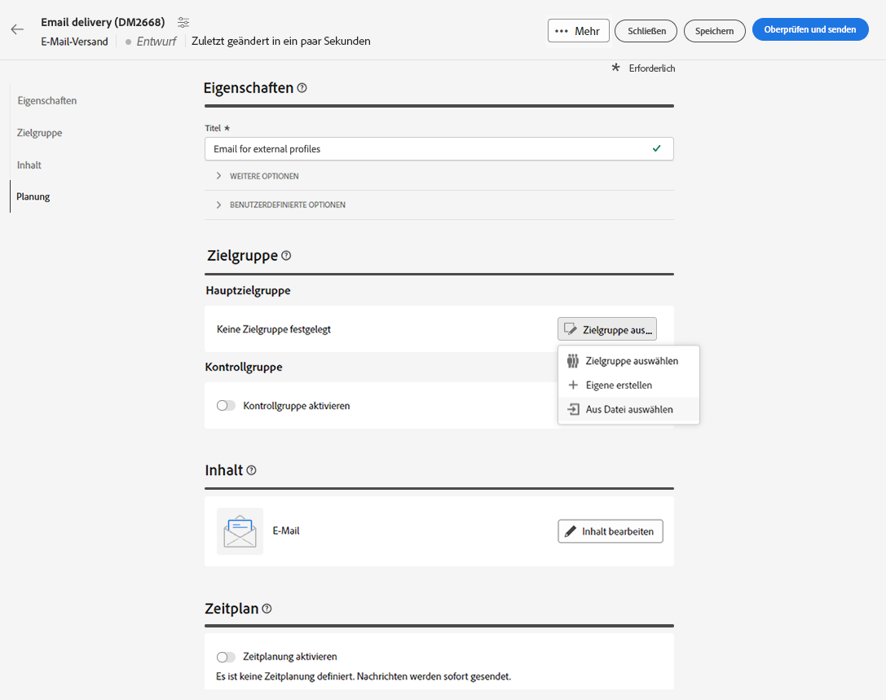
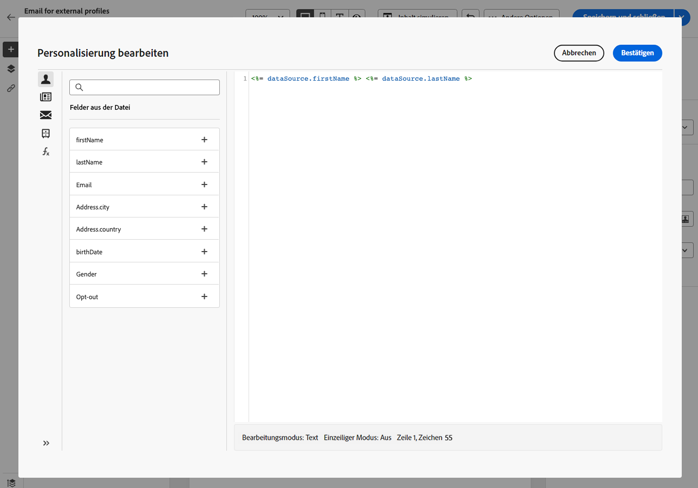

# Empfänger aus einer Datei auswählen {#audience-from-file}

Sie können Kontakte aus einer externen Datei hochladen. Diese Funktion ist nur für E-Mail-Sendungen verfügbar. Folgende Formate werden unterstützt: Textdatei (TXT) oder eine kommagetrennte Wertdatei (CSV). Sie werden dann der Datenbank hinzugefügt.

>[!NOTE]
>
>Sie können einen Import-Workflow erstellen, um mehrere Profile hinzuzufügen oder zu aktualisieren.  Weitere Informationen


Gehen Sie wie folgt vor, um Profile aus einer lokalen Datei direkt über die Benutzeroberfläche auszuwählen:

1. Klicken Sie im Erstellungsfenster des E-Mail-Versands auf die Schaltfläche **Zielgruppe auswählen** und wählen Sie die **Aus Datei auswählen** -Option.

   

1. Wählen Sie die hochzuladende lokale Datei aus.
1. Im mittleren Abschnitt des Bildschirms können Sie eine Vorschau der Datenzuordnung anzeigen.
1. Wählen Sie die Spalte aus, die die E-Mail-Adresse enthält. **Adressfeld** Dropdown-Liste.
1. Passen Sie die Spalteneinstellungen an und wie Daten aus den verfügbaren Optionen formatiert werden.
1. Klicken Sie auf **Bestätigen**, wenn die Einstellungen korrekt sind.

Bei der Erstellung und Personalisierung des Nachrichteninhalts können Sie im Personalisierungseditor Felder aus der Eingabedatei auswählen.



## Beispieldatei {#sample-file}

>[!CONTEXTUALHELP]
>id="acw_audience_fromfile_samplefile"
>title="Beispieldatei"
>abstract="Unterstützte Dateiformate: txt, csv. Erste Zeile für Spaltentitel verwenden."


```json
{
lastname,firstname,city,birthdate,email,denylist
Smith,Hayden,Paris,23/05/1985,hayden.smith@example.com,0
Mars,Daniel,London,17/11/1999,dannymars@example.com,0
Smith,Clara,Roma,08/02/1979,clara.smith@example.com,0
Durance,Allison,San Francisco,15/12/2000,allison.durance@example.com,1
}
```
