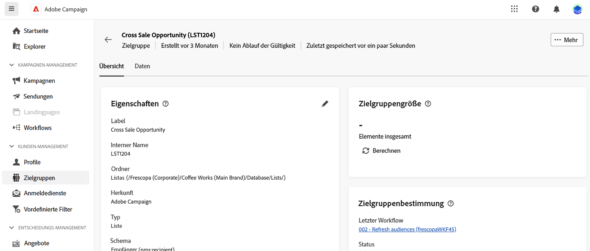

# Verwalten und Überwachen von Zielgruppen {#monitor}

>[!CONTEXTUALHELP]
>id="acw_audiences_workflow_error_data_execution"
>title="Zielgruppenfehler"
>abstract="Zielgruppendaten sind nicht verfügbar. Warten Sie bis zum Ende der Workflow-Ausführung."

Die Liste der Zielgruppen, die in Campaign Web verwendet werden können, ist über das Menü **[!UICONTROL Zielgruppen]** verfügbar.

Zielgruppen können aus mehreren Quellen stammen. Die Spalte **[!UICONTROL Herkunft]** gibt an, wo eine bestimmte Zielgruppe erstellt wurde:

* **[!UICONTROL Adobe Campaign]**: Diese Zielgruppen werden in der Adobe Campaign v8-Konsole erstellt. Weitere Informationen finden Sie in der [Dokumentation zu Campaign v8 (Client-Konsole)](https://experienceleague.adobe.com/docs/campaign/campaign-v8/audience/create-audiences/create-audiences.html?lang=de){target="_blank"}.

* **[!UICONTROL Adobe Experience Platform:]** Diese Zielgruppen werden in Adobe Experience Platform erstellt und mithilfe der Integration von Adobe-Quellen- und Zielen in Campaign Web integriert. Erfahren Sie in der [Dokumentation zu Campaign v8 (Client-Konsole)](https://experienceleague.adobe.com/docs/campaign/campaign-v8/connect/ac-aep/ac-aep.html?lang=de){target="_blank"}, wie Sie diese Integration einrichten.

>[!NOTE]
>
>Um Adobe Experience Platform-Zielgruppen in Campaign verwenden zu können, müssen Sie die Integration mit Adobe-Quellen und -Zielen konfigurieren. Weitere Informationen finden Sie in der [Dokumentation zu Campaign v8 (Client-Konsole)](https://experienceleague.adobe.com/docs/campaign/campaign-v8/connect/ac-aep/ac-aep.html?lang=de){target="_blank"}.

* **[!UICONTROL Adobe Campaign WebUI]**: Diese Zielgruppen werden mithilfe von Zielgruppen-Workflows von Campaign Web erstellt. [Erfahren Sie, wie Sie Zielgruppen erstellen](create-audience.md)

Um weitere Informationen zu einer Zielgruppe zu erhalten, öffnen Sie sie in der Liste. Die Eigenschaften der Zielgruppe werden zusammen mit der Anzahl der in der Zielgruppe enthaltenen Profile angezeigt. Sie können die Anzahl der Zielgruppen jederzeit mit der Schaltfläche **[!UICONTROL Berechnen]** aktualisieren.

Die Registerkarte **[!UICONTROL Daten]** ermöglicht die Visualisierung der Profile, die Teil der Zielgruppe sind. Sie können diese Ansicht anpassen, indem Sie weitere Spalten hinzufügen oder erweiterte Filter nutzen, um die angezeigten Daten zu präzisieren.

Um eine Zielgruppe zu duplizieren oder zu löschen, klicken Sie auf die Schaltfläche **[!UICONTROL Mehr Aktionen]** in der Zielgruppenliste neben dem Zielgruppennamen oder in einem Bildschirm mit Zielgruppendetails.
