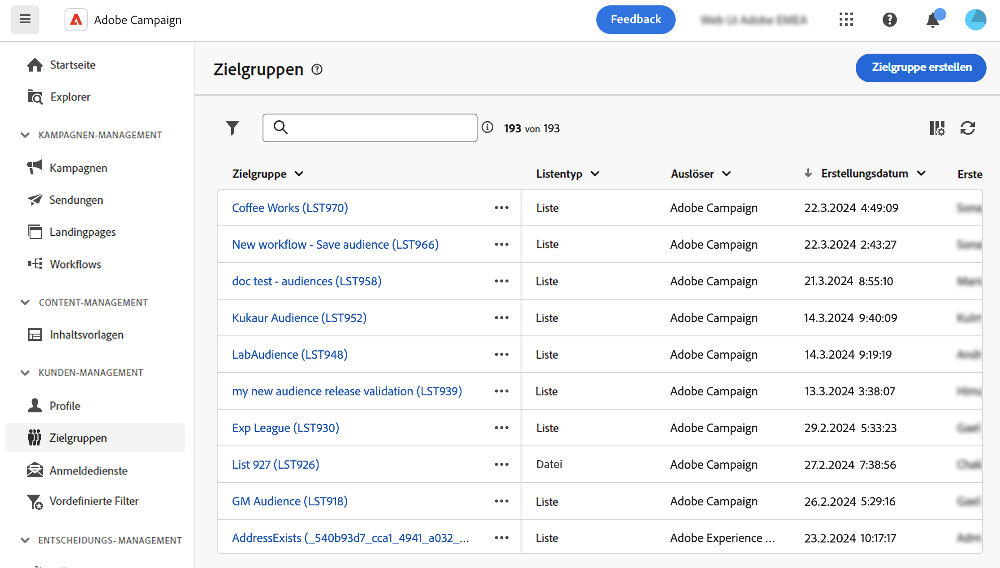

# Zielgruppen überwachen und verwalten {#monitor}

>[!CONTEXTUALHELP]
>id="acw_audiences_workflow_error_data_execution"
>title="Zielgruppenfehler"
>abstract="Zielgruppendaten sind nicht verfügbar. Warten Sie bis zum Ende der Workflow-Ausführung."

Die Liste der Zielgruppen, die im Campaign Web verwendet werden können, ist über den Link **[!UICONTROL Zielgruppen]** Menü.

Zielgruppen können aus mehreren Quellen stammen. Die **[!UICONTROL Origin]** gibt an, wo eine bestimmte Zielgruppe erstellt wurde:

* **[!UICONTROL Adobe Campaign]**: Diese Zielgruppen werden in der Adobe Campaign V8-Konsole erstellt. Weitere Informationen finden Sie in der [Dokumentation zu Campaign v8 (Client-Konsole)](https://experienceleague.adobe.com/docs/campaign/campaign-v8/audience/create-audiences/create-audiences.html?lang=de){target="_blank"}.

* **[!UICONTROL Adobe Experience Platform:]** Diese Zielgruppen werden in Adobe Experience Platform erstellt und mithilfe der Adobe-Quellen- und Zielintegration in Campaign Web integriert. Erfahren Sie, wie Sie diese Integration in [Dokumentation zu Campaign v8 (Clientkonsole)](https://experienceleague.adobe.com/docs/campaign/campaign-v8/connect/ac-aep/ac-aep.html){target="_blank"}.

>[!NOTE]
>
>Um Adobe Experience Platform-Zielgruppen in Campaign verwenden zu können, müssen Sie die Integration mit Adobe-Quellen und -Zielen konfigurieren. Weitere Informationen finden Sie in der [Dokumentation zu Campaign v8 (Client-Konsole)](https://experienceleague.adobe.com/docs/campaign/campaign-v8/connect/ac-aep/ac-aep.html){target="_blank"}.

* **[!UICONTROL Adobe Campaign WebUI]**: Diese Zielgruppen werden mithilfe von Workflows für Campaign-Webzielgruppen erstellt. [Erfahren Sie, wie Sie Audiences erstellen](create-audience.md)

Um weitere Informationen zu einer Audience zu erhalten, öffnen Sie sie in der Liste. Die Eigenschaften der Audience werden zusammen mit der Anzahl der in der Audience enthaltenen Profile angezeigt. Sie können die Anzahl der Zielgruppen jederzeit mit der Funktion **[!UICONTROL berechnen]** Schaltfläche.

Die **[!UICONTROL Daten]** -Tab ermöglicht die Visualisierung der Profile, die Teil der Audience sind. Sie können diese Ansicht anpassen, indem Sie weitere Spalten hinzufügen oder erweiterte Filter nutzen, um die angezeigten Daten zu verfeinern.

Um eine Zielgruppe zu duplizieren oder zu löschen, klicken Sie auf die Schaltfläche **[!UICONTROL Mehr Aktionen]** in der Zielgruppenliste neben dem Zielgruppennamen oder im Bildschirm mit den Zielgruppendetails verfügbar.