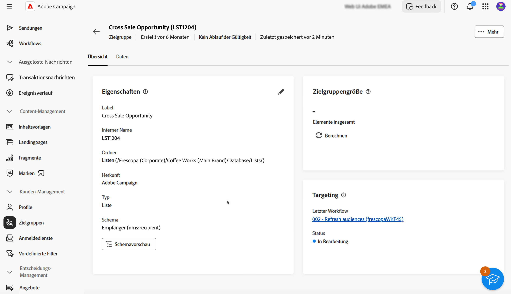

# Erste Schritte mit Zielgruppen {#monitor-manage}

>[!CONTEXTUALHELP]
>id="acw_audiences_properties"
>title="Eigenschaften"
>abstract="Hier finden Sie eine Zusammenfassung der Zielgruppeneigenschaften, z. B. Herkunft oder Speicherordner. Klicken Sie auf den Link im Abschnitt **Letzter Workflow**, um den Workflow zu öffnen, der zur Erstellung der Zielgruppe verwendet wurde."

>[!CONTEXTUALHELP]
>id="acw_audiences_count"
>title="Zielgruppengröße"
>abstract="Hier finden Sie die Gesamtzahl der Profile innerhalb der Zielgruppe. Klicken Sie auf die Schaltfläche **Berechnen**, um die Zielgruppenergebnisse zu aktualisieren und neu zu berechnen."

>[!CONTEXTUALHELP]
>id="acw_audiences_targeting"
>title="Targeting"
>abstract="Targeting"

>[!CONTEXTUALHELP]
>id="acw_audiences_workflow_error_data_execution"
>title="Zielgruppenfehler"
>abstract="Zielgruppendaten sind nicht verfügbar. Bitte warten Sie bis zum Ende der Workflow-Ausführung."

Die Zielgruppe ist das hauptsächliche Ziel Ihres Versands: die Profile, die die Nachrichten erhalten. Die Liste der Zielgruppen, die in Campaign Web verwendet werden können, ist über das Menü **[!UICONTROL Zielgruppen]** verfügbar.

{zoomable="yes"}

Zielgruppen können aus mehreren Quellen stammen. Die Spalte **[!UICONTROL Herkunft]** gibt an, wo eine bestimmte Zielgruppe erstellt wurde:

* **[!UICONTROL Adobe Campaign]**: Diese Zielgruppen wurden in der [Adobe Campaign Web-Benutzeroberfläche](create-audience.md) oder in der [Adobe Campaign v8 Client-Konsole](https://experienceleague.adobe.com/docs/campaign/campaign-v8/audience/create-audiences/create-audiences.html?lang=de){target="_blank"} erstellt.

* **[!UICONTROL Adobe Experience Platform:]** Diese Zielgruppen wurden in Adobe Experience Platform erstellt und mithilfe der Integration von Adobe-Quellen und -Zielen in Campaign Web integriert. Erfahren Sie in der [Dokumentation zu Campaign v8 (Client-Konsole)](https://experienceleague.adobe.com/docs/campaign/campaign-v8/connect/ac-aep/ac-aep.html?lang=de){target="_blank"}, wie Sie diese Integration einrichten.

  ➡️ [Entdecken Sie diese Funktion im Video](#video)

Um zusätzliche Informationen zu einer Zielgruppe zu erhalten, öffnen Sie sie in der Liste. Die Zielgruppeneigenschaften werden zusammen mit der Anzahl der in der Zielgruppe enthaltenen Profile angezeigt. Aktualisieren Sie die Anzahl der Zielgruppen jederzeit mithilfe der Schaltfläche **[!UICONTROL Berechnen]**.

Auf **[!UICONTROL Registerkarte]** Daten“ können Sie die Profile visualisieren, die Teil der Audience sind. Passen Sie diese Ansicht an, indem Sie zusätzliche Spalten hinzufügen oder erweiterte Filter verwenden, um die angezeigten Daten zu verfeinern.

{zoomable="yes"}

Um eine Zielgruppe zu duplizieren oder zu löschen, klicken Sie auf die Schaltfläche **[!UICONTROL Mehr Aktionen]** in der Zielgruppenliste neben dem Zielgruppennamen oder in einem Bildschirm mit Zielgruppendetails.

## Anleitungsvideo {#video}

Erfahren Sie, wie Sie ein Ziel für die Verwendung einer Experience Platform-Zielgruppe in der Benutzeroberfläche von Adobe Campaign Web erstellen.

>[!VIDEO](https://video.tv.adobe.com/v/3427635?quality=12)

Detaillierte Informationen zum Einrichten der Adobe-Quell- und Zielintegration finden Sie in der [Dokumentation zu Campaign v8 (Client-Konsole)](https://experienceleague.adobe.com/docs/campaign/campaign-v8/connect/ac-aep/ac-aep.html?lang=de){target="_blank"}.