# Erstellen und Verwalten von Abonnements {#manage-services}

>[!CONTEXTUALHELP]
>id="acw_subscriptions_list"
>title="Erstellen und Verwalten von Diensten"
>abstract="Adobe Campaign verwenden, um Dienste wie z. B. Newsletter zu erstellen und zu überwachen und die An- und Abmeldungen für diese Dienste zu überprüfen. Abonnements gelten nur für den E-Mail- und SMS-Versand."

Verwenden Sie Adobe Campaign Web, um Ihre Dienste wie z. B. Newsletter zu verwalten und zu erstellen und die Abonnements und Abmeldungen für diese Dienste zu überprüfen.

Dabei können mehrere Dienste parallel definiert werden, z. B. Newsletter für bestimmte Produktkategorien, Themen oder Bereiche einer Website, Abonnements zu verschiedenen Arten von Warnmeldungen und Echtzeitbenachrichtigungen.

>[!NOTE]
>
>Abonnements gelten nur für den E-Mail- und SMS-Versand.

## Zugreifen auf Anmeldedienste {#access-services}

Gehen Sie wie folgt vor, um auf die für Ihre Plattform verfügbaren Anmeldedienste zuzugreifen.

1. Navigieren Sie zum Menü **[!UICONTROL Anmeldedienste]** in der linken Navigationsleiste.

   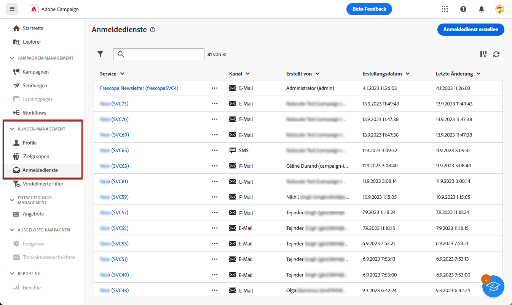{zoomable="yes"}

1. Die Liste aller vorhandenen Abonnementdienste wird angezeigt. Sie können die Dienste durchsuchen und nach dem Kanal oder dem Ordner filtern oder Regeln hinzufügen, indem Sie den [Abfrage-Modeler](../query/query-modeler-overview.md) verwenden.

   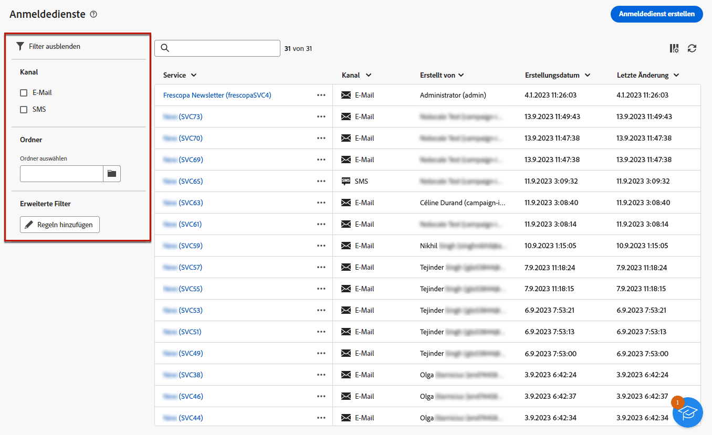{zoomable="yes"}

1. Um einen vorhandenen Dienst zu bearbeiten, klicken Sie auf seinen Namen.

1. Sie können jeden Dienst löschen oder duplizieren, indem Sie das Symbol mit den drei Punkten neben dem Namen des Dienstes verwenden.<!--so all subscribers are unsubscribed - need to mention?-->

## Erstellen Ihres ersten Anmeldedienstes {#create-service}

>[!CONTEXTUALHELP]
>id="acw_subscriptions_list_properties"
>title="Definieren der Diensteigenschaften"
>abstract="Geben Sie den Titel des Anmeldedienstes ein und definieren Sie zusätzliche Optionen, z. B. einen Gültigkeitszeitraum für Ihren Dienst."

>[!CONTEXTUALHELP]
>id="acw_subscriptions_list_confirm"
>title="Auswählen einer Bestätigungsnachricht"
>abstract="Wenn sich eine Benutzerin bzw. ein Benutzer für einen Dienst anmeldet oder sich von ihm abmeldet, können Sie eine Bestätigungsnachricht senden. Wählen Sie die Vorlagen aus, die für diese Nachricht verwendet werden sollen."

>[!CONTEXTUALHELP]
>id="acw_subscriptions_defaultlp"
>title="Standard-Landingpage"
>abstract="Wählen Sie die Standard-Landingpage aus, die mit diesem Dienst verbunden ist."

Gehen Sie wie folgt vor, um einen Anmeldedienst zu erstellen.

1. Klicken Sie auf die Schaltfläche **[!UICONTROL Anmeldedienst erstellen]**.

   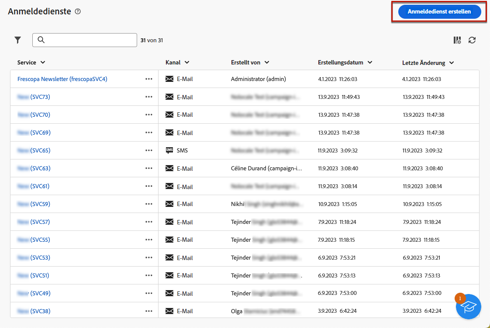{zoomable="yes"}

1. Wählen Sie einen Kanal aus: **[!UICONTROL E-Mail]** oder **[!UICONTROL SMS]**.

1. Geben Sie in den Diensteigenschaften einen Titel ein und definieren Sie nach Bedarf **[!UICONTROL zusätzliche Optionen]**.

   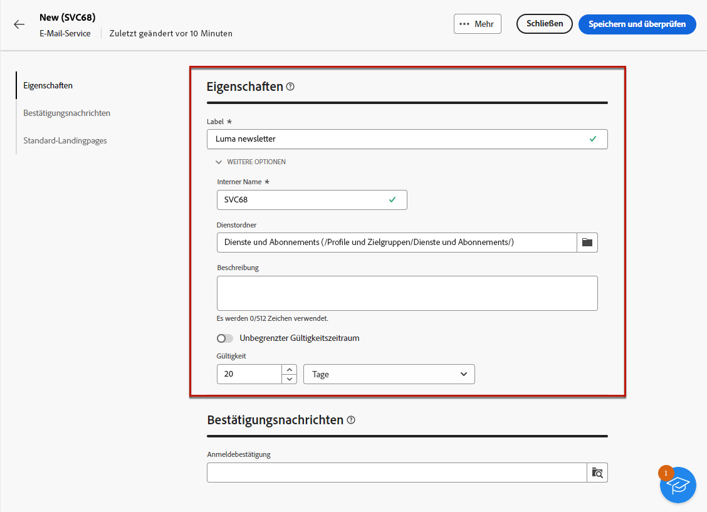{zoomable="yes"}

1. Standardmäßig werden die Dienste im Ordner **[!UICONTROL Dienste und Abonnements]** gespeichert. Sie können ihn ändern, indem Sie zum gewünschten Speicherort navigieren. [Erfahren Sie mehr über die Arbeit mit Ordnern](../get-started/permissions.md#folders)

1. Standardmäßig sind Abonnements unbegrenzt.

   Sie können die Option **[!UICONTROL Unbegrenzter Gültigkeitszeitraum]** deaktivieren, um einen Gültigkeitszeitraum für den Dienst festzulegen. Sobald der Gültigkeitszeitraum endet:
   * Profile können sich nicht mehr für diesen Dienst anmelden.
   * Alle Abonnentinnen und Abonnenten dieses Dienstes werden automatisch abgemeldet.

   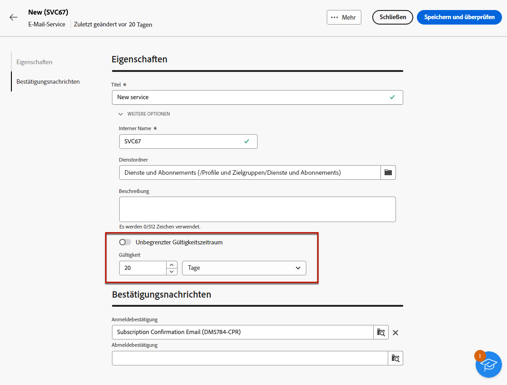{zoomable="yes"}

1. Wenn sich eine Benutzerin bzw. ein Benutzer für einen Dienst anmeldet oder sich von ihm abmeldet, können Sie eine Bestätigungsnachricht senden. Wählen Sie je nach Anwendungsfall die Vorlagen aus, die für diese Nachricht verwendet werden sollen. Diese Vorlagen müssen mit dem Zielgruppen-Mapping für die **[!UICONTROL Abonnements]** konfiguriert werden. [Weitere Informationen](#create-confirmation-message)

   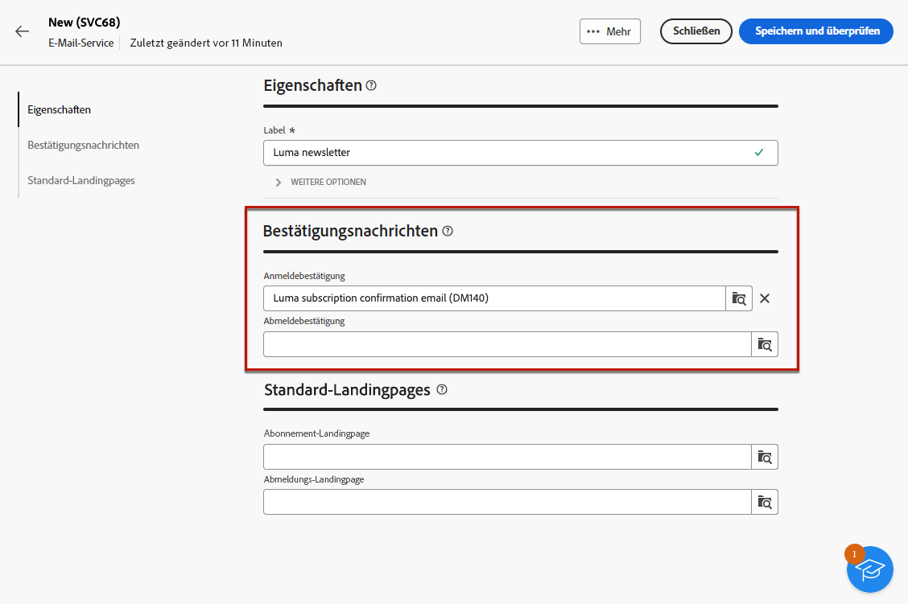{zoomable="yes"}

1. Klicken Sie auf **[!UICONTROL Speichern und überprüfen]**. Der neue Dienst wird zur Liste **[!UICONTROL Anmeldedienste]** hinzugefügt.

1. Sie können auch die standardmäßigen Anmelde- und -Abmelde-Landingpages auswählen, die diesem Dienst zugeordnet sind.

   >[!AVAILABILITY]
   >
   >Diese Funktion ist nur eingeschränkt verfügbar. Sie ist Kundinnen und Kunden vorbehalten, die **von Adobe Campaign Standard zu Adobe Campaign v8** migrieren, und kann nicht in anderen Umgebungen bereitgestellt werden.

   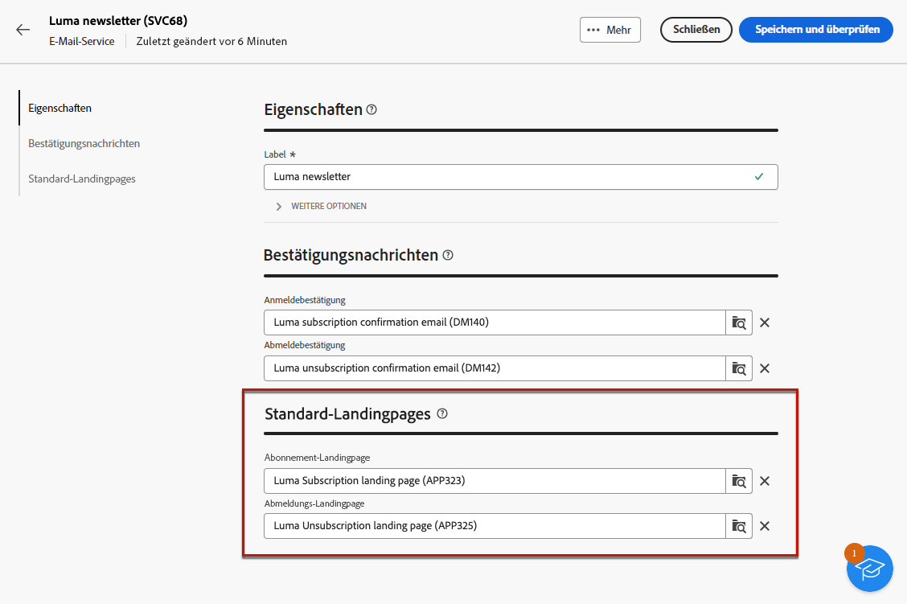{zoomable="yes"}

   Sobald Sie fertig sind, wählen Sie beim [Einsetzen eines Links](../email/message-tracking.md) in eine E-Mail die Option **[!UICONTROL Anmelde-Link]** oder **[!UICONTROL Abmelde-Link]** aus.  Wenn Benutzende auf diesen Link klicken, werden sie zur Anmelde- bzw. Abmelde-Landingpage weitergeleitet, auf die im Dienst verwiesen wird. <!--After submitting the form, they will be subscribed to / unsubscribed from the service.-->

   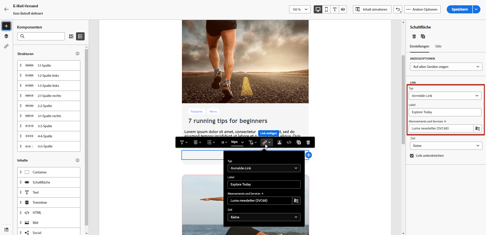{zoomable="yes"}

1. Speichern und überprüfen Sie Ihre Änderungen.

Sie können jetzt:

* Abonnentinnen und Abonnenten manuell zu diesem Dienst hinzufügen sowie Profile abmelden. [Weitere Informationen](../audience/manage-subscribers.md)

* Ihre Kundinnen und Kunden über eine Landingpage dazu einladen, sich für diesen Dienst anzumelden. [Weitere Informationen](../landing-pages/lp-use-cases.md#lp-subscription)

* Nachrichten an Abonnentinnen und Abonnenten dieses Dienstes senden. [Weitere Informationen dazu](../msg/send-to-subscribers.md)

## Erstellen einer Bestätigungsnachricht {#create-confirmation-message}

>[!CONTEXTUALHELP]
>id="acw_subscriptions_delivery_template"
>title="Auswählen der Versandvorlage für Abonnements"
>abstract="Um den Benutzerinnen und Benutzern, die sich für Ihren Dienst angemeldet haben, Bestätigungsnachrichten zu senden, müssen Sie eine Versandvorlage mit dem Zielgruppen-Mapping für die **[!UICONTROL Abonnements]** erstellen, und zwar ohne eine definierte Zielgruppe."

>[!CONTEXTUALHELP]
>id="acw_unsubscriptions_delivery_template"
>title="Auswählen der Versandvorlage für Abmeldungen"
>abstract="Um den Benutzerinnen und Benutzern, die sich von Ihrem Dienst abgemeldet haben, Bestätigungsnachrichten zu senden, müssen Sie eine Versandvorlage mit dem Zielgruppen-Mapping für die **[!UICONTROL Abonnements]** erstellen, und zwar ohne eine definierte Zielgruppe. "

Um den Benutzerinnen und Benutzern, die sich für Ihren Dienst angemeldet haben oder sich von ihm abmelden, Bestätigungsnachrichten zu senden, müssen Sie eine Versandvorlage mit dem Zielgruppen-Mapping für die **[!UICONTROL Abonnements]** erstellen, und zwar ohne eine definierte Zielgruppe. Gehen Sie dazu wie folgt vor:

1. Erstellen Sie eine Versandvorlage für die Abonnementbestätigung. [Erfahren Sie, wie Sie eine Vorlage erstellen](../msg/delivery-template.md)

1. Wählen Sie für diesen Versand keine Zielgruppe aus. Greifen Sie stattdessen auf die **[!UICONTROL Versandeinstellungen]** zu, navigieren Sie zur Registerkarte [Zielgruppe](../advanced-settings/delivery-settings.md#audience) und wählen Sie das Zielgruppen-Mapping für **[!UICONTROL Abonnements]** aus der Liste aus.

   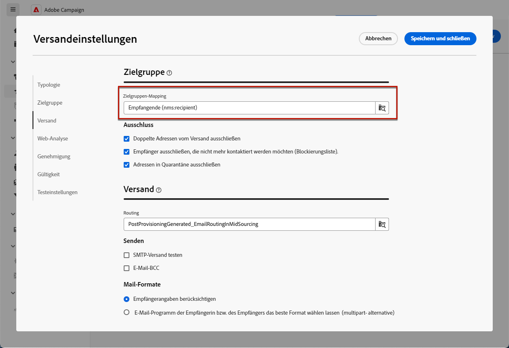{zoomable="yes"}

   >[!NOTE]
   >
   >Wenn Sie das Zielgruppen-Mapping für **[!UICONTROL Abonnements]** nicht auswählen, erhalten Ihre Abonnentinnen und Abonnenten keine Bestätigungsnachricht. Erfahren Sie mehr über Zielgruppen-Mapping in [diesem Abschnitt](../audience/targeting-dimensions.md).

1. Bearbeiten Sie den Inhalt Ihrer Versandvorlage, speichern und schließen Sie sie.

   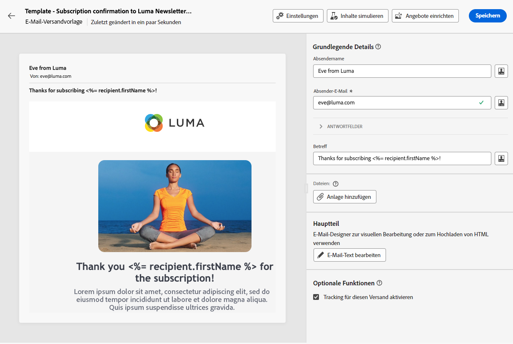{zoomable="yes"}

   >[!NOTE]
   >
   >Erfahren Sie in den Abschnitten [E-Mail-Kanal](../email/create-email.md) und [SMS-Kanal](../sms/create-sms.md) mehr über Versandkanäle und darüber, wie Sie Versandinhalte definieren.

1. Wiederholen Sie die obigen Schritte, um eine Versandvorlage für die Abmeldebestätigung zu erstellen.

Sie können diese Nachrichten jetzt auswählen, wenn Sie einen [Anmeldedienst erstellen](#create-service). Benutzende, die diesen Dienst abonnieren oder sich von ihm abmelden, erhalten die ausgewählten Bestätigungsnachrichten.

## Überwachen von Anmeldediensten {#logs-and-reports}

>[!CONTEXTUALHELP]
>id="acw_subscriptions_totalnumber_subscribers"
>title="Anzahl der Abonnierenden"
>abstract="Klicken Sie auf **Berechnen**, um die Gesamtzahl der Abonnierenden für diesen Dienst zu ermitteln."

>[!CONTEXTUALHELP]
>id="acw_subscriptions_totalnumber_subscribers_report"
>title="Abonnierende insgesamt"
>abstract="Der Key Performance Indicator (KPI) bietet einen umfassenden Überblick über die Abonnentenbasis und zeigt die Gesamtzahl der Kontakte an, die diesen Dienst abonniert haben."

>[!CONTEXTUALHELP]
>id="acw_subscriptions_overtheperiod_subscribers"
>title="Anzahl der Abonnements für den Zeitraum"
>abstract="Verwenden Sie die Dropdown-Liste, um den Zeitraum zu ändern und die Anzahl der Abonnements und Abmeldungen im ausgewählten Zeitraum anzuzeigen."

>[!CONTEXTUALHELP]
>id="acw_subscriptions_overallevolution_subscribers"
>title="Abonnements – Gesamtentwicklung"
>abstract="Dieser Graph zeigt die Aufschlüsselung nach Zeitraum, einschließlich Abonnements, Abmeldungen, Entwicklung der Zahlen und des Treueprozentsatzes."

Um die Effektivität Ihrer Anmeldedienste für die Kanäle SMS und E-Mail zu messen, können Sie auf die Protokolle und Berichte für einen bestimmten Dienst zugreifen.

1. Wählen Sie einen vorhandenen Dienst aus der Liste **[!UICONTROL Anmeldedienste]** aus. Klicken Sie auf **[!UICONTROL Berechnen]**, um die Gesamtzahl der Abonnierenden zu erhalten.

   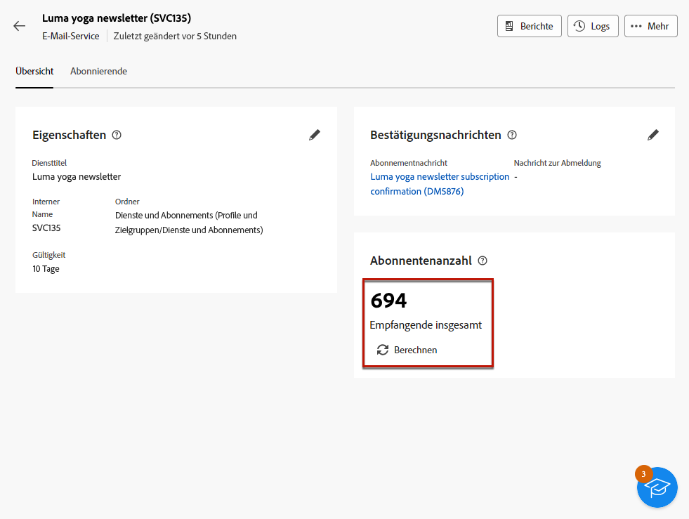{zoomable="yes"}

1. Wählen Sie im Dashboard des Dienstes **[!UICONTROL Protokolle]** aus, um die Liste der Abonnierenden dieses Dienstes anzuzeigen. 

   Sie können die Gesamtzahl der Abonnierenden, den Namen und die Adresse jeder Empfängerin bzw. jedes Empfängers sowie den Zeitpunkt der An- oder Abmeldung überprüfen. Sie können auch danach filtern.

   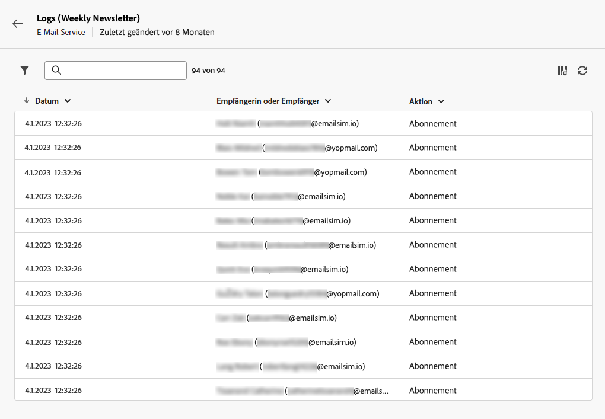{zoomable="yes"}

1. Wählen Sie im Dashboard des Dienstes die Option **[!UICONTROL Berichte]** aus. Überprüfen Sie die folgenden Indikatoren:

   * Die **[!UICONTROL Gesamtzahl der Abonnentinnen und Abonnenten]** wird angezeigt.

   * Sie können die Anzahl der Abonnierungen und Abmeldungen in einem ausgewählten Zeitraum anzeigen. Verwenden Sie die Dropdown-Liste, um den Zeitraum zu ändern.

     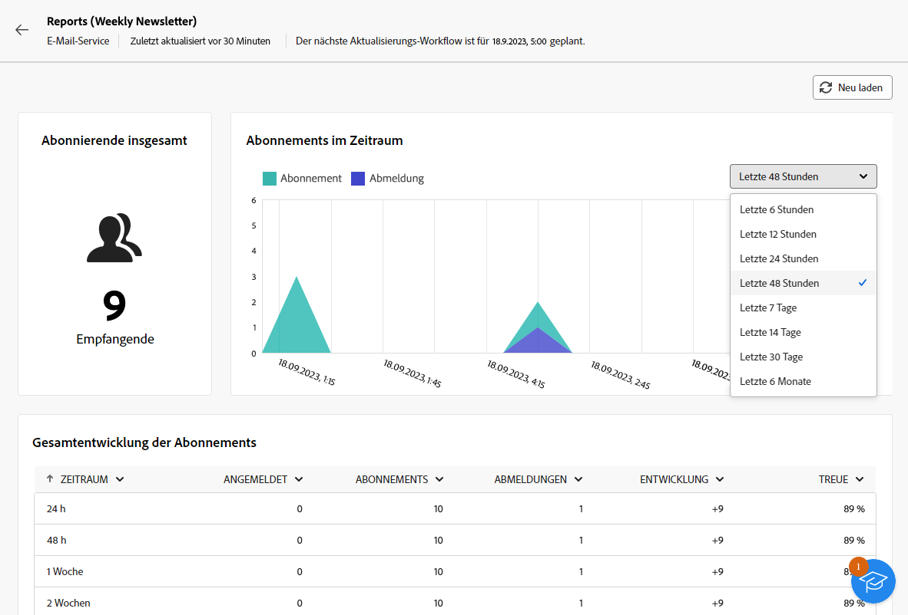{zoomable="yes"}

   * Der Graph **[!UICONTROL Gesamtentwicklung der Abonnements]** zeigt die Aufschlüsselung nach Zeitraum, einschließlich Abonnierungen, Abmeldungen, Entwicklung der Zahlen und Prozentsatz der Kundentreue.<!--what is Registered?-->

1. Klicken Sie auf **[!UICONTROL Neu laden]**, um die letzten Werte aus der Ausführung und Planung des Tracking-Workflow abzurufen.

<!--## Best practices {#best-practices}

It is recommended to send a confirmation message to the new subscribers of a service. To do so, create a delivery template and select it when creating a subscription service. [Learn more](#create-confirmation-message).

Send communications targeting your subscribers only. [Learn how](../msg/send-to-subscribers.md)

Always provide your subscribers the capability to unsubscribe from your services. [Learn how](consent.md#email-opt-out)

* When creating a confirmation message:

    * Do not select an audience for this delivery.

    * Select the **[!UICONTROL Subscriptions]** target mapping. Otherwise, your subscribers will not receive the confirmation message.
-->