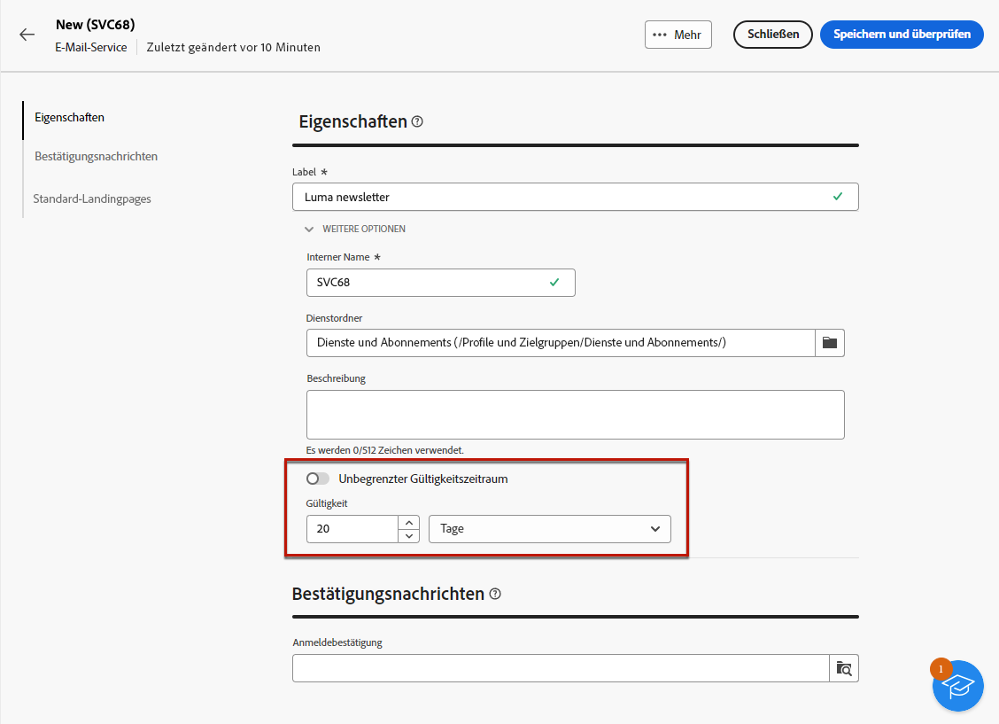
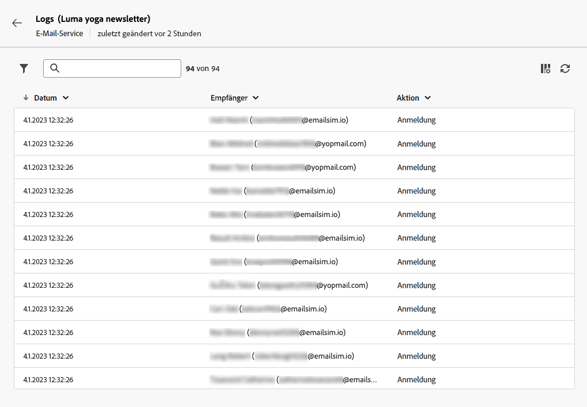

# Arbeiten mit Anmeldediensten {#manage-services}

>[!CONTEXTUALHELP]
>id="acw_subscriptions_list"
>title="Erstellen und Verwalten Ihrer Dienste"
>abstract="Mit Adobe Campaign können Sie Informationsdienste wie Newsletter erstellen und überwachen und Abonnements sowie Abmeldungen für sie verwalten. Abonnements gelten nur für den E-Mail- und SMS-Versand."

Verwenden Sie Adobe Campaign Web, um Ihre Dienste wie z. B. Newsletter zu verwalten und zu erstellen und die Abonnements und Abmeldungen für diese Dienste zu überprüfen.

>[!NOTE]
>
>Abonnements gelten nur für den E-Mail- und SMS-Versand.

Dabei können mehrere Dienste parallel definiert werden, z. B. Newsletter für bestimmte Produktkategorien, Themen oder Bereiche einer Website, Abonnements zu verschiedenen Arten von Warnmeldungen und Echtzeitbenachrichtigungen.

Weiterführende Informationen zur Verwaltung von Abonnements und Abmeldungen finden Sie im Abschnitt [Dokumentation zu Campaign v8 (Client-Konsole)](https://experienceleague.adobe.com/docs/campaign/campaign-v8/audience/subscriptions.html?lang=de){target="_blank"}.

## Zugreifen auf Anmeldedienste {#access-services}

Gehen Sie wie folgt vor, um auf die für Ihre Plattform verfügbaren Anmeldedienste zuzugreifen.

1. Navigieren Sie zum Menü **[!UICONTROL Anmeldedienste]** in der linken Navigationsleiste.

   

1. Die Liste aller vorhandenen Anmeldedienste wird angezeigt. Sie können die Dienste durchsuchen und nach Kanal, Ordner oder erweiterten Filtern filtern.

   

1. Um einen vorhandenen Dienst zu bearbeiten, klicken Sie auf seinen Namen.

1. Sie können jeden Dienst löschen oder duplizieren, indem Sie das Symbol mit den drei Punkten neben dem Namen des Dienstes verwenden.<!--so all subscribers are unsuibscribed - need to mention?-->

## Erstellen Ihres ersten Anmeldedienstes {#create-service}

>[!CONTEXTUALHELP]
>id="acw_subscriptions_list_properties"
>title="Definieren der Eigenschaften Ihres Dienstes"
>abstract="Geben Sie den Titel des Anmeldedienstes ein und definieren Sie zusätzliche Optionen, z. B. einen Gültigkeitszeitraum für Ihren Dienst."

>[!CONTEXTUALHELP]
>id="acw_subscriptions_list_confirm"
>title="Auswählen einer Bestätigungsnachricht"
>abstract="Wenn sich eine Benutzerin bzw. ein Benutzer für einen Dienst anmeldet oder sich von ihm abmeldet, können Sie eine Bestätigungsnachricht senden. Wählen Sie die Vorlagen aus, die für diese Nachricht verwendet werden sollen."

Gehen Sie wie folgt vor, um einen Anmeldedienst zu erstellen.

1. Klicken Sie auf die Schaltfläche **[!UICONTROL Anmeldedienst erstellen]**.

   

1. Wählen Sie einen Kanal aus: **[!UICONTROL E-Mail]** oder **[!UICONTROL SMS]**.

1. Geben Sie in den Diensteigenschaften einen Titel ein und definieren Sie nach Bedarf zusätzliche Optionen.

   

1. Standardmäßig sind Abonnements unbegrenzt. Sie können die Option **[!UICONTROL Unbegrenzter Gültigkeitszeitraum]** deaktivieren, um einen Gültigkeitszeitraum für den Dienst festzulegen.

   Im folgenden Beispiel wäre nach 20 Tagen Folgendes der Fall:
   * Empfängerinnen und Empfänger können sich nicht mehr für einen Dienst anmelden.
   * Alle Abonnentinnen und Abonnenten dieses Dienstes werden nach 20 Tagen automatisch abgemeldet. [Weitere Informationen](#automatic-unsubscription)

   

1. Wenn sich eine Benutzerin bzw. ein Benutzer für einen Dienst anmeldet oder sich von ihm abmeldet, können Sie eine Bestätigungsnachricht senden. Wählen Sie je nach Anwendungsfall die Vorlagen aus, die für diese Nachricht verwendet werden sollen. Diese Vorlagen müssen mit dem Zielgruppen-Mapping für die  **[!UICONTROL Abonnements]** konfiguriert werden. [Weitere Informationen](#create-confirmation-message)

   

1. Klicken Sie auf **[!UICONTROL Speichern und überprüfen]**. Der neue Dienst wird zur Liste **[!UICONTROL Anmeldedienste]** hinzugefügt.

## Erstellen einer Bestätigungsnachricht {#create-confirmation-message}

Um den Benutzerinnen und Benutzern, die sich für Ihren Dienst angemeldet haben oder sich von ihm abmelden, Bestätigungsnachrichten zu senden, müssen Sie eine Versandvorlage mit dem Zielgruppen-Mapping für die **[!UICONTROL Abonnements]** erstellen, und zwar ohne eine definierte Zielgruppe. Gehen Sie dazu wie folgt vor.

1. Erstellen Sie eine Versandvorlage für die Abonnementbestätigung. [Weitere Informationen dazu](../msg/delivery-template.md)

1. Wählen Sie für diesen Versand keine Zielgruppe aus. Greifen Sie stattdessen auf die **[!UICONTROL Versandeinstellungen]** zu, navigieren Sie zur Registerkarte [Zielgruppe](../advanced-settings/delivery-settings.md#audience) und wählen Sie das Zielgruppen-Mapping für **[!UICONTROL Abonnements]** aus der Liste aus.

   

   >[!NOTE]
   >
   >Wenn Sie das Zielgruppen-Mapping für **[!UICONTROL Abonnements]** nicht auswählen, erhalten Ihre Abonnentinnen und Abonnenten keine Bestätigungsnachricht. Zielgruppen-Mappings werden in der Campaign v8-Konsole definiert. Weitere Informationen finden Sie in der [Dokumentation zu Adobe Campaign v8](https://experienceleague.adobe.com/docs/campaign/campaign-v8/audience/add-profiles/target-mappings.html?lang=de){target="_blank"}.

1. Bearbeiten Sie den Inhalt Ihrer Versandvorlage, speichern und schließen Sie sie.

   

   >[!NOTE]
   >
   >Erfahren Sie in den Abschnitten [E-Mail-Kanal](../email/create-email.md) und [SMS-Kanal](../sms/create-sms.md) mehr über Versandkanäle und darüber, wie Sie Versandinhalte definieren.

1. Wiederholen Sie die obigen Schritte, um eine Versandvorlage für die Abmeldebestätigung zu erstellen.

Sie können diese Nachrichten jetzt auswählen, wenn Sie einen [Anmeldedienst erstellen](#create-service). Benutzende, die diesen Dienst abonnieren oder sich von ihm abmelden, erhalten die ausgewählten Bestätigungsnachrichten.

## Überwachen von Anmeldediensten {#logs-and-reports}

Um die Effektivität Ihrer Anmeldedienste für die Kanäle SMS und E-Mail zu messen, können Sie auf die Protokolle und Berichte für einen bestimmten Dienst zugreifen.

1. Wählen Sie einen vorhandenen Dienst aus der Liste **[!UICONTROL Anmeldedienste]** aus. Klicken Sie auf **[!UICONTROL Berechnen]**, um die Anzahl aller Abonnenten zu erhalten.

   

1. Wählen Sie im Dashboard des Dienstes **[!UICONTROL Protokolle]** aus, um die Liste der Abonnentinnen und Abonnenten dieses Dienstes anzuzeigen. Sie können die Gesamtzahl der Abonnentinnen und Abonnenten, den Namen und die Adresse jeder Empfängerin bzw. jedes Empfängers sowie den Zeitpunkt der An- oder Abmeldung überprüfen. Sie können auch danach filtern.

   

1. Wählen Sie im Dashboard des Dienstes die Option **[!UICONTROL Berichte]** aus. Überprüfen Sie die folgenden Indikatoren:

   * Die **[!UICONTROL Gesamtzahl der Abonnentinnen und Abonnenten]** wird angezeigt.

   * Sie können die Anzahl der Abonnierungen und Abmeldungen in einem ausgewählten Zeitraum anzeigen. Verwenden Sie die Dropdown-Liste, um den Zeitraum zu ändern.

     

   * Der Graph **[!UICONTROL Gesamtentwicklung der Abonnements]** zeigt die Aufschlüsselung nach Zeitraum, einschließlich Abonnierungen, Abmeldungen, Entwicklung der Zahlen und Prozentsatz der Kundentreue.<!--what is Registered?-->

1. Klicken Sie auf **[!UICONTROL Neu laden]**, um die letzten Werte aus der Ausführung und Planung des Tracking-Workflow abzurufen.
