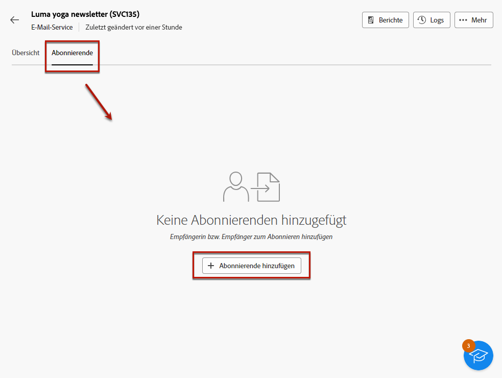
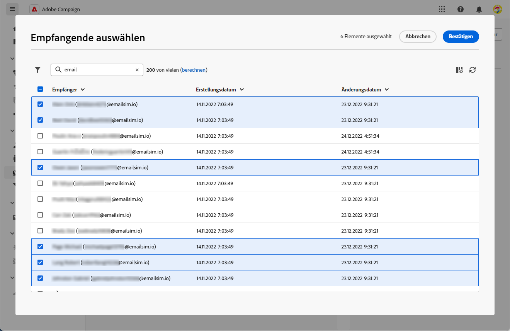
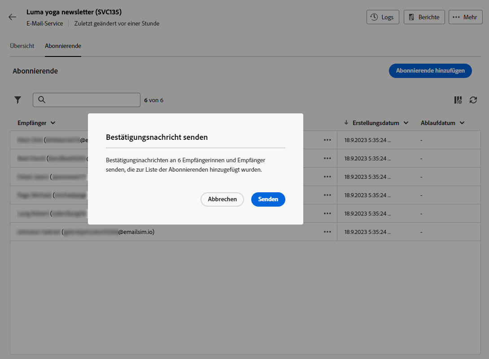
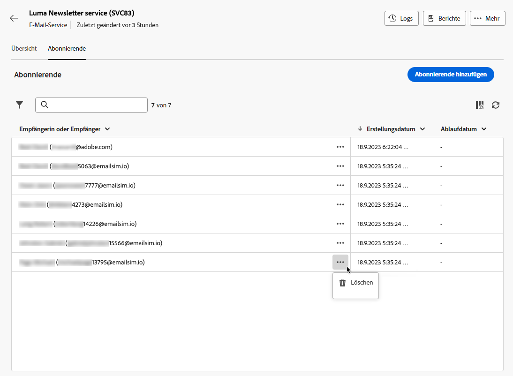

# Dienstabonnenten verwalten {#manage-subscribers}

Einmal [Dienst erstellt](manage-services.md#create-service)können Sie Abonnenten hinzufügen, Empfänger abmelden und an die Abonnenten dieses Dienstes senden.

## Abonnenten zu Ihrem Dienst hinzufügen {#add-subscribers}

Gehen Sie wie folgt vor, um Abonnenten manuell hinzuzufügen.

1. Wählen Sie einen vorhandenen Dienst aus der **[!UICONTROL Abonnementdienste]** Liste.

1. Wählen Sie die **[!UICONTROL Abonnenten]** Registerkarte und klicken Sie auf **[!UICONTROL Profile hinzufügen]**.

   

1. Wählen Sie die hinzuzufügenden Profile aus der Liste aus und klicken Sie auf **[!UICONTROL Bestätigen]**.

   

1. Klicks **[!UICONTROL Senden]**.<!--if you click cancel, does it mean that no message is sent but recipients are still subscribed, or they are not subscribed? it's 2 different actions in the console)--> Die ausgewählten Empfänger erhalten das Abonnement [Bestätigungsnachricht](manage-services.md#create-confirmation-message) die Sie beim [Erstellen des Dienstes](manage-services.md#create-service).

   

Die hinzugefügten Profile werden im Abschnitt **[!UICONTROL Abonnenten]** Liste. Sie haben jetzt Ihren Dienst abonniert.

## Entfernen von Abonnenten aus Ihrem Dienst {#remove-subscribers}

### Empfänger manuell abmelden {#manual-unsubscription}

Einmal [Abonnenten hinzugefügt](#add-subscribers) für Ihren Dienst verwenden, können Sie die Anmeldung manuell abmelden. Gehen Sie dazu wie folgt vor.

1. Wählen Sie einen vorhandenen Dienst aus der **[!UICONTROL Abonnementdienste]** Liste.

1. Klicken Sie auf das Drei-Punkte-Symbol neben dem gewünschten Empfängernamen und wählen Sie **[!UICONTROL Löschen]**.

   

1. Löschen bestätigen und auf **[!UICONTROL Senden]**. Der ausgewählte Empfänger erhält die Abmeldung [Bestätigungsnachricht](manage-services.md#create-confirmation-message) die Sie beim [Erstellen des Dienstes](manage-services.md#create-service).

   

Der Empfänger wird aus der **[!UICONTROL Abonnenten]** und Ihr Dienst nicht mehr abonniert hat.

### Empfänger automatisch abmelden {#automatic-unsubscription}

Ein Anmeldedienst kann eine begrenzte Dauer haben. Die Abmeldung erfolgt automatisch, wenn die Gültigkeitsdauer abgelaufen ist.

Dieser Zeitraum wird angegeben, wenn [Erstellen des Dienstes](manage-services.md#create-service). Aus dem **[!UICONTROL Zusätzliche Optionen]**, deaktivieren Sie die **[!UICONTROL Unbegrenzte Gültigkeitsdauer]** und legen Sie einen Gültigkeitszeitraum für den Dienst fest.

Nach Ablauf der angegebenen Dauer werden alle Abonnenten automatisch von diesem Dienst abgemeldet.

## An Abonnenten eines Dienstes versenden

Einmal [Abonnement-Dienst erstellt](manage-services.md#create-service), können Sie die Abonnenten in einem Versand gezielt ansprechen. Gehen Sie dazu wie folgt vor.

1. [Erstellen einer Zielgruppe](../audience/create-audience.md) einschließlich der Abonnenten des von Ihnen erstellten Dienstes:

   * Im **[!UICONTROL Audience erstellen]** Aktivität, erweiterte Attribute anzeigen und **[!UICONTROL Empfänger]** > **[!UICONTROL Abonnements]** > **[!UICONTROL Dienst]**.

   * Wählen Sie in diesem Beispiel die Benutzer aus, die den Dienst abonniert haben, der über die **Luma-Newsletter** Beschriftung.

   

1. [Versand erstellen](../msg/gs-messages.md#create-delivery) und wählen Sie die zuvor erstellte Audience aus.

   

1. Bearbeiten Sie den Inhalt Ihrer Nachricht nach Bedarf und senden Sie ihn.

   

Ihre Nachricht wird nur an die Abonnenten dieses Dienstes gesendet.
