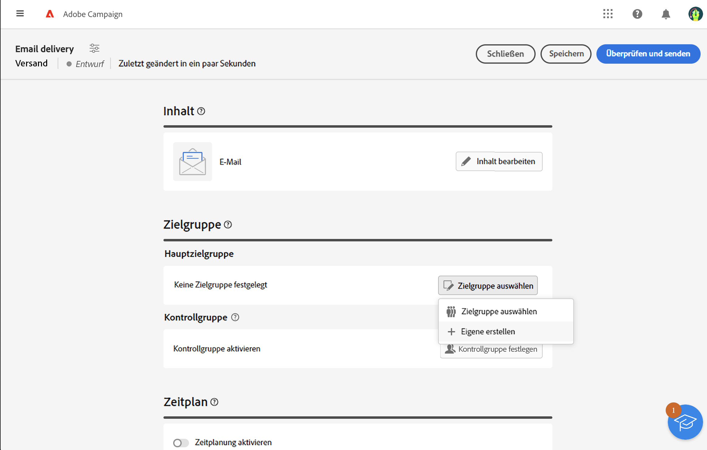
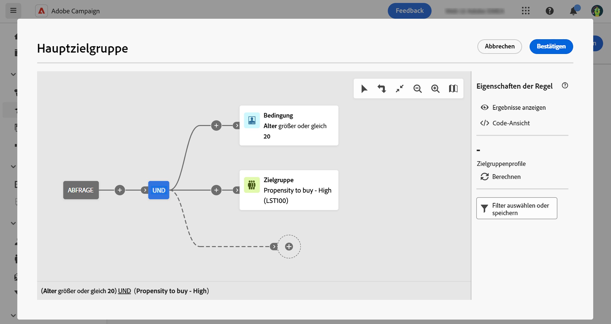

# Erstellen einer einmaligen Zielgruppe {#one-time}

In diesem Abschnitt wird beschrieben, wie Sie beim Entwerfen eines neuen Versands eine Zielgruppe erstellen. In diesem Fall werden die Empfängerinnen und Empfänger, die in die Versandzielgruppe aufgenommen werden sollen, durch Abfrage der Datenbank mit dem Abfrage-Modeler ermittelt.

Die resultierende Zielgruppe wird nur ein einziges Mal für diesen Versand verwendet. Sie wird nicht in der Zielgruppenliste gespeichert.

Bei der Bestimmung der Hauptzielgruppe eines Versands haben Sie außerdem folgende Möglichkeiten:

* [Wählen Sie eine vorhandene Zielgruppe](add-audience.md) aus der Liste **[!UICONTROL Zielgruppen]** aus.
* [Laden Sie eine Zielgruppe aus einer externen Datei](file-audience.md) (nur für E-Mails).

Gehen Sie wie folgt vor, um direkt aus einem Versand eine neue Zielgruppe zu erstellen:

1. Klicken Sie im Abschnitt **Zielgruppe** des Assistenten zur Versanderstellung auf die Schaltflache **[!UICONTROL Zielgruppe auswählen]** .

   {zoomable=&quot;yes&quot;}

1. Wählen Sie **Eigene erstellen** aus. Der Abfrage-Modeler wird angezeigt. Es ermöglicht Ihnen, die Zielpopulation für Ihren Versand zu definieren, indem Sie die in der Datenbank enthaltenen Daten filtern. [So verwenden Sie den Abfrage-Modeler](../query/query-modeler-overview.md)

   {zoomable=&quot;yes&quot;}

1. Wenn Ihre Abfrage bereit ist, klicken Sie auf **Bestätigen**, um die Zielgruppe als Hauptzielgruppe Ihres Versands zu verwenden.

   Sie können auch eine Kontrollgruppe einrichten, um die Wirkung Ihrer Kampagnen zu messen. Die Kontrollgruppe erhält die Nachricht nicht. Dadurch lässt sich das Verhalten der Population, die die Nachricht erhalten hat, mit dem Verhalten der Kontakte vergleichen, die die Nachricht nicht erhalten haben. [Weitere Informationen](control-group.md)
