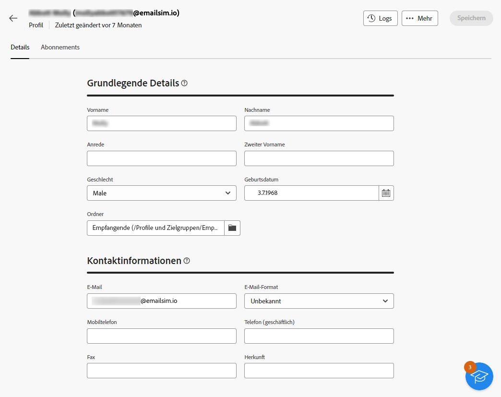
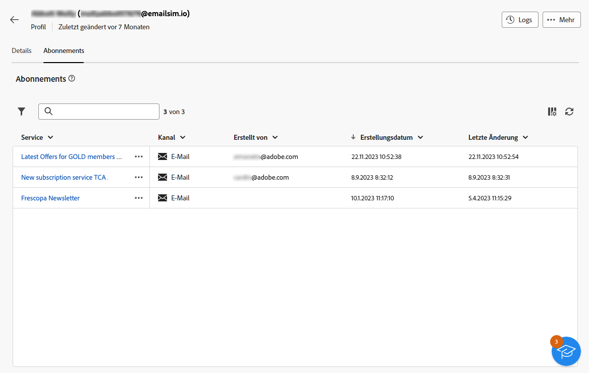
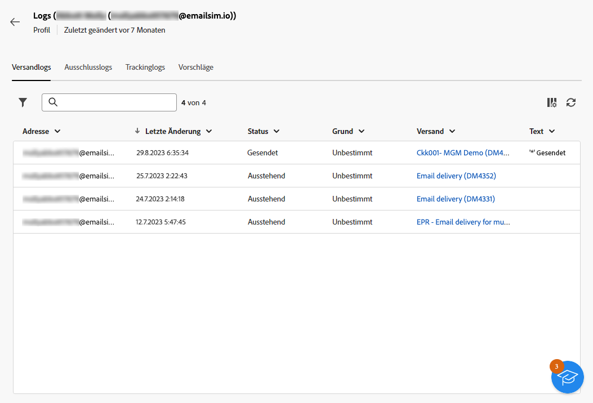

# Entdecken der Details von Profilen {#profile-view}

>[!CONTEXTUALHELP]
>id="acw_recipients_subscription_list"
>title="Abonnementliste"
>abstract="In dieser Registerkarte sind alle Dienste aufgelistet, für die das Profil angemeldet ist."

Um auf die Details eines Profils zuzugreifen, navigieren Sie zu **[!UICONTROL Kunden-Management]** > **[!UICONTROL Profile]** und klicken Sie dann auf das Profil, auf das Sie zugreifen möchten.

Informationen zum Profil sind wie folgt organisiert:

* Über die Registerkarte **[!UICONTROL Details]** können Sie nach den integrierten und benutzerdefinierten Attributen des Profils suchen. Um ein Attribut zu bearbeiten, nehmen Sie Änderungen im gewünschten Feld vor und klicken Sie auf die Schaltfläche **[!UICONTROL Speichern]**. Detaillierte Informationen zu den Attributen von Profilen finden Sie im Abschnitt [Profil erstellen](create-profile.md).

  {zoomable="yes"}

* Unter der Registerkarte **[!UICONTROL Abonnements]** finden Sie Informationen zu den Diensten, für die das Profil angemeldet ist. [Erfahren Sie mehr über Abonnementdienste](manage-services.md)

  {zoomable="yes"}

* Des Weiteren könnten Sie über die Schaltfläche **[!UICONTROL Protokolle]** oben rechts im Bildschirm auf den Verlauf der Interaktionen des Profils in Form von Versand-, Ausschluss- und Nachverfolgungsprotokollen anzuzeigen. [Erfahren Sie mehr über Versandprotokolle](../monitor/delivery-logs.md)

  Auf der Registerkarte **[!UICONTROL Vorschläge]** in diesen Protokollen können Sie auch sehen, welche Angebote dem Profil unterbreitet wurden. [Erfahren Sie mehr über Angebote](../msg/offers.md)

  {zoomable="yes"}
