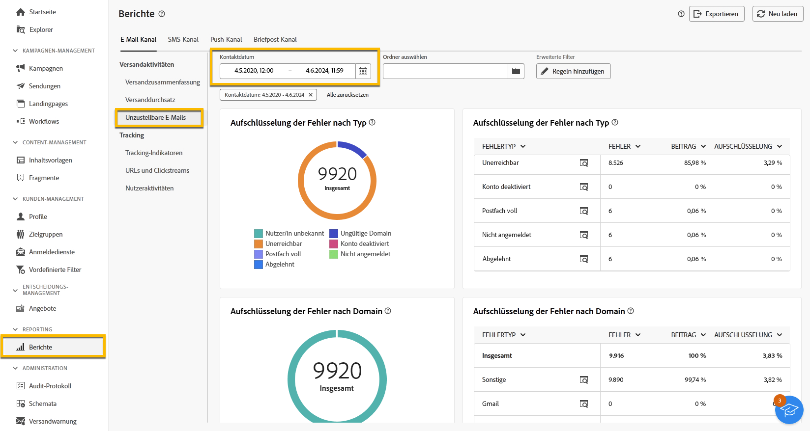
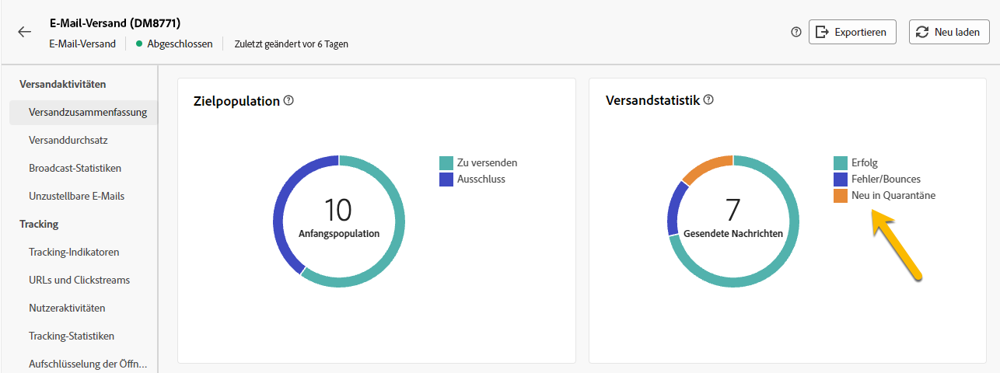

# Quarantäneverwaltung {#quarantines}

Adobe Campaign ermöglicht die Verwaltung von unter Quarantäne gestellten Adressen für E-Mail-, Push-, SMS-Kanäle.

Eine Quarantäne gilt nur für eine **E-Mail-Adresse**, eine **Telefonnummer** oder ein **Geräte-Token**, aber nicht für das Profil selbst.  Ein Profil, dessen E-Mail-Adresse unter Quarantäne gestellt wurde, kann beispielsweise mit einer neuen Adresse aktualisiert werden. Das Profil kann dann erneut bei Versandaktionen angesprochen werden. Wenn zwei Profile dieselbe Telefonnummer haben, sind beide betroffen, wenn die Nummer unter Quarantäne gestellt wird.

>[!CAUTION]
>
>Bei der Quarantänefunktion in Adobe Campaign wird die Groß-/Kleinschreibung beachtet.

## Was ist Quarantäne? {#quarantines-what}

Die Quarantäne ist die zum **Verwalten ungültiger Adressen in Sendungen** verwendete Methode.

Wenn ein Versand eine hohe Anzahl ungültiger Adressen aufweist, wird er möglicherweise als Spam angesehen. Durch die Verwaltung mittels Quarantäne wird verhindert, dass diese Adressen von Internet-Anbietern auf eine Blockierungsliste gesetzt werden.  Das ist wichtig, um Ihren Ruf zu schützen.

Wenn eine Adresse in Adobe Campaign unter Quarantäne gestellt wird, wird das Profil bei der Versandanalyse automatisch aus der Zielgruppe ausgeschlossen.

Quarantäne senkt die Kosten des SMS-Versands, indem fehlerhafte Telefonnummern aus Sendungen ausgeschlossen werden.

Weitere Informationen zum Thema Quarantäne finden Sie der [Dokumentation zu Campaign v8 (Konsole)](https://experienceleague.adobe.com/de/docs/campaign/campaign-v8/send/failures/quarantines){target="_blank"}.

## Warum eine Adresse unter Quarantäne gestellt wird {#quarantines-why}

Eine Adresse kann aus vielen Gründen unter Quarantäne gestellt werden:

* SMS: Fehlerhafte Telefonnummern
* SMS: Das Profil antwortet auf eine SMS-Nachricht mit einem Keyword wie „STOP“.
* E-Mail: Ihre Nachricht wird als Spam gemeldet.  Die Nachricht wird automatisch an ein von Adobe verwaltetes, technisches Postfach weitergeleitet. Die E-Mail-Adresse der Person wird dann automatisch unter Quarantäne gestellt und der Status in „Auf Blockierungsliste“ geändert.
* Eine E-Mail-Adresse kann unter Quarantäne gestellt werden, wenn beispielsweise das Postfach voll ist, die E-Mail-Adresse nicht existiert oder der E-Mail-Server nicht verfügbar ist.

Weitere Informationen zu Versandfehlern finden Sie in der [Dokumentation zu Campaign v8 (Konsole)](https://experienceleague.adobe.com/de/docs/campaign/campaign-v8/send/failures/delivery-failures){target="_blank"}.

## Wo finden Sie die Quarantäne-Adressen? {#quarantines-where}

Sie können alle Quarantäne-Adressen Ihrer Instanz unter **[!UICONTROL Explorer]** > **[!UICONTROL Administration]** > **[!UICONTROL Kampagnenverwaltung]** > **[!UICONTROL Unzustellbarkeitsverwaltung]** > **[!UICONTROL Adressen unzustellbarer Sendungen]** anzeigen. In diesem Abschnitt werden die unter Quarantäne gestellten Elemente für die Kanäle „E-Mail“, „SMS“ und „Push-Benachrichtigung“ aufgeführt.

{zoomable="yes"}

Sie können auch auf einen Bericht über die Quarantäne in Ihrer Instanz zugreifen:

{zoomable="yes"}

Für jeden Versand können Sie den Bericht „Versandzusammenfassung“ überprüfen. Dieser zeigt die Anzahl der unter Quarantäne gestellten Adressen in der Versandzielgruppe an:

{zoomable="yes"}

In der Adobe Campaign-Konsole stehen Ihnen weitere Optionen zur Verwaltung von Quarantäne-Adressen zur Verfügung. [Weitere Informationen](https://experienceleague.adobe.com/de/docs/campaign/campaign-v8/send/failures/quarantines#access-quarantined-addresses).