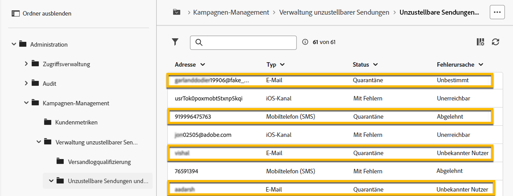

# Quarantäneverwaltung {#quarantines}

Adobe Campaign verwaltet Quarantäneadressen für E-Mail-, Push- und SMS-Kanäle.

Eine Quarantäne gilt nur für eine **E-Mail-Adresse**, eine **Telefonnummer** oder ein **Geräte-Token**, aber nicht für das Profil selbst.  Ein Profil, dessen E-Mail-Adresse unter Quarantäne gestellt wurde, kann beispielsweise mit einer neuen Adresse aktualisiert werden. Das Profil kann dann erneut von Versandaktionen angesprochen werden. Wenn zwei Profile dieselbe Telefonnummer verwenden, sind beide betroffen, wenn die Nummer unter Quarantäne gestellt wird.

>[!CAUTION]
>
>Bei der Quarantänefunktion in Adobe Campaign wird die Groß-/Kleinschreibung beachtet.

## Was ist Quarantäne? {#quarantines-what}

Die Quarantäne ist die Methode zur **Verwaltung ungültiger Adressen in Sendungen**.

Wenn ein Versand eine hohe Anzahl ungültiger Adressen aufweist, kann er als Spam eingestuft werden. Durch die Quarantäneverwaltung können Sie verhindern, dass diese Adressen von Internetanbietern auf die Blockierungsliste gesetzt werden. Dies ist wichtig, um Ihren Ruf zu wahren.

Wenn eine Adresse in Adobe Campaign unter Quarantäne gestellt wird, wird das Profil während der Versandanalyse automatisch aus der Zielgruppe ausgeschlossen.

Die Quarantäne senkt die Kosten für den SMS-Versand, indem fehlerhafte Telefonnummern aus Sendungen ausgeschlossen werden.

Weitere Informationen zum Thema Quarantäne finden Sie der [Dokumentation zu Campaign v8 (Konsole)](https://experienceleague.adobe.com/de/docs/campaign/campaign-v8/send/failures/quarantines){target="_blank"}.

## Warum eine Adresse unter Quarantäne gestellt wird {#quarantines-why}

Es gibt viele Gründe, eine Adresse unter Quarantäne zu stellen:

* SMS: Fehlerhafte Telefonnummern
* Bei SMS, wenn das Profil auf eine SMS-Nachricht mit einem Schlüsselwort wie „STOP“ antwortet
* E-Mail: Ihre Nachricht wird als Spam gemeldet.  Die Nachricht wird automatisch an ein von Adobe verwaltetes technisches Postfach weitergeleitet. Die E-Mail-Adresse der Person wird dann automatisch unter Quarantäne gestellt und der Status in „Auf Blockierungsliste“ geändert.
* Eine E-Mail-Adresse kann unter Quarantäne gestellt werden, wenn beispielsweise das Postfach voll ist, die E-Mail-Adresse nicht existiert oder der E-Mail-Server nicht verfügbar ist.

Weitere Informationen zu fehlgeschlagenen Sendungen finden Sie in der [Dokumentation zu Campaign v8 (Konsole)](https://experienceleague.adobe.com/de/docs/campaign/campaign-v8/send/failures/delivery-failures){target="_blank"}.

## Wo finden Sie die Quarantäne-Adressen? {#quarantines-where}

Sie können alle Quarantäneadressen in Ihrer Instanz unter **[!UICONTROL Explorer]** > **[!UICONTROL Administration]** > **[!UICONTROL Kampagnenverwaltung]** > **[!UICONTROL Unzustellbarkeitsverwaltung]** > **[!UICONTROL Adressen unzustellbarer Sendungen]** anzeigen. In diesem Abschnitt werden unter Quarantäne gestellte Elemente für die Kanäle E-Mail, SMS und Push-Benachrichtigungen aufgeführt.

{zoomable="yes"}

Sie können auch auf einen Bericht zur Quarantäne in Ihrer Instanz zugreifen:

{zoomable="yes"}

Für jeden Versand können Sie den Versand-Zusammenfassungsbericht überprüfen. Zeigt die Anzahl der Adressen in Quarantäne in der Versandzielgruppe:

{zoomable="yes"}

In der Adobe Campaign-Konsole stehen weitere Optionen zur Verwaltung von Quarantäneadressen zur Verfügung. [Weitere Informationen](https://experienceleague.adobe.com/de/docs/campaign/campaign-v8/send/failures/quarantines#access-quarantined-addresses).