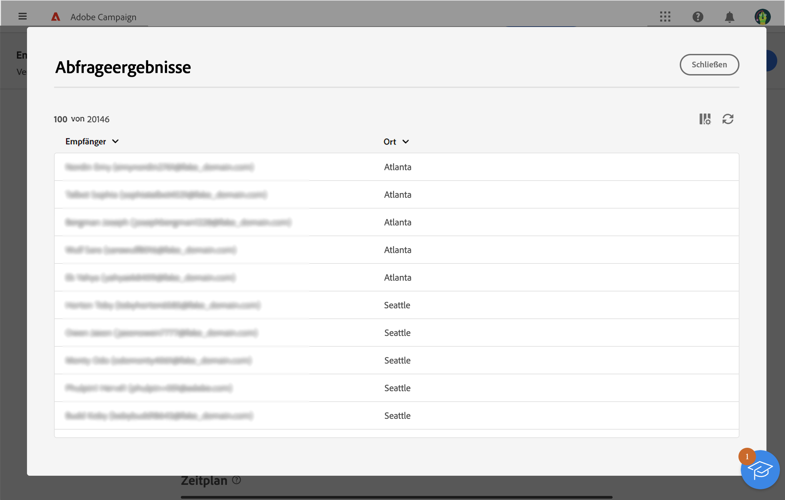

# Definieren einer Zielgruppe mit dem Regel-Builder {#segment-builder}

In diesem Abschnitt wird beschrieben, wie Sie beim Entwerfen einer neuen E-Mail eine Audience erstellen. Die erstellte Audience kann nur in dieser E-Mail verwendet werden.

Mit dem Rule Builder können Sie die Zielgruppe Ihrer Nachricht definieren, indem Sie die in der Datenbank enthaltenen Daten filtern. Informationen zur Auswahl einer bereits bestehenden Audience finden Sie in [diesem Abschnitt](add-audience.md).

Weitere Informationen zum Regel-Builder finden Sie im Abschnitt [Dokumentation zum Segmentierungsdienst](https://experienceleague.adobe.com/docs/experience-platform/segmentation/ui/segment-builder.html?lang=de).

Gehen Sie wie folgt vor, um beim Entwerfen einer E-Mail eine neue Audience zu erstellen:

1. Klicken Sie im Abschnitt **Audience** des Assistenten zur Versanderstellung auf die Schaltflache **[!UICONTROL Audience auswählen]** .

   

1. Wählen Sie **Eigene erstellen** aus. Der Regel-Builder wird angezeigt.

   

## Die Palette

Die Palette auf der linken Seite enthält alle Elemente, nach denen Sie filtern können, um Ihre Audience zu erstellen. Die in der Palette enthaltenen Kacheln müssen in die mittlere Arbeitsfläche verschoben werden, damit sie konfiguriert und berücksichtigt werden können. Die Palette ist in zwei Registerkarten unterteilt:

* **Attribute**: Auf dieser Registerkarte können Sie auf alle verfügbaren Felder des Schemas zugreifen. Die Liste der Felder hängt von dem in der E-Mail-Vorlage definierten Zielgruppenbestimmungsschema ab.

   {width="70%" align="left"}

* **Zielgruppen**: Auf diesem Tab können Sie nach einer der in der Campaign Classic-Konsole oder in Adobe Experience Platform definierten Zielgruppen filtern.

   {width="70%" align="left"}

   >[!NOTE]
   >
   >Um Adobe Experience Platform-Zielgruppen zu nutzen, müssen Sie die Integration mit Zielen konfigurieren. Siehe Abschnitt [Dokumentation zu Zielen](https://experienceleague.adobe.com/docs/experience-platform/destinations/home.html?lang=de){target="_blank"}.

Sie können die Suchleiste verwenden, um Elemente schnell zu finden.

## Die Arbeitsfläche

Die Arbeitsfläche ist der zentrale Bereich des Bildschirms, in dem Sie die Regeln basierend auf den aus der Palette hier abgelegten Elementen konfigurieren und kombinieren können. Um eine neue Regel hinzuzufügen, ziehen Sie eine Kachel aus der Palette auf die Arbeitsfläche. Anschließend erhalten Sie je nach hinzugefügtem Datentyp kontextspezifische Optionen.

{width="70%" align="left"}

## Der Bereich mit den Regeleigenschaften

Auf der rechten Seite können Sie im Bereich **Regeleigenschaften** die folgenden Aktionen ausführen:

{width="70%" align="left"}

* **Ergebnisse anzeigen:** zeigt die Liste der von der Audience angesprochenen Empfänger an.
* **Code-Ansicht**: Zeigt eine Code-basierte Version der Audience in SQL an.
* **Erweiterte Attribute anzeigen**: Aktivieren Sie diese Option, wenn Sie die vollständige Liste der Attribute in der linken Palette anzeigen möchten: Knoten, Gruppierungen, 1:1-Links, 1:n-Links.
* **Attribute**: zeigt eine Beschreibung der erstellten Audience an.

## Beispiel

In diesem Beispiel erstellen wir eine Audience, um alle Kunden anzusprechen, die in Atlanta oder Seattle leben und nach 1980 geboren wurden.

1. Suchen Sie in der Registerkarte **Attribute** der Palette nach dem Feld **Geburtsdatum**. Ziehen Sie die Kachel und legen Sie sie auf der Arbeitsfläche ab.

   

1. Wählen Sie auf der Arbeitsfläche den Operator **Nach** und geben Sie das gewünschte Datum ein.

   

1. Suchen Sie in der Palette nach dem Feld **Ort** und fügen Sie es unterhalb der ersten Regel zur Arbeitsfläche hinzu.

   

1. Geben Sie im Textfeld den Vornamen des Ortes ein und drücken Sie dann die Eingabetaste.

   

1. Wiederholen Sie diese Aktion für den zweiten Stadtnamen.

   

1. Klicken Sie auf **Ergebnisse anzeigen**, um die Liste und die Anzahl der Empfänger anzuzeigen, die der Abfrage entsprechen. Sie können auch Spalten hinzufügen, um die Daten zu visualisieren und zu überprüfen. Fügen Sie in unserem Beispiel die **Ort** und sollte Atlanta und Seattle sehen.

   

1. Klicken Sie auf **Bestätigen**.

Ihre Audience ist definiert und kann in Ihrer E-Mail verwendet werden.