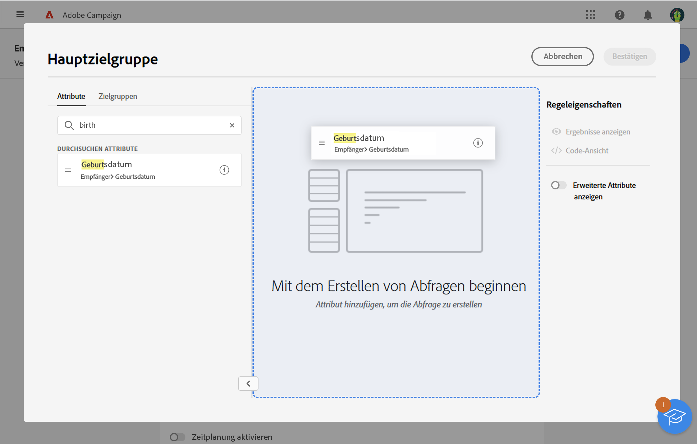

# Arbeiten mit dem Regel-Builder {#segment-builder}

Mit dem Regel-Builder können Sie die Population definieren, die mit Ihrem Versand angesprochen werden soll, indem Sie in der Datenbank enthaltene Daten filtern. Sie können damit eine Zielgruppe aus einem Workflow erstellen, indem Sie die Aktivität **[!UICONTROL Zielgruppe erstellen]** verwenden, oder beim Erstellen eines Versands eine Zielgruppe direkt als einmalige Zielgruppe erstellen.

* [Informationen zum Erstellen und Speichern einer Zielgruppe](create-audience.md)
* [Erfahren Sie, wie Sie eine einmalige Zielgruppe für einen Versand erstellen.](one-time-audience.md)

## Die Palette

Die Palette auf der linken Seite enthält alle Elemente, nach denen Sie filtern können, um Ihre Zielgruppe zu erstellen. Sie können die Suchleiste verwenden, um Elemente schnell zu finden. Die in der Palette enthaltenen Kacheln müssen in die mittlere Arbeitsfläche verschoben werden, damit sie konfiguriert und berücksichtigt werden können.

{zoomable=&quot;yes&quot;}{width="70%" align="left"}

Die Palette ist in zwei Registerkarten unterteilt:

* **Attribute**: Auf dieser Registerkarte können Sie auf alle verfügbaren Felder des Schemas zugreifen. Die Liste der Felder hängt von dem in der E-Mail-Vorlage definierten Zielgruppenbestimmungsschema ab.

* **Zielgruppen**: Auf dieser Registerkarte können Sie über einen Filter eine der vorhandenen Zielgruppen auswählen, die in der Campaign Classic-Konsole oder in Adobe Experience Platform definiert sind. Mehr über die Erstellung und Verwaltung von Zielgruppen erfahren Sie in [diesem Abschnitt](manage-audience.md).

  >[!NOTE]
  >
  >Um Adobe Experience Platform-Zielgruppen zu nutzen, müssen Sie die Integration mit Zielen konfigurieren. Weitere Informationen finden Sie in der Dokumentation zu [Adobe Experience Platform-Zielen](https://experienceleague.adobe.com/docs/experience-platform/destinations/home.html?lang=de){target="_blank"}.

## Die Arbeitsfläche

Die Arbeitsfläche ist der zentrale Bereich des Bildschirms, in dem Sie die Regeln basierend auf den aus der Palette hier abgelegten Elementen konfigurieren und kombinieren können. Um eine neue Regel hinzuzufügen, ziehen Sie eine Kachel aus der Palette auf die Arbeitsfläche. Je nach Art der hinzuzufügenden Daten werden Ihnen dann kontextspezifische Optionen angezeigt.

{zoomable=&quot;yes&quot;}{width="70%" align="left"}

## Der Bereich mit den Regeleigenschaften

Auf der rechten Seite können Sie im Bereich **Regeleigenschaften** die folgenden Aktionen ausführen.

{zoomable=&quot;yes&quot;}{width="70%" align="left"}

* **Ergebnisse anzeigen:** zeigt die Liste der von der Zielgruppe angesprochenen Profile an.
* **Code-Ansicht**: Zeigt eine Code-basierte Version der Zielgruppe in SQL an.
* **Erweiterte Attribute anzeigen**: Aktivieren Sie diese Option, wenn Sie die vollständige Liste der Attribute in der linken Palette anzeigen möchten: Knoten, Gruppierungen, 1:1-Links, 1:n-Links.
* **Berechnen**: Aktualisiert und zeigt die Anzahl der Profile an, die von Ihrer Abfrage angesprochen werden.
* **Filter auswählen oder speichern**: Verwenden Sie einen vordefinierten Filter, um Ihre Abfrage zu filtern, oder speichern Sie Ihre Abfrage als neuen Filter, um sie später erneut zu verwenden. [Erfahren Sie, wie Sie mit vordefinierten Filtern arbeiten](../get-started/predefined-filters.md)

  >[!IMPORTANT]
  >
  >In dieser Produktversion sind einige vordefinierte Filter nicht in der Benutzeroberfläche verfügbar. Sie können sie dennoch verwenden. [Weitere Informationen](../get-started/guardrails.md#predefined-filters-filters-guardrails-limitations)

* **Attribute**: zeigt eine Beschreibung der erstellten Zielgruppe an.

## Beispiel

In diesem Beispiel erstellen wir eine Zielgruppe für alle Kunden und Kundinnen, die in Atlanta oder Seattle leben und nach 1980 geboren wurden.

1. Suchen Sie in der Registerkarte **Attribute** der Palette nach dem Feld **Geburtsdatum**. Ziehen Sie die Kachel und legen Sie sie auf der Arbeitsfläche ab.

   {zoomable=&quot;yes&quot;}

1. Wählen Sie auf der Arbeitsfläche den Operator **Nach** und geben Sie das gewünschte Datum ein.

   {zoomable=&quot;yes&quot;}

1. Suchen Sie in der Palette nach dem Feld **Ort** und fügen Sie es unterhalb der ersten Regel zur Arbeitsfläche hinzu.

   {zoomable=&quot;yes&quot;}

1. Geben Sie im Textfeld den Vornamen des Ortes ein und drücken Sie dann die Eingabetaste.

   {zoomable=&quot;yes&quot;}

1. Wiederholen Sie diese Aktion für den zweiten Stadtnamen.

   {zoomable=&quot;yes&quot;}

1. Klicken Sie auf **Ergebnisse anzeigen**, um die Liste und die Anzahl der Empfangenen anzuzeigen, die der Abfrage entsprechen. Sie können auch Spalten hinzufügen, um die Daten zu visualisieren und zu überprüfen. Fügen Sie für unser Beispiel die Spalte **Stadt** hinzu. Atlanta und Seattle sollten hier zu sehen sein.

   {zoomable=&quot;yes&quot;}

1. Klicken Sie auf **Bestätigen**.