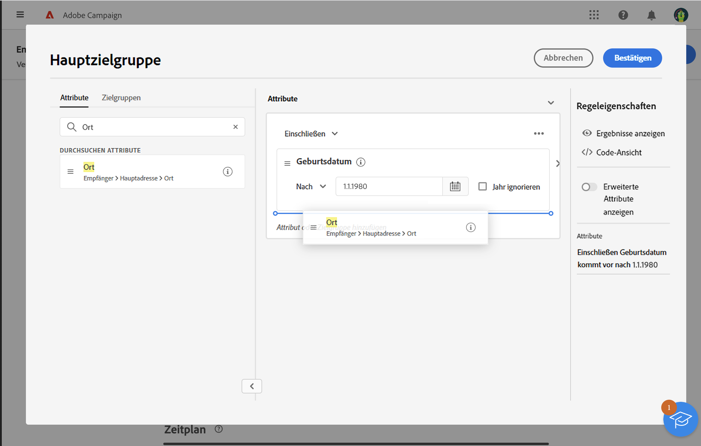

# Arbeiten mit dem Regel-Builder {#segment-builder}

Mit dem Regel-Builder können Sie die Population für Ihren Versand definieren, indem Sie in der Datenbank enthaltene Daten filtern. Verwenden Sie diese Option, um entweder über einen Workflow mit der Aktivität **[!UICONTROL Zielgruppe aufbauen]** oder direkt beim Erstellen eines Versands eine einmalige Zielgruppe zu erstellen.

* [Informationen zum Erstellen und Speichern einer Zielgruppe](create-audience.md)
* [Erfahren Sie, wie Sie eine einmalige Zielgruppe für einen Versand erstellen.](one-time-audience.md)

## Die Palette

Die Palette auf der linken Seite enthält alle Elemente, nach denen Sie filtern können, um Ihre Audience zu erstellen. Verwenden Sie die Suchleiste, um Elemente schnell zu finden. Verschieben Sie die in der Palette enthaltenen Kacheln in die mittlere Arbeitsfläche, um sie zu konfigurieren und zu berücksichtigen.

{zoomable="yes"}{width="70%" align="left"}

Die Palette ist in zwei Registerkarten unterteilt:

* **Attribute**: Diese Registerkarte bietet Zugriff auf alle verfügbaren Felder des Schemas. Die Liste der Felder hängt von dem in der E-Mail-Vorlage definierten Zielgruppenbestimmungsschema ab.

* **Audiences**: Auf dieser Registerkarte können Sie mithilfe der in der Campaign Classic-Konsole oder in Adobe Experience Platform definierten bestehenden Audiences filtern. In diesem Abschnitt erfahren Sie, wie Sie Audiences [ und verwalten](manage-audience.md).

  >[!NOTE]
  >
  >Um Adobe Experience Platform-Zielgruppen zu verwenden, konfigurieren Sie die Integration mit Zielen. Weitere Informationen finden Sie in der Dokumentation zu [Adobe Experience Platform-Zielen](https://experienceleague.adobe.com/docs/experience-platform/destinations/home.html?lang=de){target="_blank"}.

## Die Arbeitsfläche

Die Arbeitsfläche ist der zentrale Bereich, in dem Sie Regeln basierend auf den aus der Palette hinzugefügten Elementen konfigurieren und kombinieren können. Um eine neue Regel hinzuzufügen, ziehen Sie eine Kachel aus der Palette auf die Arbeitsfläche. Kontextspezifische Optionen werden basierend auf dem Typ der hinzuzufügenden Daten angezeigt.

{zoomable="yes"}{width="70%" align="left"}

## Der Bereich mit den Regeleigenschaften

Auf der rechten Seite können Sie im Bereich **Regeleigenschaften** die unten aufgeführten Aktionen ausführen.

{zoomable="yes"}{width="70%" align="left"}

* **Ergebnisse anzeigen:** Zeigt die Liste der Profile an, auf die sich die Audience bezieht.
* **Code-Ansicht**: Zeigt eine Code-basierte Version der Zielgruppe in SQL an.
* **Erweiterte Attribute anzeigen**: Aktivieren Sie diese Option, um die vollständige Liste der Attribute in der linken Palette anzuzeigen, einschließlich Knoten, Gruppierungen, 1:1-Links und 1:n-Links.
* **Berechnen**: Aktualisiert und zeigt die Anzahl der Profile an, auf die Ihre Abfrage abzielt.
* **Filter auswählen oder speichern**: Verwenden Sie einen vordefinierten Filter, um Ihre Abfrage zu filtern, oder speichern Sie Ihre Abfrage als neuen Filter für die zukünftige Wiederverwendung. [Erfahren Sie, wie Sie mit vordefinierten Filtern arbeiten](../get-started/predefined-filters.md).

  >[!IMPORTANT]
  >
  >In dieser Version des Produkts sind einige vordefinierte Filter nicht in der Benutzeroberfläche verfügbar. Sie können sie dennoch verwenden. [Weitere Informationen](../get-started/guardrails.md#predefined-filters-filters-guardrails-limitations).

* **Attribute**: Zeigt eine Beschreibung der erstellten Zielgruppe an.

## Beispiel

In diesem Beispiel wird eine Zielgruppe für alle Kunden erstellt, die in Atlanta oder Seattle leben und nach 1980 geboren wurden.

1. Suchen Sie in der Registerkarte **Attribute** der Palette nach dem Feld **Geburtsdatum**. Ziehen Sie die Kachel und legen Sie sie auf der Arbeitsfläche ab.

   {zoomable="yes"}

1. Wählen Sie auf der Arbeitsfläche den Operator **Nach** und geben Sie das gewünschte Datum ein.

   {zoomable="yes"}

1. Suchen Sie in der Palette nach dem Feld **Ort** und fügen Sie es unterhalb der ersten Regel zur Arbeitsfläche hinzu.

   {zoomable="yes"}

1. Geben Sie im Textfeld den Vornamen des Ortes ein und drücken Sie dann die Eingabetaste.

   {zoomable="yes"}

1. Wiederholen Sie diese Aktion für den zweiten Stadtnamen.

   {zoomable="yes"}

1. Klicken Sie auf **Ergebnisse anzeigen**, um die Liste und die Anzahl der Empfangenen anzuzeigen, die der Abfrage entsprechen. Spalten hinzufügen, um die Daten zu visualisieren und zu überprüfen. Fügen Sie in diesem Beispiel die Spalte **Stadt** hinzu, um Atlanta und Seattle anzuzeigen.

   {zoomable="yes"}

1. Klicken Sie auf **Bestätigen**.