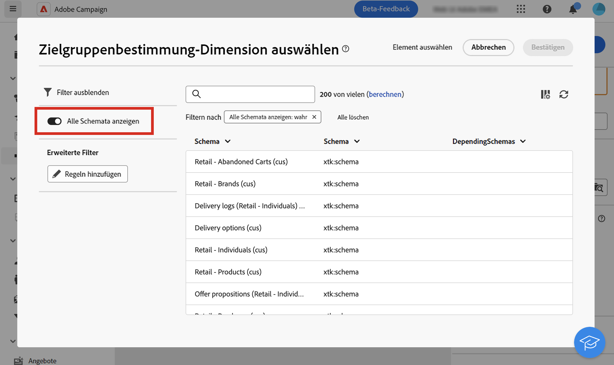

# Zielgruppendimensionen {#targeting-dimensions}

>[!CONTEXTUALHELP]
>id="acw_orchestration_build_audience_dimension"
>title="Auswählen der Zielgruppendimension"
>abstract="Die Zielgruppendimension ermöglicht die Bestimmung der vom Vorgang betroffenen Population: Empfängerinnen und Empfänger, Vertragsbegünstigte, Benutzerinnen und Benutzer, Abonnentinnen und Abonnenten usw. Standardmäßig wird die Zielgruppe aus den Empfängerinnen und Empfängern ausgewählt."

Die Zielgruppendimension, auch bekannt als Zielgruppen-Mapping, ist der Datentyp, den ein Vorgang verarbeitet. Hier können Sie die Zielpopulation festlegen: Profile, Vertragsbegünstigte, Benutzerinnen und Benutzern, Abonnierende, usw.

## Zielgruppendimensionen von Workflows {#workflow}

Die Zielgruppendimension eines Workflows wird durch die erste Aktivität **[!UICONTROL Zielgruppe erstellen]** definiert und wird bis zum Ende des Workflows für alle weiteren Aktivitäten verwendet. Wenn Sie z. B. Profile aus der Datenbank abfragen, enthält die ausgehende Transition Daten vom Typ „Empfänger“ und wird an die nächste Aktivität weitergeleitet.

Beachten Sie, dass Sie die Zielgruppendimension in einem Workflow mithilfe der Aktivität [Dimensionsänderung](../workflows/activities/change-dimension.md) wechseln können. Auf diese Weise können Sie beispielsweise die Datenbank in einer bestimmten Tabelle (z. B. zu Käufen oder Abonnements) abfragen und die Zielgruppendimension in „Empfänger“ ändern, um Sendungen an die entsprechenden Profile durchzuführen.

Bei der Auswahl einer Zielgruppendimension (in den Workflow-Einstellungen oder in Aktivitäten wie **Zielgruppe erstellen**, **Abstimmung** oder **Dimensionsänderung**) wird in der Liste standardmäßig eine Auswahl häufig verwendeter Schemata angezeigt. Um alle verfügbaren Schemata anzuzeigen, aktivieren Sie die Schaltfläche **[!UICONTROL Alle Schemata anzeigen]**. Die Optionsauswahl wird für jeden Benutzer bzw. jede Benutzerin gespeichert.

## Zielgruppendimensionen {#list}

Standardmäßig haben die E-Mail- und SMS-Versandvorlagen Profile als Zielgruppe. Ihr Zielgruppen-Mapping verwendet daher die Felder der Tabelle **nms:recipient**. Für Push-Benachrichtigungen ist die standardmäßige Zielgruppendimension **Abonnierte Anwendungen (nms:appSubscriptionRcp)**, das mit der Empfängertabelle verknüpft ist.

Sie können auch andere integrierte Zielgruppen-Mappings in Ihren Workflows und Sendungen verwenden, die unten aufgeführt sind:

| Name | Verwendungszweck | Schema |
|---|---|---|
| Empfängerinnen und Empfänger | Versand an Empfänger (integrierte Empfängertabelle) | nms:recipient |
| Besucher | Versand an Besucher, deren Profile beispielsweise über Empfehlungen (Viral Marketing) erfasst wurden. | mns:visitor |
| Abonnements  | Versand richtet sich an Abonnenten eines Informationsdienstes wie z. B. einen Newsletter | nms:subscription |
| Besucher-Abonnements | Versand richtet sich an Besucher, die einen Informationsdienst beziehen | nms:visitorSub |
| Benutzer | Versand richtet sich an Adobe-Campaign-Benutzer | nms:operator |
| Externe Datei | Versand basiert auf einer Datei, die alle notwendigen Informationen enthält | Ohne Schema oder Zielgruppe |
| Abonnierte Anwendungen | Versand an Empfängerinnen und Empfänger, die eine Anwendung abonniert haben | nms:appSubscriptionRcp |

Zusätzlich können Sie je nach Bedarf ein neues Zielgruppen-Mapping erstellen. Dies erfolgt über die Client-Konsole. Weitere Informationen finden Sie in der [Dokumentation zu Campaign v8 (Client-Konsole)](https://experienceleague.adobe.com/docs/campaign/campaign-v8/audience/add-profiles/target-mappings.html?lang=de#new-mapping){target="_blank"}.
