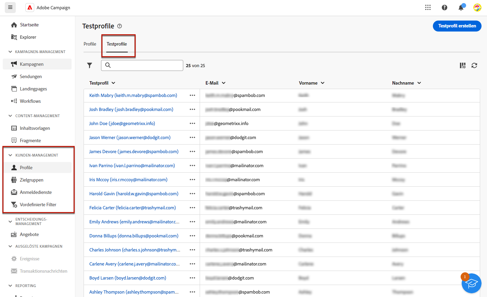
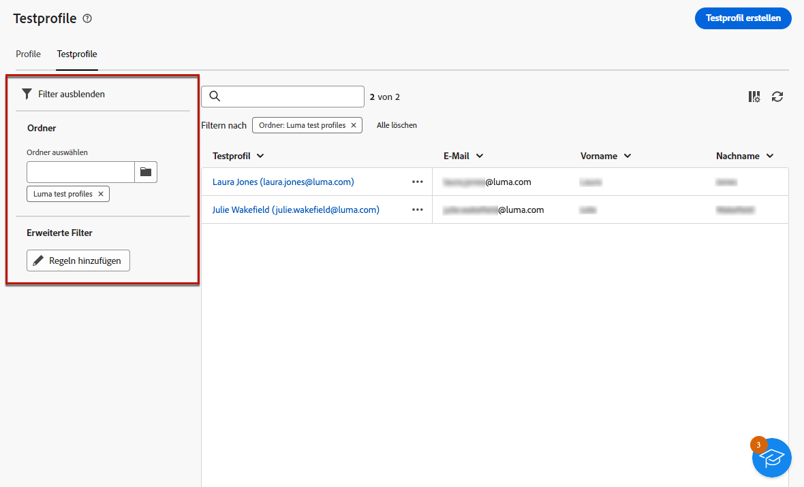
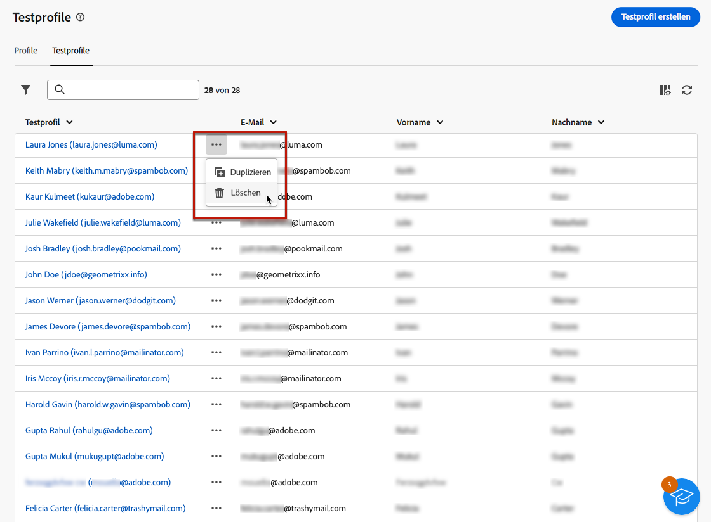
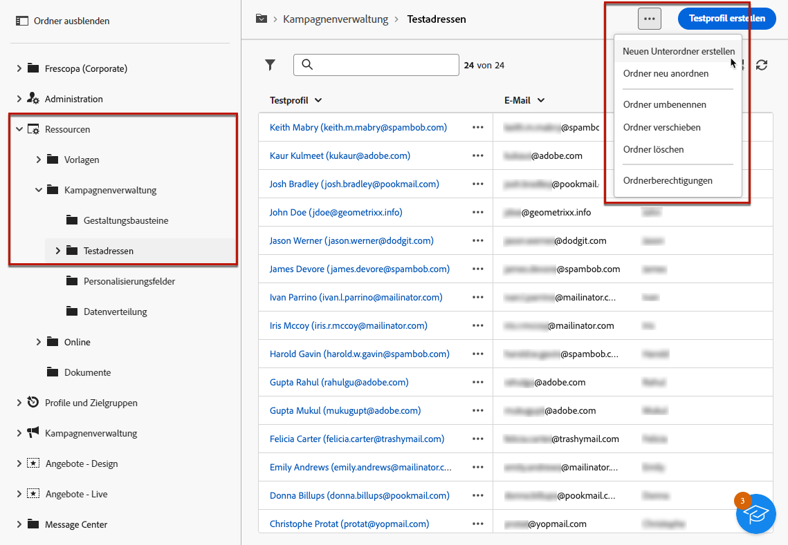
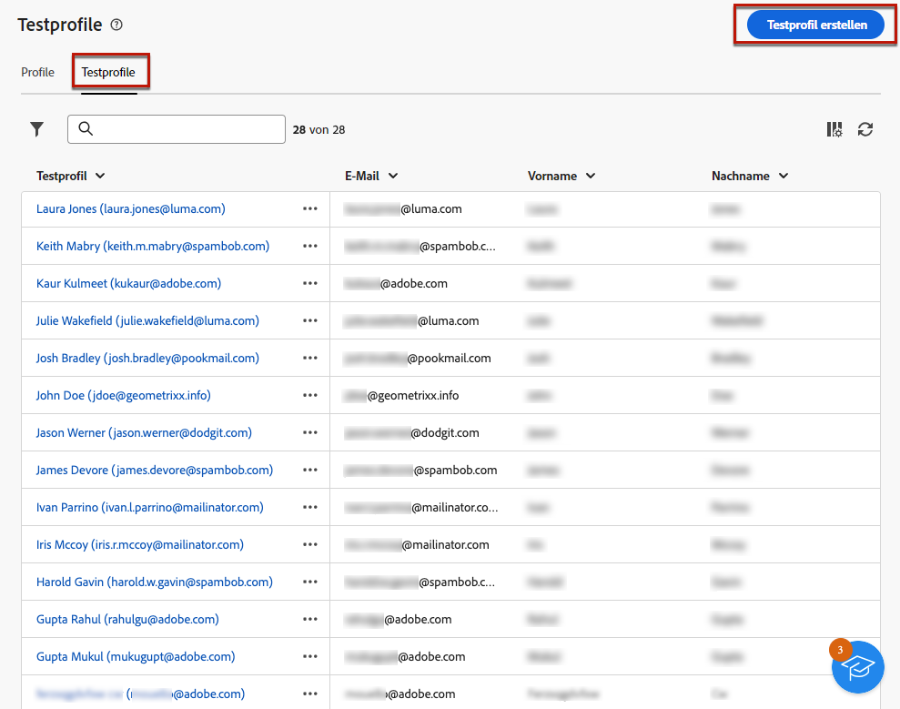
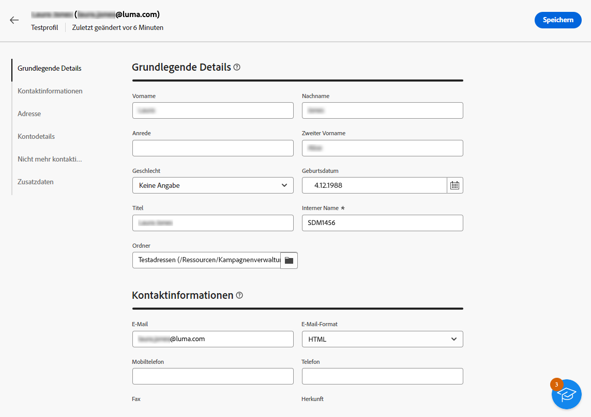
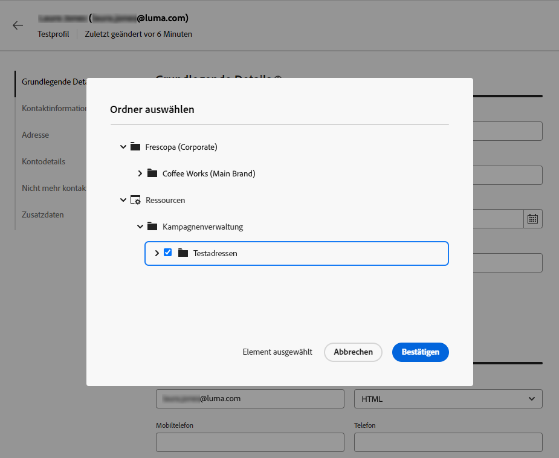
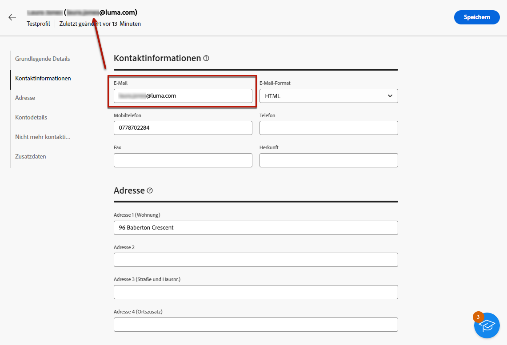
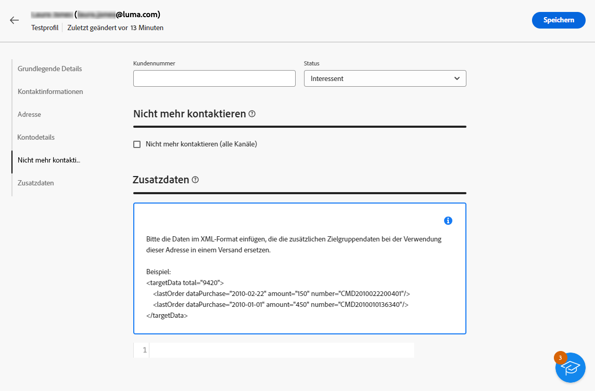

# Erstellen und Verwalten von Testprofilen {#create-test-profiles}

>[!CONTEXTUALHELP]
>id="acw_recipients_testprofiles_menu"
>title="Erstellen von Testprofilen"
>abstract="Testprofile sind zusätzliche Empfängerinnen und Empfänger, die Ihnen ermöglichen, die Personalisierung und das Rendern vor dem Nachrichtenversand in der Vorschau anzusehen und zu testen. Bei der Vorschau eines Nachrichteninhalts können Sie ein Testprofil auswählen und Testsendungen an die Testprofile durchführen, um den Nachrichteninhalt und die Einstellungen zu kontrollieren und zu validieren."

Testprofile werden verwendet, um Testsendungen durchzuführen und den Inhalt sowie die Einstellungen Ihrer Nachricht zu validieren. Diese Profile stehen für zusätzliche Empfängerinnen und Empfänger, die Ihnen ermöglichen, vor dem Senden Ihrer Nachrichten die Personalisierung und das Rendern in der Vorschau anzusehen und zu testen. Bei der Vorschau eines Nachrichteninhalts können Sie ein Testprofil auswählen und Testsendungen an die Testprofile durchführen, um den Nachrichteninhalt und die Einstellungen zu kontrollieren und zu validieren.

➡️ [Entdecken Sie diese Funktion im Video](#video)

<!--Learn more about test profiles in the [Campaign v8 (client console) documentation](https://experienceleague.adobe.com/docs/campaign/campaign-v8/audience/add-profiles/test-profiles.html?lang=de){target="_blank"}.-->

Informationen zum Versand von Testsendungen an Testprofile finden Sie in [diesem Abschnitt](../preview-test/test-deliveries.md#test-profiles).

>[!NOTE]
>
>* Testprofile werden als Testadressen in der Client-Konsole erstellt. 
>
>* Testprofile werden aus Berichten zu folgenden Versandstatistiken automatisch ausgeschlossen: **[!UICONTROL Klicks]**, **[!UICONTROL Öffnungen]**, **[!UICONTROL Abmeldungen]**. 

## Zugreifen auf und Verwalten von Testprofilen {#access-test-profiles}

Um auf die Testprofilliste zuzugreifen, wählen Sie im linken Menü die Option **[!UICONTROL Kunden-Management]** > **[!UICONTROL Profile]** aus und klicken Sie auf die Registerkarte **[!UICONTROL Testprofile]**.

{zoomable="yes"}

* Über die Dropdown-Liste können Sie nach einem bestimmten [Ordner](../get-started/permissions.md#folders) filtern oder mithilfe des [Abfrage-Modelers](../query/query-modeler-overview.md) Regeln hinzufügen.

  {zoomable="yes"}

* Sie können jedes Testprofil nach Bedarf duplizieren und aktualisieren. Die Schritte zum Bearbeiten eines Testprofils sind dieselben wie beim [Erstellen eines Testprofils](#create-test-profile).

* Um ein Testprofil zu löschen, wählen Sie die entsprechende Option aus dem Menü **[!UICONTROL Mehr Aktionen]**.

  {zoomable="yes"}

* Klicken Sie auf das gewünschte Element in der Liste, um ein Testprofil zu bearbeiten. Die Schritte zum Bearbeiten eines Testprofils sind dieselben wie beim [Erstellen eines Testprofils](#create-test-profile).

Sie können auch in der **[!UICONTROL Explorer]**-Ansicht unter dem Knoten **[!UICONTROL Ressourcen]** > **[!UICONTROL Kampagnen-Management]** > **[!UICONTROL Testadressen]** auf Testprofile zugreifen.

Dort können Sie Ordner oder Unterordner durchsuchen, erstellen und verwalten sowie die zugehörigen Berechtigungen überprüfen. [Erfahren Sie, wie Sie Ordner erstellen](../get-started/permissions.md#folders)

{zoomable="yes"}

In der Ansicht **[!UICONTROL Explorer]** können Sie Testprofile auch filtern, löschen, bearbeiten und [erstellen](#create-test-profile).

## Erstellen eines Testprofils {#create-test-profile}

>[!CONTEXTUALHELP]
>id="acw_recipients_testprofiles_additionaldata"
>title="Zusätzliche Daten zu Testprofilen"
>abstract="Die Personalisierungsdaten angben, die für die in den Data-Management-Workflows erstellten Sendungen verwendet werden und denen ein bestimmter Wert zugeweisen werden soll."

Gehen Sie wie folgt vor, um ein Testprofil zu erstellen:

1. Navigieren Sie zu **[!UICONTROL Kunden-Management]** > **[!UICONTROL Profile]** und wählen Sie die Registerkarte **[!UICONTROL Testprofile]** aus.

1. Klicken Sie auf die Schaltfläche **[!UICONTROL Testprofil erstellen]**.

   {zoomable="yes"}

1. Geben Sie die Details des Testprofils nach Bedarf ein. <!--Most of the fields are the same as when creating profiles. [Learn more]-->

   {zoomable="yes"}

   >[!NOTE]
   >
   >Das Feld **[!UICONTROL Titel]** wird automatisch mit dem von Ihnen festgelegten Vor- und Nachnamen ausgefüllt.

1. Standardmäßig werden Testprofile im Ordner **[!UICONTROL Testadressen]** gespeichert. Sie können ihn ändern, indem Sie zum gewünschten Speicherort navigieren. [Erfahren Sie mehr über die Arbeit mit Ordnern](../get-started/permissions.md#folders)

   <!--{zoomable="yes"}-->

<!--
You do not need to enter all fields of each tab when creating a seed address. Missing personalization elements are entered randomly during delivery analysis. (Not valid?)
-->

1. Geben Sie im Abschnitt **[!UICONTROL Kontaktdaten]** die E-Mail-Adresse und andere relevante Daten ein. Die E-Mail-Adresse wird in eckigen Klammern hinter der Testprofilbezeichnung angezeigt.

   {zoomable="yes"}

1. Wenn Sie die Option **[!UICONTROL Nicht mehr kontaktieren (alle Kanäle)]** aktivieren, befindet sich das Testprofil auf der Blockierungsliste. Solch eine Person wird auf keinem Kanal (E-Mail, SMS, usw.) mehr ausgewählt.

1. Geben Sie in der Registerkarte **[!UICONTROL Zusätzliche Daten]** die Personalisierungsdaten ein, mit denen die Sendungen in den Daten-Management-Workflows erstellt wurden und denen Sie einen bestimmten Wert zuweisen möchten. [Erfahren Sie mehr über Workflows](../workflows/gs-workflows.md)

   {zoomable="yes"}

   Stellen Sie sicher, dass in der Workflow-Aktivität **[!UICONTROL Anreicherung]** zusätzliche Zielgruppendaten mit einem Alias definiert wurden, der mit „@“ beginnt. Andernfalls können Sie sie in der Versandaktivität nicht ordnungsgemäß mit Ihren Testadressen verwenden. [Weitere Informationen zur Aktivität „Anreicherung“](../workflows/activities/enrichment.md)

1. Klicken Sie auf die Schaltfläche **[!UICONTROL Speichern]**.

Das soeben erstellte Testprofil kann jetzt zur Durchführung einer Testsendung verwendet werden. [Weitere Informationen](../preview-test/test-deliveries.md#test-profiles)

<!--Use test profiles in Direct mail? cf v7/v8-->

## Anleitungsvideo {#video}

Erfahren Sie, wie Sie mit der Campaign Web-Benutzeroberfläche Testprofile erstellen und verwalten.

>[!VIDEO](https://video.tv.adobe.com/v/3442844?quality=12)