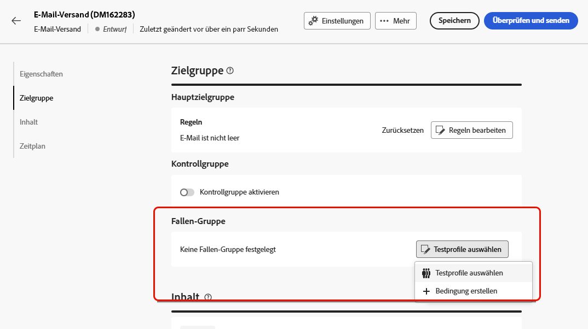
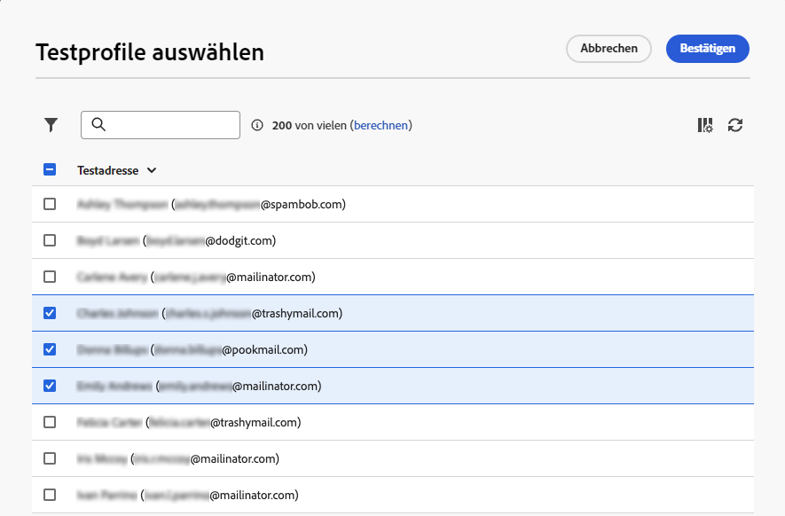
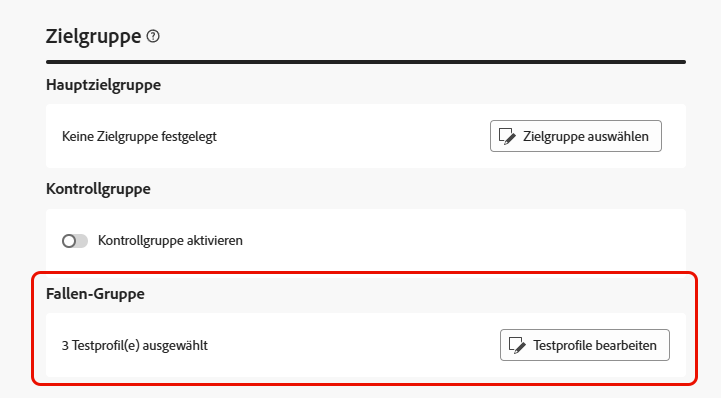
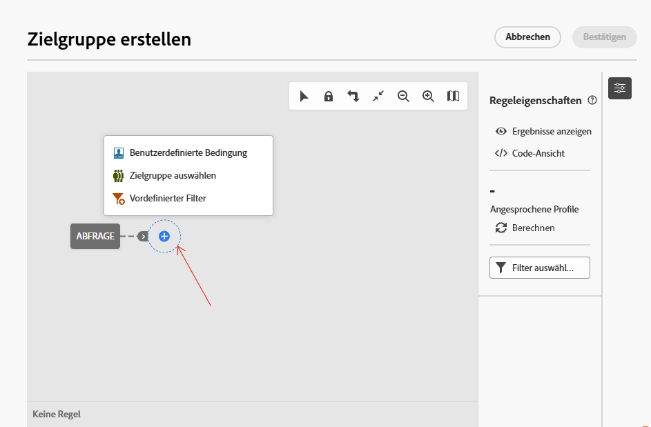
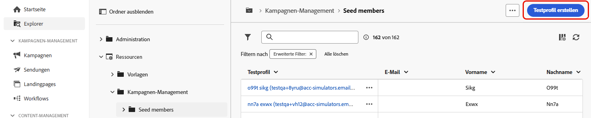
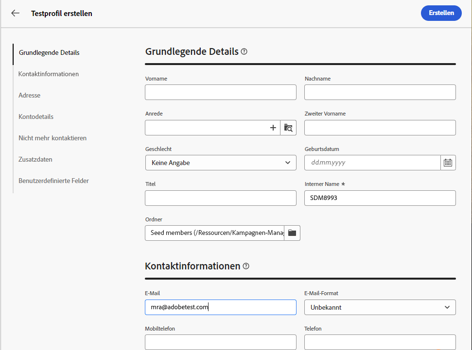

# Verwenden einer Trap-Gruppe {#trap-group}

Eine **[!UICONTROL Trap-Gruppe]** (auch **[!UICONTROL Testadressenliste]** genannt) wird verwendet, um bestimmte Adressen in Ihre Sendungen einzubeziehen und den Verteilungsprozess zu überwachen und zu überprüfen, indem Sie Profile auswählen, die nicht den definierten Zielgruppenkriterien entsprechen. Auf diese Weise können Empfängerinnen und Empfänger, die außerhalb des Versandbereichs liegen, die Sendungen wie jeder andere Zielgruppenempfangende erhalten.

Eine **[!UICONTROL Trap-Gruppe]** ist eine Gruppe von **[!UICONTROL Testadressen]** mit dem Titel **[!UICONTROL Testprofile]** in der Benutzeroberfläche von Campaign.

## Warum sollte eine Trap-Gruppe verwendet werden? {#why-trap-group}

Sie können eine **[!UICONTROL Trap-Gruppe]** für Folgendes verwenden:

1. **Testversand**: Jedes Mitglied der **[!UICONTROL Trap-Gruppe]** erhält den Versand so, als wäre es Teil der Zielgruppe.

1. **Zum Schutz Ihrer Mailingliste**: Da jedes **[!UICONTROL Testprofil]** der **[!UICONTROL Trap-Gruppe]** das Gleiche erhält wie die Zielgruppe, fällt es auf, wenn die Mailing-Liste von Dritten verwendet wird.

>[!NOTE]
>
>Zusätzlich zum [Versenden von Testsendungen während der Erstellung des Versands](../email/create-email.md#preview-test) und von der [Kontrollgruppe](control-group.md) aus ist das Hinzufügen einer Trap-Gruppe eine gute Möglichkeit, Ihre Zielgruppe zu testen.

## Informationen zu Trap-Gruppen {#about-trap-group}

Testprofile werden aus Berichten zu folgenden Versandstatistiken automatisch ausgeschlossen: **Klicks**, **Öffnungen**, **Abmeldungen**. Die Berichte beziehen sich ausschließlich auf die tatsächliche Zielgruppe.

In E-Mail-Sendungen ist für die **[!UICONTROL Trap-Gruppe]** nur die E-Mail-Adresse erforderlich. Die Personalisierung anderer Felder wird zufällig von Campaign ausgefüllt.

## Hinzufügen einer Trap-Gruppe zu einem Versand {#trap-group-in-delivery}

Navigieren Sie zum Einrichten einer **[!UICONTROL Trap-Gruppe]** zu den **[!UICONTROL Zielgruppeneinstellungen]** Ihres Versands. Sie haben zwei Optionen:

* [Testprofile auswählen](#select-test-profile)
* [Erstellen einer Bedingung](#create-condition)

{zoomable="yes"}

### Testprofile auswählen {#select-test-profiles}

Wenn Sie **Testprofile auswählen** auswählen, können Sie die Schaltfläche **Testprofil(e) hinzufügen** verwenden, wie unten dargestellt:

{zoomable="yes"}

Wenn Sie auf die Schaltfläche klicken, erhalten Sie Zugriff auf die Testprofile, die Sie zu Ihrer **[!UICONTROL Trap-Gruppe]** hinzufügen können. Wählen Sie diejenigen aus, die Sie verwenden möchten.

Sie können außerdem neue Testprofile erstellen. [Weitere Informationen](#create-seed)

{zoomable="yes"}

Wenn Sie Ihre Testprofile bestätigen, überprüfen Sie, ob die richtige Nummer in der **[!UICONTROL Trap-Gruppe]** vorliegt.

{zoomable="yes"}

### Erstellen einer Bedingung {#create-condition}

Mit der Option **[!UICONTROL Bedingung erstellen]** können Sie eine Abfrage erstellen, um die Testprofile zu definieren, die Sie verwenden möchten:

{zoomable="yes"}

Ihre Abfrage wird unter **[!UICONTROL Trap-Gruppe]** angezeigt.

{zoomable="yes"}

## Erstellen eines neuen Testprofils {#create-seed}

Sie können ein neues **[!UICONTROL Testprofil]** unter **[!UICONTROL Explorer]** > **[!UICONTROL Ressourcen]** > **[!UICONTROL Kampagnenverwaltung]** > **[!UICONTROL Testempfänger]** erstellen.

{zoomable="yes"}

Konfigurieren Sie alle Einstellungen für Ihr **[!UICONTROL Testprofil]** wie für jedes Profil:

{zoomable="yes"}
