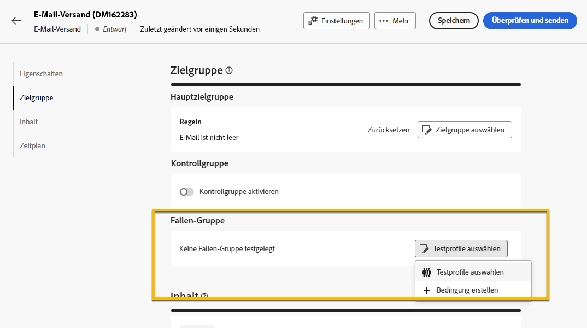
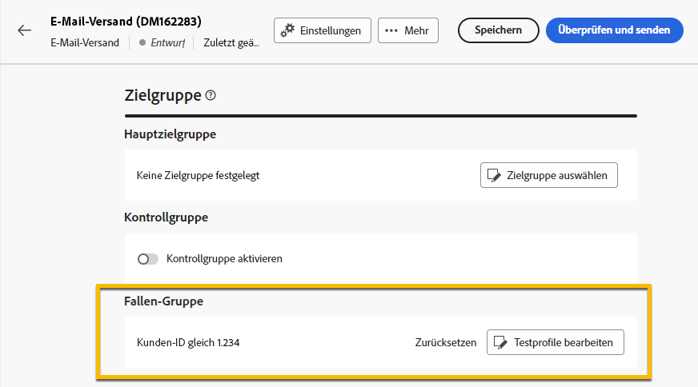

# Verwenden einer **[!UICONTROL Trap-Gruppe]** {#trap-group}

Eine **[!UICONTROL Trap-Gruppe]** ermöglicht den Versand an Empfängerinnen und Empfänger, die nicht den vorliegenden Zielgruppenkriterien entsprechen. Auf diese Weise können Empfängerinnen und Empfänger, die außerhalb des Versandumfangs liegen, die Nachricht ebenso wie jede andere Person innerhalb der Zielgruppe erhalten.
Eine **[!UICONTROL Trap-Gruppe]** ist eine Gruppe von **[!UICONTROL Testadressen]**.

## Warum sollte eine **[!UICONTROL Trap-Gruppe]** verwendet werden?

Sie können eine **[!UICONTROL Trap-Gruppe]** für Folgendes verwenden:

1. **Testversand**: Jedes Mitglied der **[!UICONTROL Trap-Gruppe]** erhält den Versand so, als wäre es Teil der Zielgruppe.

1. **Zum Schutz Ihrer Mailing-Liste**: Durch das Erhalten des Inhalts, den die Zielgruppe erhält, wird jede **[!UICONTROL Testadresse]** der **[!UICONTROL Trap-Gruppe]** angezeigt, wenn die Mailing-Liste von Dritten verwendet wird.

## Informationen zur **[!UICONTROL Trap-Gruppe]**

Testadressen werden grundsätzlich nicht in den folgenden Versandstatistikberichten berücksichtigt: **Klicks**, **Öffnungen**, **Abmeldungen**. Die Berichte beziehen sich ausschließlich auf die tatsächliche Zielgruppe.

In E-Mail-Sendungen ist für die **[!UICONTROL Trap-Gruppe]** nur die E-Mail-Adresse erforderlich. Die Personalisierung anderer Felder wird zufällig von Campaign ausgefüllt.

## Einrichten einer **[!UICONTROL Trap-Gruppe]** im Versand

Navigieren Sie zum Einrichten einer **[!UICONTROL Trap-Gruppe]** zu den **[!UICONTROL Zielgruppeneinstellungen]** Ihres Versands. Sie haben zwei Optionen:
- [Testprofile auswählen](#select-test-profile)
- [Bedingung erstellen](#create-condition)

{zoomable="yes"}

### Testprofile auswählen {#select-test-profiles}

Wenn Sie sich für „Testprofile auswählen“ entscheiden, wird das Fenster wie unten dargestellt angezeigt. Dort werden Sie zum **[!UICONTROL Hinzufügen von Testprofilen]** aufgefordert:

{zoomable="yes"}

Wenn Sie auf die Schaltfläche klicken, erhalten Sie Zugriff auf die Testadressen, die Sie zu Ihrer **[!UICONTROL Trap-Gruppe]** hinzufügen können. Kreuzen Sie diejenigen an, die Sie verwenden möchten.
Sie können neue Testadressen erstellen. [Weitere Informationen](#create-seed)

{zoomable="yes"}

Wenn Sie Ihre Trap-Adressen bestätigen, überprüfen Sie, ob die richtige Nummer unter **[!UICONTROL Trap-Gruppe]** vorliegt.

{zoomable="yes"}

### Bedingung erstellen {#create-condition}

Wenn Sie die Option **[!UICONTROL Bedingung erstellen]** wählen, wird ein neues Fenster angezeigt, in dem Sie eine Abfrage anpassen können, um die Testadressen zu definieren, die Sie verwenden möchten:

{zoomable="yes"}

Ihre Abfrage wird unter **[!UICONTROL Trap-Gruppe]** angezeigt.

{zoomable="yes"}

## Erstellen einer neuen **[!UICONTROL Testadresse]** {#create-seed}

Sie können eine neue **[!UICONTROL Testadresse]** unter **[!UICONTROL Explorer]** > **[!UICONTROL Ressourcen]** > **[!UICONTROL Kampagnenverwaltung]** > **[!UICONTROL Testempfänger]** erstellen.

{zoomable="yes"}

Sie können alle Details zu Ihrem Testmitglied so ausfüllen, als wäre es ein Zielgruppenprofil:

{zoomable="yes"}