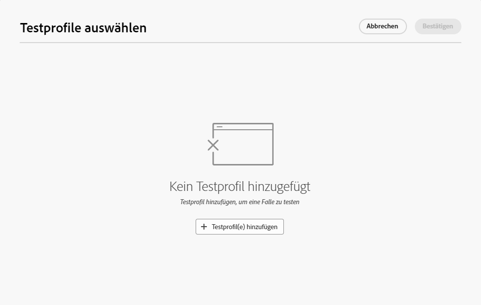

# Verwenden Sie eine **[!UICONTROL Fallen-Gruppe]** {#trap-group}

A **[!UICONTROL Fallen-Gruppe]** wird verwendet, um Empfänger auszuwählen, die nicht den definierten Zielgruppenkriterien entsprechen. Auf diese Weise können Empfänger, die außerhalb des Versandumfangs liegen, den Versand wie jeder andere Zielempfänger erhalten.
A **[!UICONTROL Fallen-Gruppe]** ist eine Gruppe von **[!UICONTROL Testadressen]**.

## Warum **[!UICONTROL Fallen-Gruppe]**

Sie können **[!UICONTROL Fallen-Gruppe]** :

1. **Als Beweis** : jedes Mitglied der **[!UICONTROL Fallen-Gruppe]** erhält den Versand so, als wären sie Teil der Zielgruppe.

1. **So schützen Sie Ihre Mailingliste** : durch Erhalt des Inhalts, den die Zielgruppe erhält, jede **[!UICONTROL Testadresse]** des **[!UICONTROL Fallen-Gruppe]** wird angezeigt, wenn die Mailingliste von einem Dritten verwendet wird.

## Info **[!UICONTROL Fallen-Gruppe]**

Testadressen werden automatisch aus Berichten über die folgenden Versandstatistiken ausgeschlossen: **Klicks**, **Öffnungen**, **Abmeldungen**. Die Berichte beziehen sich ausschließlich auf die tatsächliche Zielgruppe.

Bei einem E-Mail-Versand ist nur die E-Mail-Adresse erforderlich, um die **[!UICONTROL Fallen-Gruppe]**, wird die Personalisierung anderer Felder zufällig von Campaign ausgefüllt.

## Einrichten einer **[!UICONTROL Fallen-Gruppe]** im Versand

So richten Sie eine **[!UICONTROL Fallen-Gruppe]**, navigieren Sie zu **[!UICONTROL Zielgruppe]** Versandeinstellungen. Sie haben zwei Optionen:
- [Testprofile auswählen](#select-test-profile)
- [Bedingung erstellen](#create-condition)

{zoomable="yes"}

### Testprofile auswählen {#select-test-profiles}

Wenn Sie &quot;Testprofile auswählen&quot;auswählen, wird das Fenster wie unten dargestellt angezeigt, in dem Sie zur **[!UICONTROL Hinzufügen von Testprofilen]** :

{zoomable="yes"}

Wenn Sie auf die Schaltfläche klicken, haben Sie Zugriff auf die Testadressen, die Sie hinzufügen können **[!UICONTROL Fallen-Gruppe]**. Überprüfen Sie die, die Sie verwenden möchten.
Sie können neue Testadressen erstellen. [Weitere Informationen](#create-seed)

{zoomable="yes"}

Wenn Sie Ihre Fallen-Adressen bestätigen, überprüfen Sie, ob Sie die richtige Nummer unter **[!UICONTROL Fallen-Gruppe]**.

{zoomable="yes"}

### Bedingung erstellen {#create-condition}

Mit dem **[!UICONTROL Bedingung erstellen]** Wählen Sie aus, erhalten Sie ein neues Fenster, in dem Sie eine Abfrage erstellen können, um die Testadressen zu definieren, die Sie verwenden möchten:

{zoomable="yes"}

Ihre Abfrage wird unter **[!UICONTROL Fallen-Gruppe]**.

{zoomable="yes"}

## Erstellen eines neuen **[!UICONTROL Testadresse]** {#create-seed}

Sie können eine neue **[!UICONTROL Testadresse]** in **[!UICONTROL Explorer]** > **[!UICONTROL Ressourcen]** > **[!UICONTROL Campaign Management]** > **[!UICONTROL Testempfänger]**

{zoomable="yes"}

Sie können alle Details zu Ihrem Seed-Mitglied so ausfüllen, als wäre es ein Zielgruppenprofil :

{zoomable="yes"}