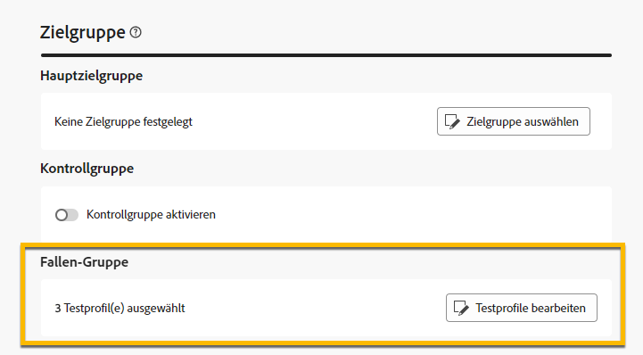
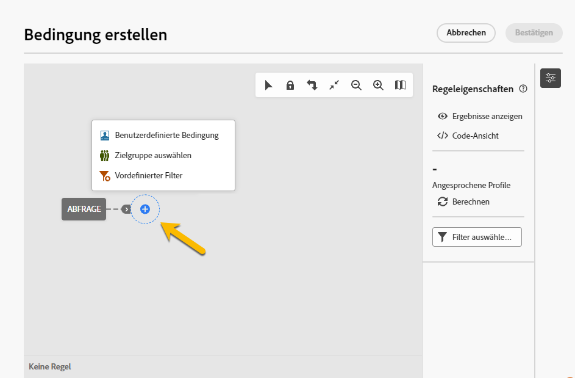
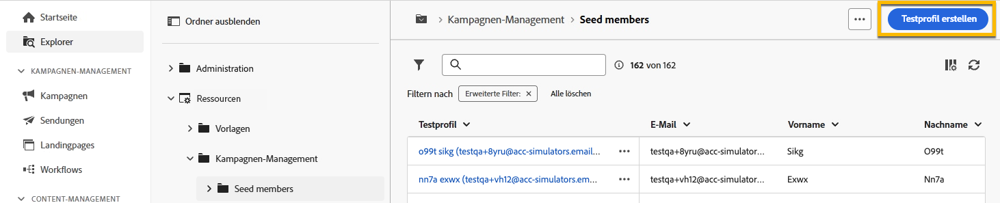

# Verwenden einer Trap-Gruppe {#trap-group}

>[!CONTEXTUALHELP]
>id="acw_homepage_welcome_rn2"
>title="Fallen-Gruppe"
>abstract="Sie können eine Fallen-Gruppe verwenden, um bestimmte Adressen in Ihre Sendungen einzubeziehen, um den Verteilungsprozess zu überwachen und zu überprüfen, indem Sie Profile auswählen, die nicht den definierten Zielgruppenkriterien entsprechen."
>additional-url="https://experienceleague.adobe.com/docs/campaign-web/v8/release-notes/release-notes.html?lang=de" text="Siehe Versionshinweise"

Eine **[!UICONTROL Fallen-Gruppe]** (auch **[!UICONTROL Testliste]** genannt) wird verwendet, um bestimmte Adressen in Ihre Sendungen einzubeziehen, um den Verteilungsprozess zu überwachen und zu überprüfen, indem Profile ausgewählt werden, die nicht den definierten Zielkriterien entsprechen. Auf diese Weise können Empfänger, die außerhalb des Versandperimeters liegen, die Nachricht so wie jeder andere Empfänger innerhalb der Zielgruppe erhalten.

Eine **[!UICONTROL Fallen-Gruppe]** ist eine Gruppe von **[!UICONTROL Testadressen]** mit dem Namen **[!UICONTROL Testprofil]** in der Campaign-Webbenutzeroberfläche.

## Warum eine Fallen-Gruppe verwenden? {#why-trap-group}

Sie können **[!UICONTROL Fallen-Gruppe]** verwenden:

1. **Als Testversand**: Jedes Mitglied der **[!UICONTROL Trap-Gruppe]** erhält den Versand so, als wäre es Teil der Zielgruppe.

1. **Schutz Ihrer Mailingliste**: Durch den Empfang der Informationen, die die Zielgruppe erhalten wird, wird jedes **[!UICONTROL Testprofil]** der **[!UICONTROL Trap group]** bemerkt, wenn die Mailingliste von einem Drittanbieter verwendet wird.

>[!NOTE]
>
>Zusätzlich zum [ Senden von Testsendungen während der Erstellung des Versands](../email/create-email.md#preview-test) und von der [Kontrollgruppe](control-group.md) ist das Hinzufügen einer Fallen-Gruppe eine gute Möglichkeit, Ihre Zielgruppe zu testen.

## Fallen-Gruppen {#about-trap-group}

Testprofile werden aus Berichten zu folgenden Versandstatistiken automatisch ausgeschlossen: **Klicks**, **Öffnungen**, **Abmeldungen**. Die Berichte beziehen sich ausschließlich auf die tatsächliche Zielgruppe.

In E-Mail-Sendungen ist für die **[!UICONTROL Trap-Gruppe]** nur die E-Mail-Adresse erforderlich. Die Personalisierung anderer Felder wird zufällig von Campaign ausgefüllt.

## Hinzufügen einer Fallen-Gruppe in einem Versand {#trap-group-in-delivery}

Navigieren Sie zum Einrichten einer **[!UICONTROL Trap-Gruppe]** zu den **[!UICONTROL Zielgruppeneinstellungen]** Ihres Versands. Sie haben zwei Optionen:

* [Testprofile auswählen](#select-test-profile)
* [Bedingung erstellen](#create-condition)

{zoomable="yes"}

### Testprofile auswählen {#select-test-profiles}

Wenn Sie **Testprofile auswählen** auswählen, können Sie die Schaltfläche **Testprofil(e) hinzufügen** verwenden, wie unten dargestellt:

{zoomable="yes"}

Wenn Sie auf die Schaltfläche klicken, haben Sie Zugriff auf die Testprofile, die Sie Ihrer **[!UICONTROL Fallen-Gruppe]** hinzufügen können. Wählen Sie die aus, die Sie verwenden möchten.

Sie können auch neue Testprofile erstellen. [Weitere Informationen](#create-seed)

{zoomable="yes"}

Wenn Sie Ihre Testprofile bestätigen, vergewissern Sie sich, dass unter **[!UICONTROL Trap group]** die richtige Zahl vorhanden ist.

{zoomable="yes"}

### Bedingung erstellen {#create-condition}

Mit der Option **[!UICONTROL Bedingung erstellen]** können Sie eine Abfrage erstellen, um die Testprofile zu definieren, die Sie verwenden möchten:

{zoomable="yes"}

Ihre Abfrage wird unter **[!UICONTROL Trap group]** angezeigt.

{zoomable="yes"}

## Neues Testprofil erstellen {#create-seed}

Sie können ein neues **[!UICONTROL Testprofil]** aus dem Ordner **[!UICONTROL Explorer]** > **[!UICONTROL Ressourcen]** > **[!UICONTROL Campaign Management]** > **[!UICONTROL Testempfänger]** erstellen.

{zoomable="yes"}

Konfigurieren Sie alle Einstellungen für Ihr **[!UICONTROL Testprofil]** wie für jedes Profil:

{zoomable="yes"}