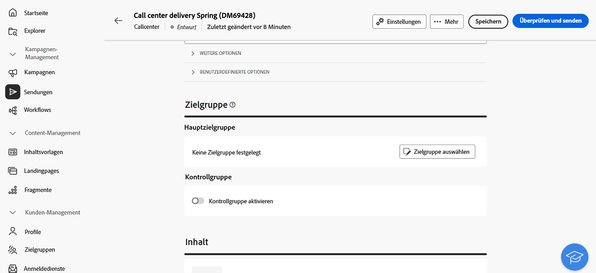
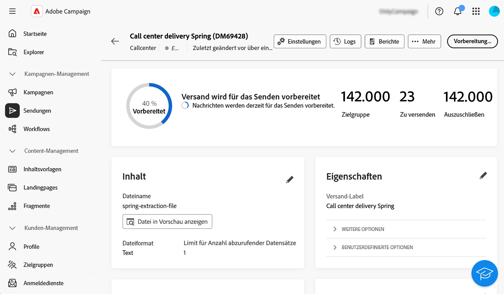

# Erstellen und Durchführen eines Callcenter-Versands {#create-call-center}

Sie können einen eigenständigen Callcenter-Versand erstellen oder einen im Kontext eines Kampagnen-Workflows erstellen. Die folgenden Schritte beschreiben das Verfahren für einen eigenständigen (einmaligen) Versand. Wenn Sie im Kontext eines Kampagnen-Workflows arbeiten, werden in [diesem Abschnitt](../workflows/activities/channels.md#create-a-delivery-in-a-campaign-workflow) die Schritte beschrieben, die zum Erstellen eines solchen Versands erforderlich sind.

Gehen Sie wie folgt vor, um einen neuen eigenständigen Callcenter-Versand zu erstellen und zu senden:

1. Versand erstellen, [mehr dazu](#create-delivery)
1. Definieren Sie die Audience [mehr dazu](#select-audience)
1. Inhalt bearbeiten, [mehr dazu](#edit-content)
1. Vorschau und Versand des Versands [mehr dazu](#preview-send)

## Erstellen des Versands{#create-delivery}

Führen Sie die folgenden Schritte aus, um den Versand zu erstellen und seine Eigenschaften zu konfigurieren:

1. Wählen Sie das **[!UICONTROL Sendungen]** und klicken Sie auf die Schaltfläche **[!UICONTROL Versand erstellen]**.

1. Wählen Sie **[!UICONTROL Kanal]** Callcenter“ aus und klicken Sie zur Bestätigung **[!UICONTROL Versand erstellen]**.

   {zoomable="yes"}

   >[!NOTE]
   >
   >Wenn Sie eine andere Vorlage auswählen möchten, lesen Sie diese [Seite](../msg/delivery-template.md).

1. Geben **[!UICONTROL unter &quot;]**&quot; einen **[!UICONTROL Titel]** für den Versand ein. Weitere Optionen werden in diesem [Abschnitt](../email/create-email.md#create-email) beschrieben.

   {zoomable="yes"}

>[!NOTE]
>
>Sie können den Versand so planen, dass er zu einem bestimmten Datum erfolgt. Weitere Informationen hierzu finden Sie in diesem [Abschnitt](../msg/gs-deliveries.md#gs-schedule).

## Zielgruppe definieren{#select-audience}

Definieren Sie nun die Audience für die Extraktionsdatei.

1. Klicken Sie **[!UICONTROL Abschnitt]** Audience“ auf der Versandseite auf **[!UICONTROL Audience auswählen]**.

   {zoomable="yes"}

1. Wählen Sie eine vorhandene Audience aus oder erstellen Sie eine eigene.

   * [Erfahren Sie, wie Sie eine vorhandene Zielgruppe auswählen.](../audience/add-audience.md)
   * [Erfahren Sie, wie Sie eine neue Zielgruppe erstellen.](../audience/one-time-audience.md)

   {zoomable="yes"}

>[!NOTE]
>
>Callcenter-Empfänger müssen mindestens ihren Namen und ihre Telefonnummer enthalten. Alle Empfänger mit unvollständigen Informationen werden von den Sendungen an das Callcenter ausgeschlossen.
>
>Informationen zum Konfigurieren von Kontrollgruppen finden Sie auf dieser [Seite](../audience/control-group.md).

## Inhalt bearbeiten{#edit-content}

Bearbeiten wir nun den Inhalt der Extraktionsdatei, die vom Callcenter-Versand generiert wird.

1. Klicken Sie auf der Versandseite auf die Schaltfläche **[!UICONTROL Inhalt bearbeiten]**.

   {zoomable="yes"}

1. Geben Sie den **[!UICONTROL Dateinamen“]**. Informationen zum Personalisieren des Dateinamens finden Sie auf dieser [Seite](../personalization/personalize.md).

1. Wählen Sie ein **[!UICONTROL Dateiformat]** aus: **Text**, **Text mit Spalten fester Breite**, **CSV (Excel)** oder **XML**.

   {zoomable="yes"}

   >[!NOTE]
   >
   >Die Optionen für das Extraktionsformat werden auf dieser [Seite](../direct-mail/content-direct-mail.md#properties) beschrieben.

1. Schalten Sie die Option **[!UICONTROL Angeforderte Menge]** ein, wenn Sie die Anzahl der Empfänger für Ihren Versand einschränken möchten.

1. Klicken **[!UICONTROL Abschnitt „Inhalt]** auf die Schaltfläche **[!UICONTROL Attribut hinzufügen]**, um eine neue Spalte zu erstellen, die in der Extraktionsdatei angezeigt wird.

1. Wählen Sie das Attribut aus, das in der Spalte angezeigt werden soll, und bestätigen Sie dann die Auswahl. Weitere Informationen zum Auswählen von Attributen und Hinzufügen zu Favoriten finden Sie auf dieser [Seite](../get-started/attributes.md).

   

1. Wiederholen Sie diese Schritte, um so viele Spalten hinzuzufügen, wie Sie für Ihre Extraktionsdatei benötigen.

   Anschließend können Sie die Attribute bearbeiten, die Extraktionsdatei sortieren oder die Position der Spalten ändern. Weiterführende Informationen hierzu finden Sie auf [dieser Seite](../direct-mail/content-direct-mail.md#content).

   

## Vorschau anzeigen und Versand durchführen{#preview-send}

Wenn der Versandinhalt fertig ist, können Sie ihn mithilfe von Testprofilen in der Vorschau anzeigen und einen Testversand durchführen. Sie können dann den Callcenter-Versand durchführen, um die Extraktionsdatei zu generieren.

Die wichtigsten Schritte zum Anzeigen einer Vorschau und zum Senden der Extraktionsdatei sind: Weitere Informationen finden Sie auf [dieser Seite](../direct-mail/send-direct-mail.md).

1. Klicken Sie auf der Inhaltsseite des Versands auf die Schaltfläche **[!UICONTROL Inhalt simulieren]**.

   {zoomable="yes"}

1. Wählen Sie ein oder mehrere Testprofile aus, um eine Vorschau des personalisierten Inhalts anzuzeigen. Sie können auch Testsendungen durchführen. [Weitere Informationen](../direct-mail/send-direct-mail.md#preview-dm)

   {zoomable="yes"}

1. Klicken Sie auf der Versandseite auf **[!UICONTROL Überprüfen und senden]**.

   {zoomable="yes"}

1. Klicken Sie **[!UICONTROL Vorbereiten]** und überwachen Sie den Fortschritt und die bereitgestellten Statistiken und bestätigen Sie dann.

   {zoomable="yes"}

1. Klicken Sie **[!UICONTROL Senden]**, um mit dem endgültigen Sendevorgang fortzufahren, und bestätigen Sie dann.

Nach dem Versand wird die Extraktionsdatei automatisch generiert und an den Speicherort exportiert, der im externen **[!UICONTROL Routing]**-Konto angegeben ist, das in den erweiterten [ der Versandvorlage ausgewählt ](../advanced-settings/delivery-settings.md). Sie können die Datei auch in der Vorschau anzeigen **indem Sie im Abschnitt** Inhalt **des Bildschirms auf die Schaltfläche „Vorschau der Datei** klicken.

Verfolgen Sie die Daten Ihrer KPIs (Key Performance Indicators) über Ihre Versandseite und weitere Daten über das Menü **[!UICONTROL Logs]**.

Messen Sie die Wirkung Ihrer Nachricht mit integrierten Berichten. [Weitere Informationen](../reporting/direct-mail.md)
