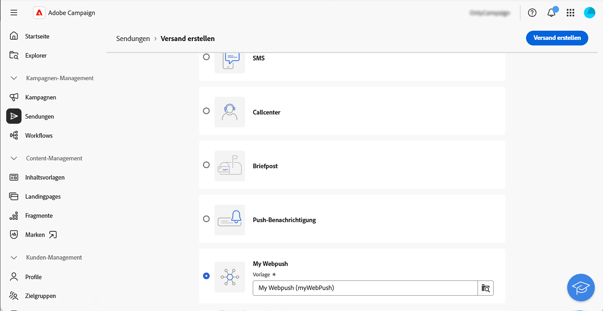
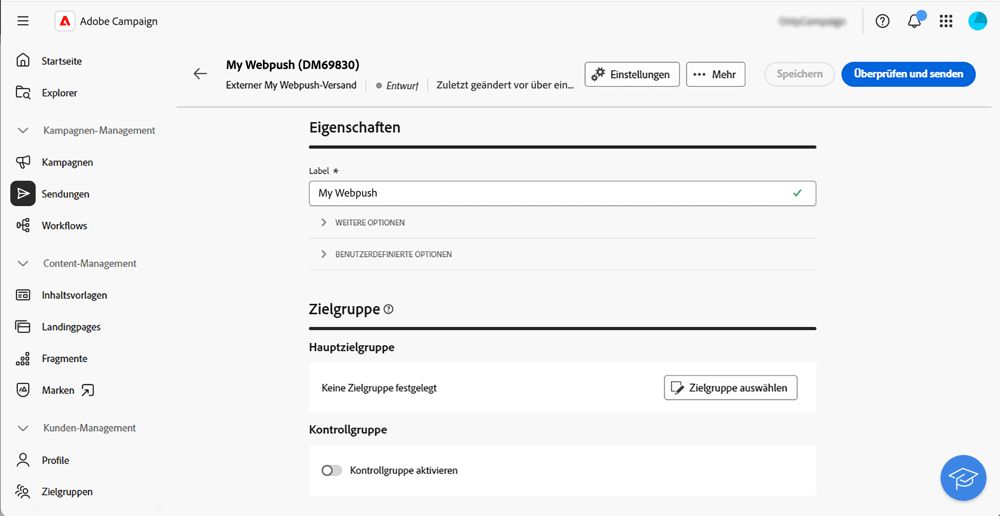
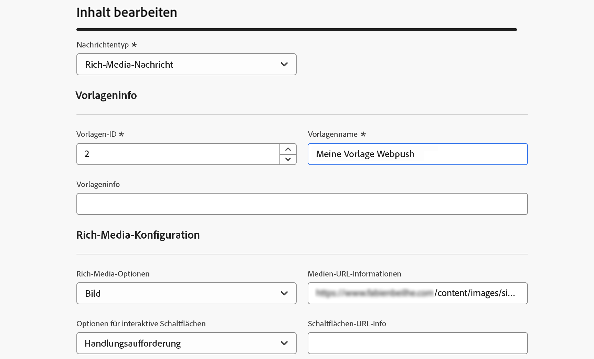
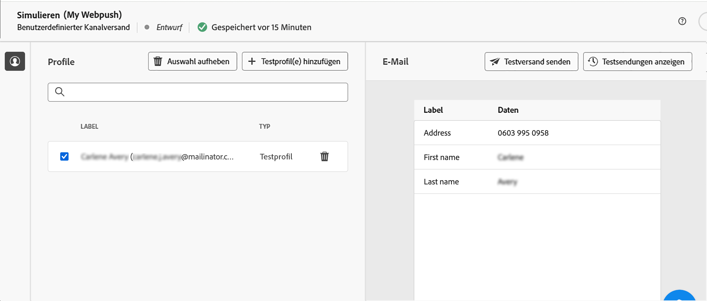
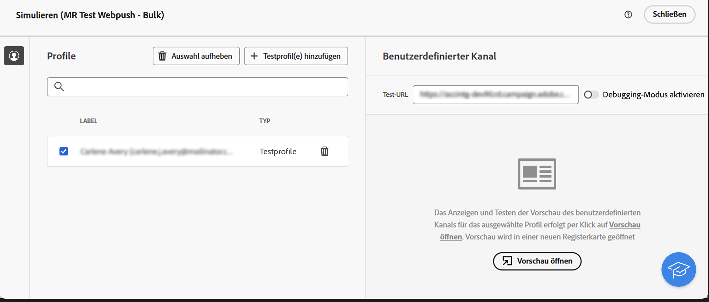
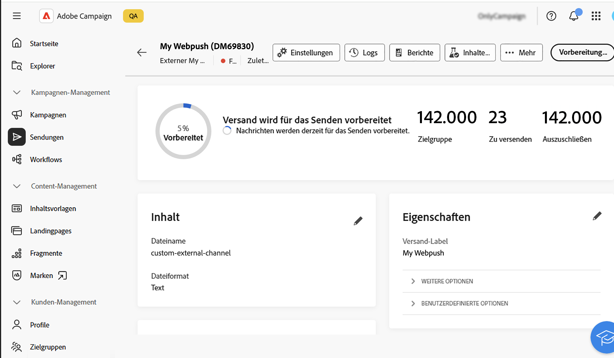

# Erste Schritte mit benutzerdefinierten Kanälen {#gs-custom-channel}

>[!CONTEXTUALHELP]
>id="acw_homepage_welcome_rn1"
>title="Benutzerdefinierter Kanal für API-Sendungen"
>abstract="Sie können jetzt direkt über die Adobe Campaign-Web-Benutzeroberfläche Sendungen koordinieren und ausführen, die auf benutzerdefinierten API-Kanälen basieren. Diese Sendungen können eigenständig oder Teil eines Workflows sein."
>additional-url="https://experienceleague.adobe.com/docs/campaign-web/v8/release-notes/release-notes.html?lang=de" text="Siehe Versionshinweise"

Sie können Sendungen direkt über die Adobe Campaign-Web-Benutzeroberfläche koordinieren und ausführen, indem Sie benutzerdefinierte Kanäle verwenden, die mit Drittanbieterprogrammen integriert sind. Die Konfiguration des benutzerdefinierten Kanals erfolgt in der Client-Konsole.

Es werden zwei Arten von benutzerdefinierten Kanälen unterstützt: externe Kanäle und API. Über externe Kanäle generiert Campaign anpassbare Exportdateien mit allen erforderlichen Kontakt- und Personalisierungsdaten. Bei API-Kanälen werden Nachrichten über die konfigurierte API an die Zielprofile gesendet.

Sie können benutzerdefinierte Kanalsendungen in Workflows hinzufügen oder sie einfach als eigenständige Sendungen verwenden.

Die folgenden Schritte beschreiben die Vorgehensweise beim Erstellen eines eigenständigen (einmaligen) Versands. Die meisten Schritte ähneln denen von Callcenter-Sendungen. Weitere Informationen finden Sie auf dieser [Seite](../call-center/create-call-center.md).

Gehen Sie wie folgt vor, um einen neuen eigenständigen benutzerdefinierten Versand durchzuführen:

1. Konfigurieren des benutzerdefinierten Kanals, [mehr dazu](#create-channel)
1. [Weitere Informationen](#create-delivery) zum Erstellen eines Versands
1. [Weitere Informationen](#select-audience) zum Definieren einer Zielgruppe
1. [Weitere Informationen](#edit-content) zum Bearbeiten des Inhalts
1. [Weitere Informationen](#preview-send) zum Anzeigen einer Vorschau und zum Senden eines Versands

## Konfigurieren des benutzerdefinierten Kanals{#create-channel}

Zunächst müssen Sie den benutzerdefinierten Kanal konfigurieren. Im Folgenden finden Sie die wichtigsten Schritte, die in der Client-Konsole ausgeführt werden müssen. Diese Schritte gelten für benutzerdefinierte externe und API-Kanäle:

1. Konfigurieren Sie das Schema , um den neuen Kanal zur Liste der verfügbaren Kanäle hinzuzufügen. [Weitere Informationen](https://experienceleague.adobe.com/docs/campaign/campaign-v8/send/custom-channel.html#configure-schema){target="_blank"}
1. Erstellen Sie ein neues externes Routing-Konto. [Weitere Informationen](https://experienceleague.adobe.com/docs/campaign/campaign-v8/send/custom-channel.html#reate-ext-account){target="_blank"}
1. Erstellen Sie eine neue Versandvorlage, die mit dem neuen Kanal verknüpft ist. [Weitere Informationen](https://experienceleague.adobe.com/docs/campaign/campaign-v8/send/custom-channel.html#create-template){target="_blank"}

Benutzerdefinierte API-Kanäle erfordern eine zusätzliche Konfiguration. [Weitere Informationen](https://experienceleague.adobe.com/docs/campaign/campaign-v8/send/custom-channel.html#api-additional){target="_blank"}

## Erstellen des Versands{#create-delivery}

Führen Sie die folgenden Schritte aus, um den Versand zu erstellen und seine Eigenschaften zu konfigurieren:

1. Wählen Sie das Menü **[!UICONTROL Sendungen]** aus und klicken Sie auf die Schaltfläche **[!UICONTROL Versand erstellen]**.

1. Wählen Sie den gewünschten benutzerdefinierten Kanal aus, wählen Sie die zugehörige Vorlage aus und klicken Sie zur Bestätigung **[!UICONTROL Versand erstellen]**.

   {zoomable="yes"}

1. Geben Sie unter **[!UICONTROL Eigenschaften]** ein **[!UICONTROL Label]** für den Versand ein. 

   {zoomable="yes"}

Weitere Informationen zum Erstellen eines Versands finden Sie in der [Dokumentation](../call-center/create-call-center.md#create-delivery) zum Callcenter.

## Definieren der Zielgruppe{#select-audience}

Jetzt müssen Sie die Audience definieren, die angesprochen werden soll.

1. Klicken Sie **[!UICONTROL Abschnitt]** Audience“ im Versand-Dashboard auf **[!UICONTROL Audience auswählen]**.

1. Wählen Sie eine vorhandene Zielgruppe oder erstellen Sie eine eigene.

   {zoomable="yes"}

Weitere Informationen zum Definieren von Zielgruppen finden Sie in der [Dokumentation](../call-center/create-call-center.md#select-audience) zum Callcenter.

## Bearbeiten des Inhalts{#edit-content}

Bearbeiten wir nun den Inhalt des Versands.

>[!BEGINTABS]

>[!TAB Benutzerdefinierter externer Kanal]

1. Klicken Sie im Versand-Dashboard auf die Schaltfläche **[!UICONTROL Inhalt bearbeiten]**.

1. Geben Sie einen **[!UICONTROL Dateinamen]** an, wählen Sie ein **[!UICONTROL Dateiformat]** aus und fügen Sie so viele Spalten hinzu, wie Sie für Ihre Extraktionsdatei benötigen.

   

>[!TAB Benutzerdefinierter API-Kanal]

1. Klicken Sie im Versand-Dashboard auf die Schaltfläche **[!UICONTROL Inhalt bearbeiten]**.

1. Füllen Sie die Felder nach Bedarf aus. Informationen zum Einrichten dieses Bildschirms finden Sie auf [ Seite](https://experienceleague.adobe.com/docs/campaign/campaign-v8/send/custom-channel.html#api-additional-screen){target="_blank"}.

   

>[!ENDTABS]

Weitere Informationen zum Bearbeiten von Inhalten finden Sie in der [Dokumentation](../call-center/create-call-center.md#edit-content) zum Callcenter.

## Vorschau und Durchführen des Versands{#preview-send}

Wenn der Versandinhalt fertig ist, können Sie ihn mithilfe von Testprofilen in der Vorschau anzeigen. Sie können dann den Versand durchführen, um die Extraktionsdatei zu generieren, oder die Nachricht über die API senden.

>[!BEGINTABS]

>[!TAB Benutzerdefinierter externer Kanal]

1. Klicken Sie im Versand-Dashboard auf die Schaltfläche **[!UICONTROL Inhalt bearbeiten]**.

1. Klicken Sie auf der Seite mit dem Versandinhalt auf die Schaltfläche **[!UICONTROL Inhalte simulieren]** und wählen Sie „Testprofile“ aus.

   {zoomable="yes"}

>[!TAB Benutzerdefinierter API-Kanal]

1. Klicken Sie im Versand-Dashboard auf die Schaltfläche **[!UICONTROL Inhalt bearbeiten]**.

1. Klicken Sie auf der Seite mit dem Versandinhalt auf die Schaltfläche **[!UICONTROL Inhalte simulieren]** und wählen Sie „Testprofile“ aus.

1. Klicken Sie auf der rechten Seite auf **Vorschau**. Diese Funktion muss mithilfe von JSSP konfiguriert werden. Mehr dazu erfahren Sie auf [dieser Seite](https://experienceleague.adobe.com/docs/campaign/campaign-v8/send/custom-channel.html#api-additional-preview){target="_blank"}.

   {zoomable="yes"}

>[!ENDTABS]

Klicken Sie im Versand-Dashboard auf **[!UICONTROL Überprüfen und senden]** und klicken Sie auf **[!UICONTROL Vorbereiten]**. Bestätigen Sie dann. Klicken Sie auf **[!UICONTROL Senden]**, um mit dem endgültigen Sendevorgang fortzufahren, und bestätigen Sie dann.

{zoomable="yes"}

Weitere Informationen zum Anzeigen in der Vorschau und Senden finden Sie in der [Dokumentation](../call-center/create-call-center.md#preview-send) zum Callcenter.
