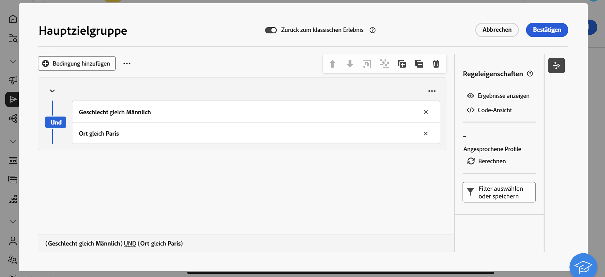

# Erste Schritte mit benutzerdefinierten externen Kanälen {#gs-custom-channel}

Sie können Sendungen direkt über die Adobe Campaign-Web-Benutzeroberfläche koordinieren und ausführen, indem Sie benutzerdefinierte externe Kanäle verwenden, die mit Drittanbieterprogrammen integriert sind. Die Erstellung des benutzerdefinierten externen Kanals erfolgt in der Client-Konsole.

Sie können benutzerdefinierte externe Kanalsendungen in Workflows oder als eigenständige Sendungen konfigurieren, Ihre Audience definieren und anpassbare Exportdateien mit allen erforderlichen Kontakt- und Personalisierungsdaten generieren.

>[!NOTE]
>
>Berichte sind in der Web-Benutzeroberfläche für Sendungen über benutzerdefinierte Kanäle nicht verfügbar. Sie müssen zur Client-Konsole gehen, um auf Berichte zuzugreifen.

Die folgenden Schritte beschreiben das Verfahren für einen eigenständigen (einmaligen) Versand. Die meisten Schritte ähneln denen von Callcenter-Sendungen. Weitere Informationen finden Sie auf dieser [Seite](../call-center/create-call-center.md).

Gehen Sie wie folgt vor, um einen neuen eigenständigen benutzerdefinierten externen Versand zu erstellen und zu senden:

1. Erstellen des benutzerdefinierten externen Kanals, [mehr dazu](#create-channel)
1. Versand erstellen, [mehr dazu](#create-delivery)
1. Definieren Sie die Audience [mehr dazu](#select-audience)
1. Inhalt bearbeiten, [mehr dazu](#edit-content)
1. Vorschau und Versand des Versands [mehr dazu](#preview-send)

## Erstellen des benutzerdefinierten externen Kanals{#create-channel}

Zunächst müssen Sie den benutzerdefinierten externen Kanal konfigurieren. Im Folgenden finden Sie die wichtigsten Schritte, die in der Client-Konsole ausgeführt werden müssen:

1. Konfigurieren Sie das Schema , um den neuen Kanal zur Liste der verfügbaren Kanäle hinzuzufügen.
1. Erstellen Sie ein neues externes Routing-Konto.
1. Erstellen Sie eine neue Versandvorlage, die mit dem neuen Kanal verknüpft ist.

Weitere Informationen finden Sie in der [Dokumentation zur Client-Konsole](https://experienceleague.adobe.com/docs/campaign/campaign-v8/send/custom-channel.html?lang=de)

## Erstellen des Versands{#create-delivery}

Führen Sie die folgenden Schritte aus, um den Versand zu erstellen und seine Eigenschaften zu konfigurieren:

1. Wählen Sie das **[!UICONTROL Sendungen]** und klicken Sie auf die Schaltfläche **[!UICONTROL Versand erstellen]**.

1. Wählen Sie den gewünschten benutzerdefinierten externen Kanal aus, wählen Sie die zugehörige Vorlage aus und klicken Sie zur Bestätigung **[!UICONTROL Versand erstellen]**.

   {zoomable="yes"}

1. Geben **[!UICONTROL unter &quot;]**&quot; einen **[!UICONTROL Titel]** für den Versand ein.

   {zoomable="yes"}

Weitere Informationen zur Versanderstellung finden Sie in der Call-Center-Dokumentation [Dokumentation](../call-center/create-call-center.md#create-delivery).

## Zielgruppe definieren{#select-audience}

Definieren Sie nun die Audience für die Extraktionsdatei.

1. Klicken Sie **[!UICONTROL Abschnitt]** Audience“ auf der Versandseite auf **[!UICONTROL Audience auswählen]**.

1. Wählen Sie eine vorhandene Audience aus oder erstellen Sie eine eigene.

   {zoomable="yes"}

Weitere Informationen zur Definition von Audiences finden Sie in der Dokumentation [ Callcenter ](../call-center/create-call-center.md#select-audience).

## Inhalt bearbeiten{#edit-content}

Bearbeiten wir nun den Inhalt der Extraktionsdatei, die vom Versand des benutzerdefinierten Kanals generiert wird.

1. Klicken Sie auf der Versandseite auf die Schaltfläche **[!UICONTROL Inhalt bearbeiten]**.

1. Geben Sie einen **[!UICONTROL Dateinamen]** an, wählen Sie ein **[!UICONTROL Dateiformat]** und fügen Sie so viele Spalten hinzu, wie für Ihre Extraktionsdatei erforderlich sind.

   

Weitere Informationen zur Inhaltsbearbeitung finden Sie in der Dokumentation zum Callcenter [&#128279;](../call-center/create-call-center.md#edit-content).

## Vorschau anzeigen und Versand durchführen{#preview-send}

Wenn der Versandinhalt fertig ist, können Sie ihn mithilfe von Testprofilen in der Vorschau anzeigen und einen Testversand durchführen. Sie können dann den Versand durchführen, um die Extraktionsdatei zu generieren.

1. Klicken Sie auf der Inhaltsseite des Versands auf die Schaltfläche **[!UICONTROL Inhalt simulieren]** und wählen Sie Testprofile aus.

   {zoomable="yes"}

1. Klicken Sie auf der Versandseite auf **[!UICONTROL Überprüfen und senden]** und klicken Sie auf **[!UICONTROL Vorbereiten]**. Bestätigen Sie dann.

   {zoomable="yes"}

1. Klicken Sie **[!UICONTROL Senden]**, um mit dem endgültigen Sendevorgang fortzufahren, und bestätigen Sie dann.

Weitere Informationen zur Vorschau und zum Versand finden Sie in der Dokumentation zum Callcenter [Dokumentation](../call-center/create-call-center.md#preview-send).
