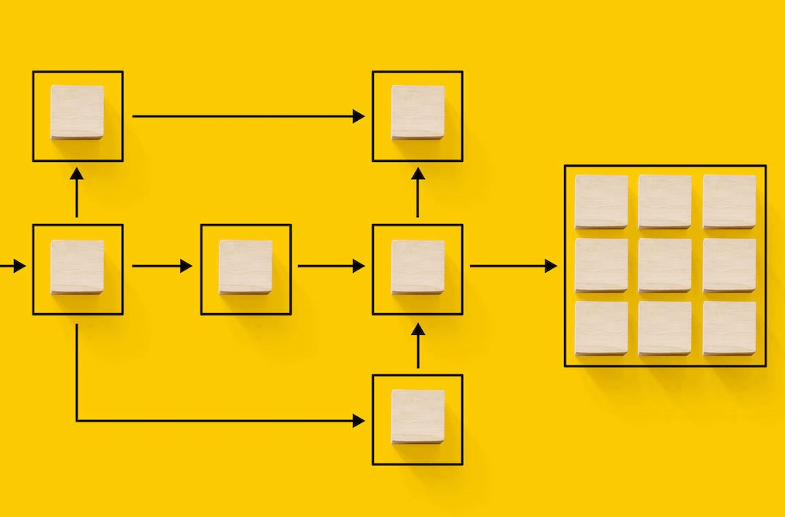

# Dokumentation zu Adobe Campaign v8 Web {#campaign-documentation}

Campaign bietet jetzt eine neue Web-Benutzeroberfläche mit verbesserter Benutzerfreundlichkeit, Barrierefreiheit und einem neuen Design, um Ihr Benutzererlebnis erheblich zu verbessern. Diese neue, moderne Benutzeroberfläche vereinfacht die Gestaltung und den Versand von Marketing-Kampagnen und sorgt für Konsistenz mit anderen Adobe-Lösungen, einschließlich Adobe Experience Platform. [Weitere Informationen](get-started/get-started.md)

>Campaign v8 Web befindet sich derzeit in der Alpha-Version. Der Zugriff ist auf eine kleine Gruppe von Alpha-Kunden beschränkt. Beachten Sie, dass sich die Produktoberfläche, die Funktionen und die Nutzungsflüsse ohne Vorankündigung ändern können. [Weitere Informationen](rn/release-notes.md)

## Neue Funktionen im Campaign-Web

**Neue Benutzeroberfläche von Campaign v8**

Die neue Web-Oberfläche von Campaign v8 bietet ein modernes und intuitives Benutzererlebnis, das die Gestaltung und den Versand von Marketing-Kampagnen vereinfacht. Diese neue Benutzeroberfläche ist in Adobe Experience Platform integriert.

**Neu gestaltete Oberfläche der Workflow-Arbeitsfläche**

Unsere umfassende grafische Arbeitsfläche erleichtert Ihnen das Entwerfen von Prozessen wie Segmentierung, Kampagnenausführung und mehr. Mit diesem erweiterten Tool können Sie Ihren Workflow optimieren und Ihre Kampagnen optimieren.

**Email Designer erfüllen**

Beginnen Sie mit einer Vorlage oder verwenden Sie den neuen Email Designer von Adobe Campaign, um E-Mails zu erstellen, ohne eine einzelne Codezeile schreiben zu müssen. Erfahren Sie, wie Sie mit Email Designer Inhalte erstellen, eine Vorschau anzeigen und testen und eine E-Mail an eine bestehende Audience senden können.

**Dynamische Inhalte erstellen**

Erstellen bedingter Inhalte zur Definition einer dynamischen Personalisierung basierend auf dem Empfängerprofil und zum automatischen Ersetzen von Textbausteinen und Bildern, wenn bestimmte Bedingungen erfüllt sind. Diese Funktion kann Ihre Kampagnen auf neue Höhen bringen und zielgerichtete, personalisierte Erlebnisse für Ihre Zielgruppe bereitstellen

**Kanalübergreifenden Versand senden**

Mit den Adobe Campaign-Funktionen können Sie zentralisierte Kundendaten verwalten, Kundenkommunikation und Kampagnen erstellen und personalisierte Erlebnisse über verschiedene Kanäle hinweg erstellen: E-Mail, Push und SMS.

## Tauchen wir tiefer in die Materie ein

Nachdem Sie nun wissen, was Sie im Adobe Campaign Web tun können, ist es an der Zeit, diese Dokumentationsabschnitte näher zu untersuchen, um mit ihr zu arbeiten.

<table style="table-layout:fixed"><tr style="border: 0;">
<td>

<a href="get-started/user-interface.md"><strong>Entdecken Sie die neue Benutzeroberfläche</strong>

</td>
<td>

<a href="preview-test/proofs.md"><strong>Neu gestaltete Oberfläche der Workflow-Arbeitsfläche</strong></a>

</td>
<td>

<a href="content/create-email-content.md"><strong>Email Designer erfüllen</strong></a>

</td>
<td>

<a href="audience/about-audiences.md"><strong>Dynamische Inhalte erstellen</strong></a>

</td>
<td>

<a href="preview-test/proofs.md"><strong>Kanalübergreifenden Versand senden</strong></a>

</td>
</tr></table>

<!--
<table style="table-layout:fixed">
<tr style="border: 0;"><td width="30%"></td><td>Discover Campaign Web new user interface, latest improvements, key capabilities. Learn how to use them to build cross-channel campaigns for your audiences. With its user-friendly features, Campaign helps you streamline personalized cross-channel campaign creation process, drive results, and gain a competitive edge.</td></tr>
<tr style="border: 0;"><td width="30%"></td><td>Our comprehensive graphical canvas makes it easy for you to design processes such as segmentation, campaign execution, and more. With this advanced tool at your fingertips, you can streamline your workflow and elevate your campaigns.</td></tr>
<tr style="border: 0;"><td width="30%"></td><td>Start from a template, or use Adobe Campaign's new Email Designer to create emails without having to write a single line of code. Learn how to use the Email Designer to create your content, preview and test it, and send an email to an existing audience in an end-to-end use case.</td></tr>
<tr style="border: 0;"><td width="30%"></td><td>Create conditional content to define dynamic personalization based on the recipient's profile, automatically replacing text blocks and images when certain conditions are met. This feature can take your campaigns to new heights and deliver highly targeted, personalized experiences to your audience</td></tr>
<tr style="border: 0;"><td width="30%"></td><td>Adobe Campaign capabilities help you manage centralized customer data, design customer communications and campaigns, and create personalized experiences across different channels: Email, Push and SMS.</td></tr>
</table>
-->

