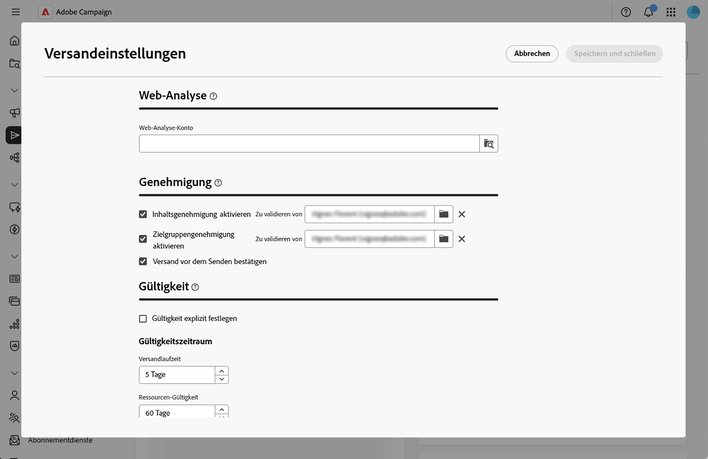
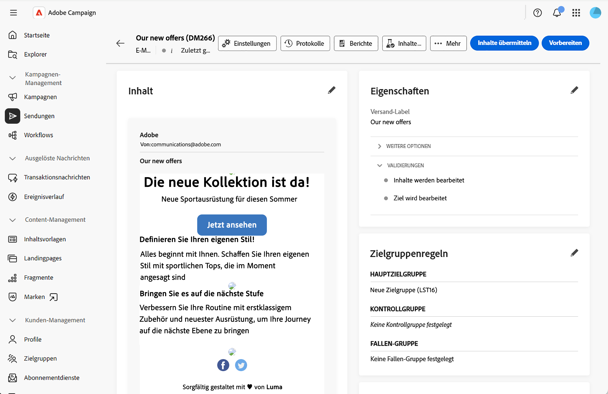
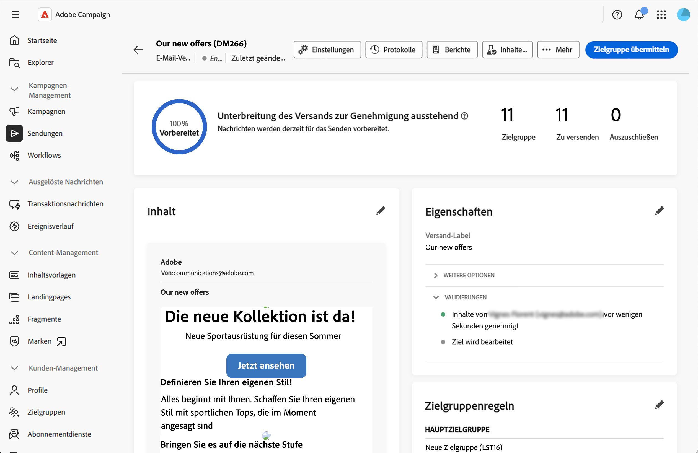
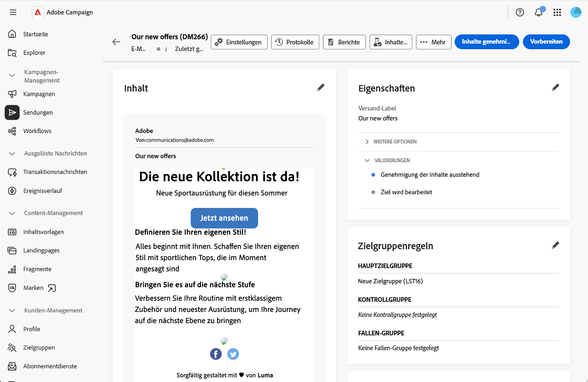
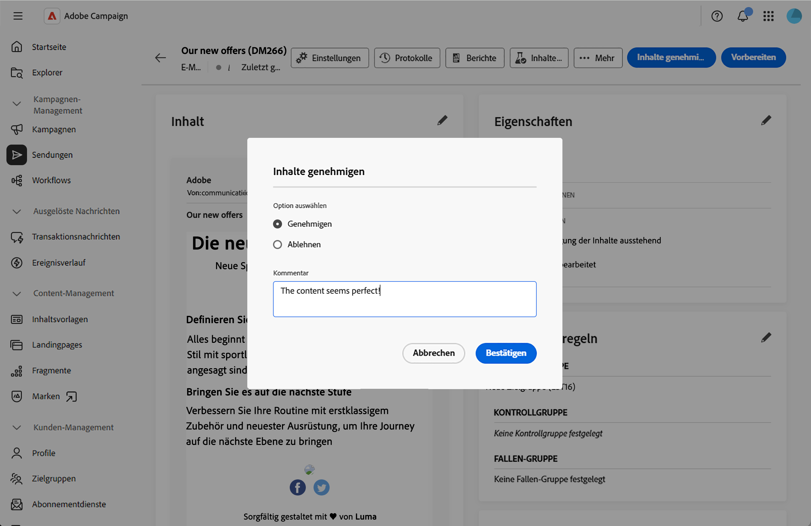

# Genehmigungsprozess verwalten {#campaign-approvals}

>[!CONTEXTUALHELP]
>id="acw_homepage_welcome_rn6"
>title="Validierungsverwaltung für Kampagnen"
>abstract="Sie können jetzt die Validierung durch Stakeholder koordinieren, bevor Sie Sendungen durchführen. Sie benötigen Genehmigungen von Marketing-Managern, Datenanalysten oder anderen Teams zur Qualitätskontrolle."
>additional-url="https://experienceleague.adobe.com/docs/campaign-web/v8/release-notes/release-notes.html?lang=de" text="Siehe Versionshinweise"

>[!IMPORTANT]
>
>Validierungen sind nur für Sendungen verfügbar, die innerhalb einer Kampagne erstellt wurden. Dies gilt nicht für eigenständige Sendungen oder Sendungen, die in Workflows außerhalb eines Kampagnenkontexts erstellt wurden.

Der Validierungsprozess hilft, mehrere Stakeholder zu koordinieren, und stellt die Qualitätskontrolle vor dem Versand sicher. Verwenden Sie Validierungen, wenn Ihr Unternehmen die Validierung durch verschiedene Teams erfordert, z. B. durch Marketing-Manager, die Inhalte überprüfen, oder durch Datenanalysten, die Zielgruppen validieren.

Wenn Validierungen aktiviert sind, müssen Sie Inhalte oder Zielgruppen zur Genehmigung einreichen. Designierte Validierungsverantwortliche erhalten E-Mail-Benachrichtigungen, in denen sie zur Validierung aufgefordert werden, und können diese direkt über die Web-Benutzeroberfläche genehmigen oder ablehnen. Sendungen können erst durchgeführt werden, wenn alle erforderlichen Genehmigungen erteilt wurden. Sie können Folgendes aktivieren:

* **Inhaltsvalidierung**: Validieren von Nachrichteninhalt, Design und Personalisierung
* **Zielgruppenvalidierung**: Validieren der Zielgruppe und der Zielgruppenkriterien
* **Versandbestätigung**: Vor dem Versand ist eine endgültige Bestätigung erforderlich.

## Konfigurieren von Validierungseinstellungen {#configure-approvals}

Validierungseinstellungen werden von der Kampagnenvorlage übernommen und können für einzelne Kampagnen geändert werden. Gehen Sie wie folgt vor, um die Validierungseinstellungen zu konfigurieren:

1. Öffnen Sie Ihre Kampagne oder Kampagnenvorlage oder erstellen Sie eine neue Vorlage über das Menü **[!UICONTROL Kampagnen]**.

1. Klicken Sie auf **[!UICONTROL Einstellungen]** oben rechts im Kampagnen-Dashboard.

1. Konfigurieren **[!UICONTROL im Abschnitt]** die folgenden Optionen:

   {zoomable="yes"}

   * **[!UICONTROL Inhaltsvalidierung aktivieren]**: Bei Aktivierung muss der Versandinhalt vor dem Versand validiert werden. Klicken Sie auf das Ordnersymbol im Feld **[!UICONTROL Prüfer]**, um einen Benutzer oder eine Benutzergruppe auszuwählen.

   * **[!UICONTROL Zielgruppenvalidierung aktivieren]** Wenn diese Option aktiviert ist, muss die Zielgruppe des Versands validiert werden. Klicken Sie auf das Ordnersymbol im Feld **[!UICONTROL Prüfer]**, um einen Benutzer oder eine Benutzergruppe auszuwählen.

   * **[!UICONTROL Versand vor dem Senden bestätigen]**: Erfordert eine letzte manuelle Bestätigung vor dem Senden, auch nachdem alle anderen Validierungen abgeschlossen sind.

>[!NOTE]
>
>* Wenn kein Validierungsverantwortlicher angegeben ist, wird der Kampagnenverantwortliche als Validierungsverantwortliche zugewiesen.
>* Validierungsverantwortliche benötigen entsprechende Berechtigungen, um Sendungen zu genehmigen. Nur in der Reviewer-Liste identifizierte Benutzer können genehmigen.

## Zur Genehmigung unterbreiten {#submit-approval}

Führen Sie nach der Erstellung des Versands die folgenden Schritte aus, um den Inhalt und die Zielgruppe zur Genehmigung einzureichen.

>[!NOTE]
>Validierungen sind sowohl in Kampagnen-Workflow-Sendungen als auch in eigenständigen Kampagnen-Sendungen verfügbar.

1. Klicken Sie im Versand-Dashboard auf die Schaltfläche **[!UICONTROL Inhalt übermitteln]**. Designierte Reviewer können genehmigen oder ablehnen. Weitere Informationen finden Sie in diesem [Abschnitt](#approve-reject).

   {zoomable="yes"}

   Der Genehmigungsstatus ändert sich im Abschnitt **[!UICONTROL Eigenschaften]** des Versand-Dashboards in Ausstehend. Weitere Informationen finden Sie in diesem [Abschnitt](#rack-approvals).

1. Nachdem der Inhalt genehmigt wurde, klicken Sie auf die Schaltfläche **[!UICONTROL Vorbereiten]**, um die Versandzielgruppe vorzubereiten. Das System bereitet die Zielgruppen- und Zielgruppenkriterien vor.

1. Klicken Sie auf **[!UICONTROL Schaltfläche „Ziel]**&quot;. Designierte Reviewer können dann genehmigen oder ablehnen. Weitere Informationen finden Sie in diesem [Abschnitt](#approve-reject).

   {zoomable="yes"}

   Der Genehmigungsstatus ändert sich in Ausstehend. Weitere Informationen finden Sie in diesem [Abschnitt](#rack-approvals).

1. Sobald die Zielgruppe validiert wurde, wird die Vorbereitung fortgesetzt und der Versand kann durchgeführt werden.

>[!NOTE]
>Wird eine Validierung abgelehnt, muss der Versandverantwortliche alle erforderlichen Änderungen am Inhalt oder an der Zielgruppe vornehmen, die auf dem Feedback der validierenden Person basieren, und den Versand zur Validierung erneut übermitteln.

## Genehmigen oder ablehnen {#approve-reject}

Designierte Validierungsverantwortliche können Übermittlungen von Inhalten und Zielgruppen genehmigen oder ablehnen. Weitere Informationen finden Sie in diesem [Abschnitt](#submit-approval).

>[!NOTE]
>Damit die E-Mail-Benachrichtigung gesendet werden kann, muss die Adresse des Validierungsverantwortlichen in der Instanz konfiguriert werden.

1. Wenn Sie die Benachrichtigungs-E-Mail erhalten, öffnen Sie den Versand, für den eine Validierung erforderlich ist, direkt über die Web-Benutzeroberfläche.

1. Überprüfen Sie die Inhalts- oder Zielinformationen.

1. Klicken Sie auf **[!UICONTROL Schaltfläche]** Inhalt genehmigen“ oder **[!UICONTROL Zielgruppe]**.

   {zoomable="yes"}

1. Klicken Sie **[!UICONTROL Genehmigen]** oder **[!UICONTROL Ablehnen]**.

1. Fügen Sie optional einen &quot;**[!UICONTROL &quot; hinzu]** um Ihre Entscheidung zu erklären.

   {zoomable="yes"}

1. Bestätigen Sie Ihre Entscheidung. Der Validierungsstatus wird sofort im Versand-Dashboard aktualisiert. Weitere Informationen finden Sie in diesem [Abschnitt](#rack-approvals).

## Genehmigungsstatus verfolgen {#track-approvals}

Der Validierungsstatus wird im **[!UICONTROL Eigenschaften]** des Versand-Dashboards angezeigt. Der Status zeigt an, welche Genehmigungen warten und wie der aktuelle Status lautet:

{zoomable="yes"}

* **[!UICONTROL In Bearbeitung]**: Der Inhalt oder die Zielgruppe wurde noch nicht zur Genehmigung eingereicht
* **[!UICONTROL Ausstehende Genehmigung]**: Der Inhalt oder die Zielgruppe wartet auf Überprüfung
* **[!UICONTROL Genehmigt]**: Der Inhalt oder die Zielgruppe wurde vom Validierungsverantwortlichen genehmigt
* **[!UICONTROL Abgelehnt]**: Der Inhalt oder die Zielgruppe wurde vom Validierungsverantwortlichen abgelehnt

Der Abschnitt Validierung zeigt alle aktivierten Validierungen und Aktualisierungen in Echtzeit an, da die Validierungsverantwortlichen jeden Schritt validieren oder ablehnen.

## Verwandte Themen {#related}

* [Erstellen von Kampagnen](create-campaigns.md)
* [Verwalten von Kampagnen](manage-campaigns.md)
