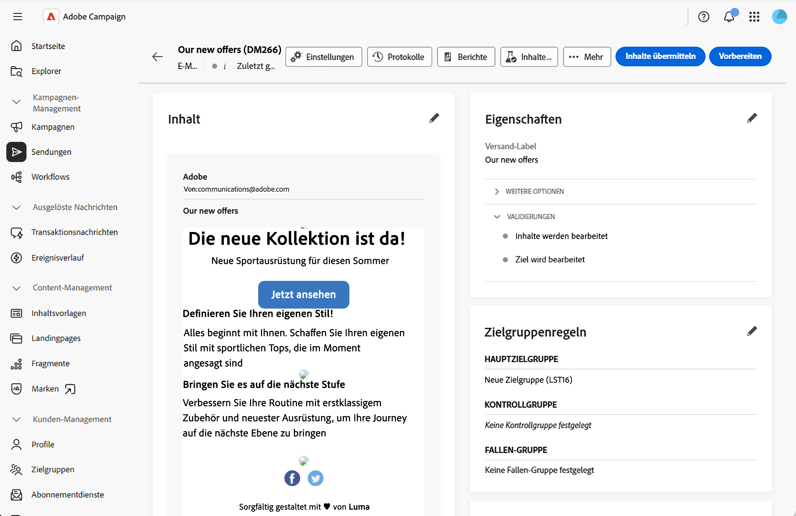
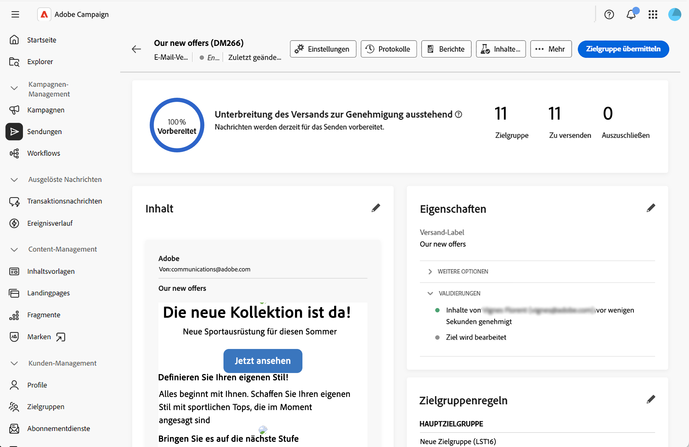
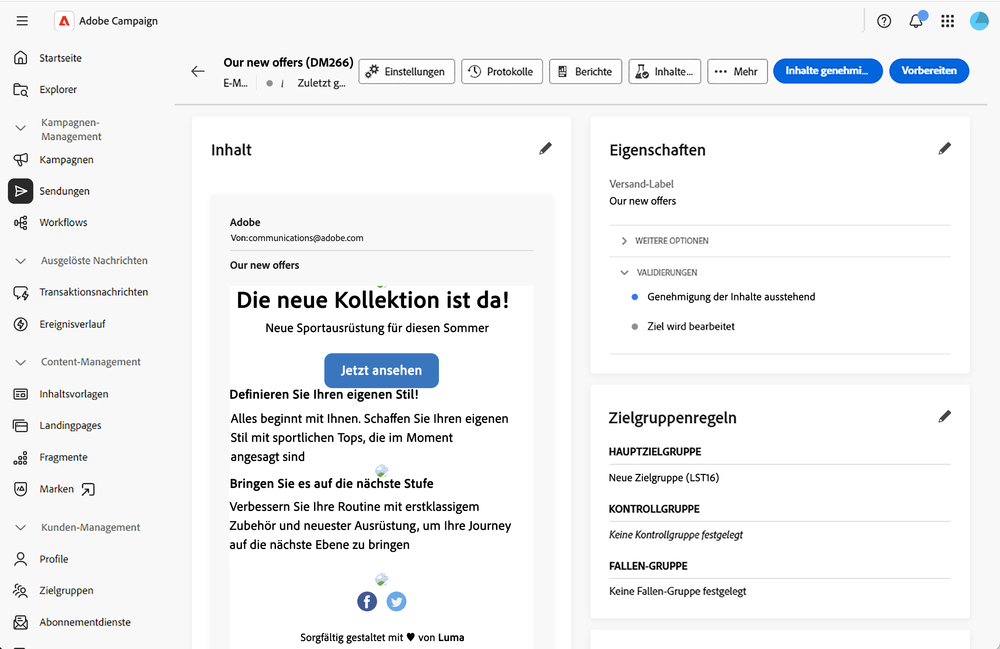
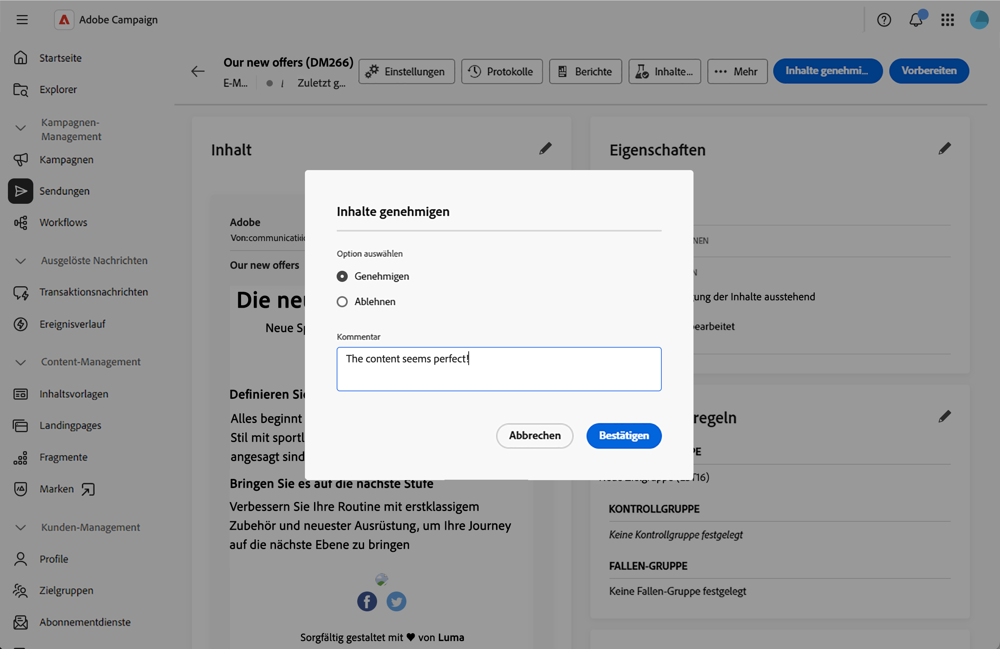

# Verwalten des Genehmigungsprozesses {#campaign-approvals}

>[!IMPORTANT]
>
>Validierungen sind nur für Kampagnen und Sendungen verfügbar, die innerhalb einer Kampagne erstellt wurden.

Der Validierungsprozess hilft, mehrere Stakeholder zu koordinieren, und stellt die Qualitätskontrolle vor dem Versand sicher. Verwenden Sie Validierungen, wenn Ihre Organisation die Validierung durch verschiedene Teams erfordert, z. B. durch das Marketing-Management, das Inhalte überprüft, oder durch das Datenanalyse-Team, das Zielgruppen validiert.

Wenn Validierungen aktiviert sind, müssen Sie Inhalte oder Zielgruppen zur Genehmigung einreichen. Designierte Validierungsverantwortliche erhalten E-Mail-Benachrichtigungen, in denen sie zur Validierung aufgefordert werden, und können diese direkt über die Web-Benutzeroberfläche genehmigen oder ablehnen. Sendungen können erst durchgeführt werden, wenn alle erforderlichen Genehmigungen erteilt wurden. Sie können Folgendes aktivieren:

* **Inhaltsvalidierung**: Validieren von Nachrichteninhalt, Design und Personalisierung. Sie können einen Bearbeitungsschritt vor der Inhaltsvalidierung, die von einem festgelegten Benutzer durchgeführt wird, und einen Validierungsschritt für einen externen Validierungsverantwortlichen hinzufügen, sobald der Inhalt intern genehmigt wurde.
* **Zielgruppenvalidierung**: Validieren der Zielgruppe und der Zielgruppenkriterien
* **Budgetvalidierung**: Versandbudget validieren
* **Versandstart**: Legt fest, wer mit dem Versand an einen bestimmten Validierer beginnen kann
* **Versandbestätigung**: Vor dem Versand ist eine endgültige Bestätigung erforderlich.

## Konfigurieren von Validierungseinstellungen {#configure-approvals}

Validierungseinstellungen werden von der Kampagnenvorlage übernommen und können für einzelne Kampagnen geändert werden. Derselbe Abschnitt **[!UICONTROL Validierungen]** ist auch in den Einstellungen eines Versands verfügbar, der innerhalb einer Kampagne erstellt wurde, sodass Sie die Konfiguration auf Kampagnenebene nur für diesen Versand überschreiben können.

Führen Sie die folgenden Schritte aus, um die Validierungseinstellungen auf Kampagnenebene zu konfigurieren:

1. Öffnen Sie Ihre Kampagne oder Kampagnenvorlage oder erstellen Sie eine neue Kampagne über das Menü **[!UICONTROL Kampagnen]**.

1. Klicken Sie rechts oben im Kampagnen-Dashboard auf die Schaltfläche **[!UICONTROL Einstellungen]**.

1. Konfigurieren Sie im Abschnitt **[!UICONTROL Genehmigungen]** die beiden folgenden Optionen:

   {zoomable="yes"}

   >[!NOTE]
   >
   > Wenn Sie eine Validierungsoption aktivieren möchten, klicken Sie auf das Ordnersymbol im Feld **[!UICONTROL Validierungsverantwortliche]**, um einen Benutzer oder eine Benutzergruppe auszuwählen.

1. Konfigurieren **[!UICONTROL Inhaltsvalidierung]**: Nach der Aktivierung muss der Versandinhalt vor dem Versand validiert werden. Wenn diese Option aktiviert ist, werden zwei Felder angezeigt:

   * **[!UICONTROL Inhaltsbearbeitung zuweisen]**: Fügt einen Bearbeitungsschritt vor der Inhaltsvalidierung hinzu. Ein spezieller Benutzer, z. B. ein Webmaster, wird benachrichtigt, dass er den Inhalt bearbeitet, und stellt ihn dann zur Genehmigung bereit.
   * **[!UICONTROL Externe Inhaltsvalidierung]**: Fügt einen Validierungsschritt für einen externen Validierer hinzu, z. B. einen Partner oder Lieferanten, der das Rendering des Versands (z. B. Markenkonsistenz) validiert, sobald der Inhalt intern validiert wurde.

1. Definieren Sie die **[!UICONTROL Zielgruppenvalidierung]**: Nach der Aktivierung muss die Zielgruppe des Versands validiert werden.

1. Legen Sie die **[!UICONTROL Budgetvalidierung]** fest: Wenn diese Option aktiviert ist, muss das Versandbudget validiert werden. Für diese Option muss der Kampagne bereits ein Budget zugewiesen sein. Dies erfolgt derzeit über die Client-Konsole.

1. Wählen Sie **[!UICONTROL Versandstart]** aus, um den Versandstart auf einen bestimmten Benutzer oder eine bestimmte Benutzergruppe zu beschränken. Wenn ein(e) nicht autorisierte(r) Benutzende(r) versucht, den Versand durchzuführen, wird ein Fehler angezeigt, der angibt, dass er/sie nicht berechtigt ist, diesen Vorgang auszuführen.

1. Legen Sie die Option **[!UICONTROL Versand vor dem Senden bestätigen]** fest. Erfordert eine letzte manuelle Bestätigung vor dem Senden, auch nachdem alle anderen Validierungen abgeschlossen sind.

>[!NOTE]
>
>* Wenn keine prüfende Person angegeben ist, wird die Kampagneneigentümerin bzw. der Kampagneneigentümer als prüfende Person zugewiesen.
>* Prüfende benötigen entsprechende Berechtigungen, um Sendungen zu genehmigen. Nur in der Liste der Prüfenden identifizierte Benutzende können genehmigen.

## Zur Validierung unterbreiten {#submit-approval}

Führen Sie nach der Erstellung des Versands die folgenden Schritte aus, um den Inhalt und die Zielgruppe zur Genehmigung einzureichen.

>[!NOTE]
>
>Validierungen gelten unabhängig davon, ob der Versand direkt in der Kampagne oder über einen Kampagnen-Workflow erstellt wurde.

1. Klicken Sie im Versand-Dashboard auf die Schaltfläche **[!UICONTROL Inhalte übermitteln]**. Designierte Prüfende können genehmigen oder ablehnen. Weitere Informationen finden Sie in diesem [Abschnitt](#approve-reject).

   {zoomable="yes"}

   Der Genehmigungsstatus ändert sich im Abschnitt **[!UICONTROL Eigenschaften]** des Versand-Dashboards in „Ausstehend“. Weitere Informationen finden Sie in diesem [Abschnitt](#track-approvals).

1. Nachdem der Inhalt genehmigt wurde, klicken Sie auf die Schaltfläche **[!UICONTROL Vorbereiten]**, um das Versandziel vorzubereiten. Das System bereitet die Zielgruppen- und Zielgruppenkriterien vor.

1. Klicken Sie auf die Schaltfläche **[!UICONTROL Zielgruppe übermitteln]**. Designierte Prüfende können anschließend genehmigen oder ablehnen. Weitere Informationen finden Sie in diesem [Abschnitt](#approve-reject).

   {zoomable="yes"}

   Der Genehmigungsstatus ändert sich in „Ausstehend“. Weitere Informationen finden Sie in diesem [Abschnitt](#track-approvals).

1. Wenn die Budgetvalidierung aktiviert ist, übermitteln Sie das Budget entsprechend demselben Prinzip zur Validierung. Designierte Prüfende können genehmigen oder ablehnen. Weitere Informationen finden Sie in diesem [Abschnitt](#approve-reject).

1. Sobald die Zielgruppe und gegebenenfalls das Budget genehmigt wurden, wird die Vorbereitung fortgesetzt und der Versand kann durchgeführt werden.

>[!NOTE]
>Wird eine Genehmigung abgelehnt, muss die Eigentümerin bzw. der Eigentümer des Versands alle erforderlichen Änderungen am Inhalt oder an der Zielgruppe vornehmen, die auf dem Feedback der prüfenden Person basieren, und den Versand erneut zur Genehmigung einreichen.

## Genehmigen oder ablehnen {#approve-reject}

Designierte Reviewer können Content-, Zielgruppen- und Budgetübermittlungen genehmigen oder ablehnen. Weitere Informationen finden Sie in diesem [Abschnitt](#submit-approval).

>[!NOTE]
>Damit die E-Mail-Benachrichtigung gesendet werden kann, muss die Adresse der prüfenden Person in der Instanz konfiguriert werden.

1. Wenn Sie die Benachrichtigungs-E-Mail erhalten, öffnen Sie den Versand, für den eine Genehmigung erforderlich ist, direkt über die Web-Benutzeroberfläche.

1. Überprüfen Sie die Inhalts- oder Zielinformationen.

1. Klicken Sie auf die Schaltfläche **[!UICONTROL Inhalt]**, **[!UICONTROL Zielgruppe]** oder **[!UICONTROL Budget]**.

   {zoomable="yes"}

1. Klicken Sie auf **[!UICONTROL Genehmigen]** oder **[!UICONTROL Ablehnen]**.

1. Fügen Sie optional einen **[!UICONTROL Kommentar]** hinzu, um Ihre Entscheidung zu erklären.

   {zoomable="yes"}

1. Bestätigen Sie Ihre Entscheidung. Der Genehmigungsstatus wird sofort im Versand-Dashboard aktualisiert. Weitere Informationen finden Sie in diesem [Abschnitt](#track-approvals).

## Nachverfolgen des Genehmigungsstatus {#track-approvals}

Der Genehmigungsstatus wird im Abschnitt **[!UICONTROL Eigenschaften]** des Versand-Dashboards angezeigt. Der Status zeigt an, welche Genehmigungen ausstehen und wie der aktuelle Status lautet:

{zoomable="yes"}

* **[!UICONTROL In Bearbeitung]**: Der Inhalt oder die Zielgruppe wurde noch nicht zur Genehmigung eingereicht
* **[!UICONTROL Genehmigung ausstehend]**: Der Inhalt oder die Zielgruppe wartet auf Überprüfung
* **[!UICONTROL Genehmigt]**: Der Inhalt oder die Zielgruppe wurde von der prüfenden Person genehmigt
* **[!UICONTROL Abgelehnt]**: Der Inhalt oder die Zielgruppe wurde von der prüfenden Person abgelehnt

Der Abschnitt „Genehmigung“ zeigt alle aktivierten Genehmigungen und Aktualisierungen in Echtzeit an, während die prüfenden Personen die einzelnen Schritte genehmigen oder ablehnen.

## Verwandte Themen {#related}

* [Erstellen von Kampagnen](create-campaigns.md)
* [Verwalten von Kampagnen](manage-campaigns.md)
