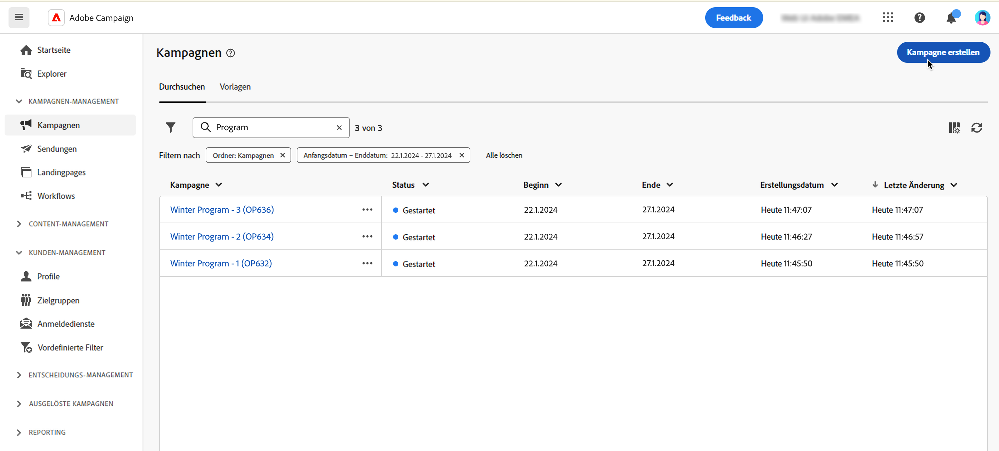
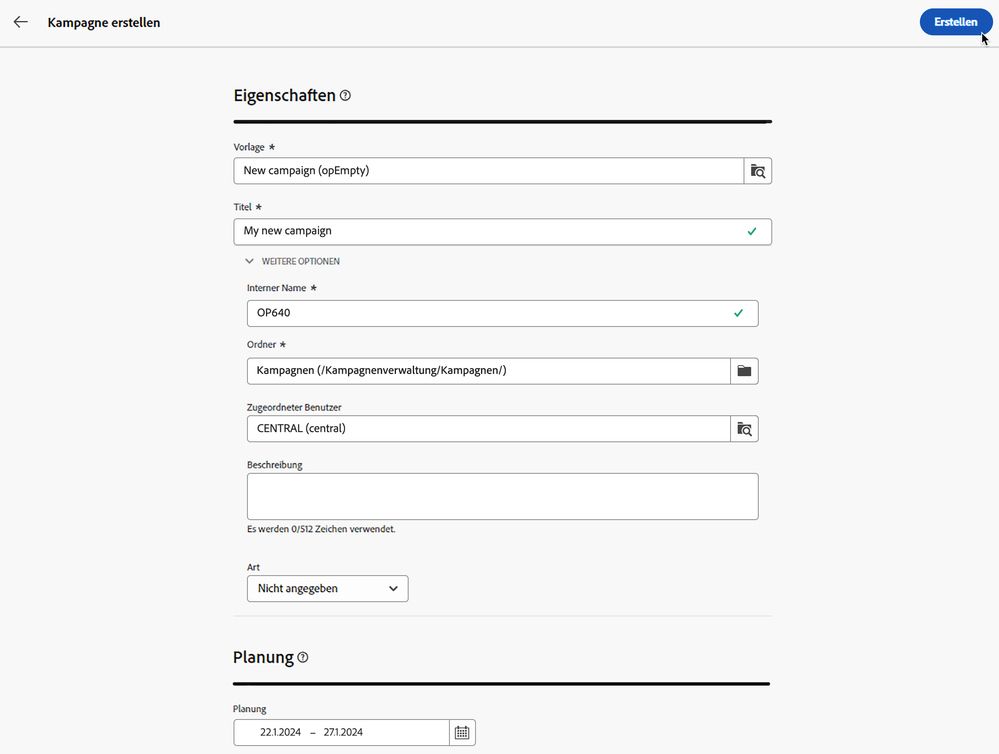

# Erste Kampagne erstellen {#create-first-campaigns}

>[!CONTEXTUALHELP]
>id="acw_campaign_creation_properties"
>title="Kampagnenerstellungs-Eigenschaften"
>abstract="Definieren Sie auf diesem Bildschirm die Kampagnenparameter: Wählen Sie eine Vorlage aus und geben Sie einen Titel für die Kampagne ein. Navigieren Sie zu den zusätzlichen Einstellungen, um den standardmäßigen internen Namen und Ordner zu ändern, eine Beschreibung hinzuzufügen und die bzw. den Verantwortlichen auszuwählen."

>[!CONTEXTUALHELP]
>id="acw_campaign_properties"
>title="Eigenschaften der Kampagne"
>abstract="Auf diesem Bildschirm können Sie Ihre Kampagneneinstellungen überprüfen und aktualisieren: Titel, interner Name, Ordner und Beschreibung. Sie können auch anzeigen, welcher Benutzerin oder welchem Benutzer er zugewiesen ist."

Um eine neue Kampagne zu erstellen, definieren Sie deren Einstellungen, planen Workflows und Sendungen und schließen sie ein.

## Erstellen der Kampagne {#campaign-create}

Um eine neue Kampagne zu erstellen, gehen Sie folgendermaßen vor:

1. Klicken Sie auf das Menü **[!UICONTROL Kampagnen]** und dann auf die Schaltfläche **[!UICONTROL Kampagne erstellen]**.

   

1. Wählen Sie die **Vorlage** aus und geben Sie einen Titel für die Kampagne an. [Weitere Informationen](manage-campaigns.md#manage-campaign-templates)
1. Ändern Sie bei Bedarf die folgenden **Zusätzliche Optionen**: interner Name, Ordner, Zuweisung, Beschreibung und Art.
1. Definieren Sie den **Zeitplan** für Ihre Kampagne. Näheres dazu, wie Sie Ihren Kampagnenkalender festlegen, finden [ in diesem Abschnitt ](#campaign-schedule).
1. Klicken Sie auf **Erstellen**.

   

1. Fügen Sie Workflows und Sendungen zu Ihrer Kampagne hinzu:

   * Klicken Sie auf der Registerkarte **Workflows** auf **Workflow erstellen**. Beim Erstellen Ihrer Kampagne wird automatisch ein Standard-Workflow hinzugefügt. Weitere Informationen zum Erstellen [ Workflows ](../workflows/create-workflow.md).

   * Klicken Sie auf der Registerkarte **Sendungen** auf **Versand erstellen**. [Weitere Informationen](../msg/gs-messages.md)

## Überwachen und Nachverfolgen Ihrer Kampagne {#campaign-monitoring}

Die Überwachung von Kampagnen ist ein wichtiger Schritt zur Analyse der Effektivität Ihrer Kampagnen. Öffnen Sie Ihre Kampagne und klicken Sie auf die Schaltfläche **Protokolle**.

Sie können auch die entsprechenden Berichte anzeigen, indem Sie auf die Schaltfläche **Berichte** klicken. Weitere Informationen finden Sie in diesem [Abschnitt](../reporting/campaign-reports.md).

## Definieren des Kampagnenzeitplans {#campaign-schedule}

>[!CONTEXTUALHELP]
>id="acw_campaign_creation_schedule"
>title="Kampagnenzeitplan"
>abstract="Wählen Sie den Kampagnenzeitplan aus. Sie können eine Kampagne erstellen, die beginnt, wenn das Anfangsdatum erreicht ist. Standardmäßig ist das Kampagnenstartdatum das Erstellungsdatum, und sie dauert fünf Tage. Start- und Enddatum werden in der Kampagnenliste angezeigt und können als Filter verwendet werden."

Die Kampagne beginnt, wenn das Startdatum erreicht ist. Solange das Startdatum nicht erreicht ist, verfügt die Kampagne über den Status **[!UICONTROL Entwurf]**. Wenn das Startdatum erreicht ist, wird es zu **[!UICONTROL In Bearbeitung]**. Sobald das Enddatum erreicht ist, wechselt die Kampagne in den Status **[!UICONTROL Abgeschlossen]**.

Start- und Enddatum werden in der Kampagnenliste angezeigt und können als Filter verwendet werden. Weitere Informationen finden Sie in diesem [Abschnitt](manage-campaigns.md#access-campaigns).

>[!NOTE]
>
>Sie können diese Eigenschaften später über das Symbol **Kampagneneinstellungen konfigurieren** neben dem Kampagnentitel ändern. Weitere Informationen finden Sie in diesem [Abschnitt](gs-campaigns.md#campaign-dashboard).

Sobald das Datum erreicht ist, werden Sendungen, die in dieser Kampagne im Kontext eines Workflows erstellt wurden und versandbereit sind, tatsächlich gesendet. Dazu muss der Workflow gestartet worden sein.

<!--
    +++WORKF
++screen
## Create a cross-channel campaign {#cross-channel-campaign}

In a cross-channel campaign, a single marketing communication uses different channels. Data is passed between the channels. The customer receives communication through multiple channels based on, for example, their interaction with the previous communication.
-->
<!--
existing campaign: settings button -> properties like when creation
schedule in header

About plans, programs and campaigns
Adobe Campaign allows you to plan marketing campaigns in which you can create and manage different types of activities: emails, SMS messages, push notifications, workflows, landing pages. These campaigns and their contents can be gathered into programs.

The programs and campaigns allow you to regroup and view the different marketing activities that are linked to them.

A program may contain other programs as well as campaigns, workflows, and landing pages. It appears in the timeline and helps you organize your marketing activities: you can separate them by country, by brand, by unit, and similar criteria.

A campaign enables you to gather all the marketing activities of your choice under a single entity. A campaign may contain emails, SMS, push notifications, direct mails, workflows, and landing pages.

To better organize your marketing plans, Adobe recommends the following hierarchy: Program > Sub-programs > Campaigns > Workflows > Deliveries.

Reports on programs and campaigns allow you to analyze their impact. For example, you can build reports at the campaign level to aggregate data on all deliveries contained in that campaign.

Related topics:

* Timeline
* About dynamic reports
* Creating a campaign

In programs and sub-programs, you can add campaigns. Campaigns can contain marketing activities such as emails, SMS, push notifications, workflows, and landing pages.

From the Adobe Campaign home page, select the Programs & Campaigns card, and access a program or sub-program.

Click on the Create button, and select Campaign.

In the Creation mode screen, select a campaign type.

The campaign types available are based on templates defined in Resources > Templates > Campaign templates. For more on this, refer to the Managing templates section.

In the Properties screen, enter the name and ID of the campaign.

Select a start and end date for your campaign. These dates only apply to the campaign itself.

Click on Create to confirm the creation of the campaign.

The campaign is created and displayed. Use the Create button to add marketing activities to your campaign.

>[!NOTE]
>
>Depending on your license agreement, you may access only some of these activities.

You can also create a campaign from the marketing activity list. You can choose to link the marketing activity to a parent program or sub-program via the properties window of the campaign.

Programs and campaigns icons and statuses:

Each program and each campaign in the list has a visual symbol and an icon whose color indicates the execution status. This status depends on the validity period of the program or the campaign.

* Gray: the program/campaign has not yet started - Editing status.
* Blue: the program/campaign is in progress - In progress status.
* Green: the program/campaign has finished - Finished status.

By default, the current date is automatically shown as the validity start date, and the end date is calculated according to the start date (D+186 days). You can change these dates in the program or campaign properties.

Business.Adobe.com resources
-->