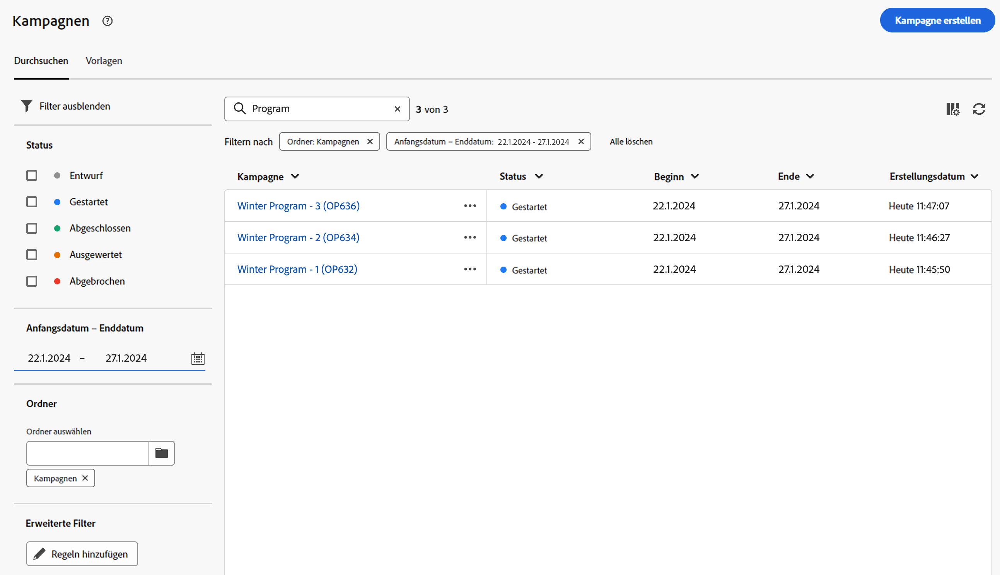

# Erste Schritte mit Kampagnen {#campaigns}

>[!CONTEXTUALHELP]
>id="acw_homepage_card5"
>title="Kanalübergreifende Kampagnen erstellen und senden"
>abstract="Mit den Adobe Campaign-Funktionen können Sie zentralisierte Kundendaten verwalten, Kundenkommunikation und Kampagnen erstellen und personalisierte Erlebnisse über verschiedene Kanäle hinweg erstellen: E-Mail, Push und SMS."

Mit Adobe Campaign können Sie Ihre zielgerichteten Marketinginitiativen mithilfe der integrierten Kampagnenverwaltungsfunktion einfach koordinieren. Mit der Fähigkeit, einen Zeitplan festzulegen, können Sie die Dauer und den Zeitpunkt Ihrer Kampagnen so planen, dass sie mit strategischen Zielen übereinstimmen und die Interaktion der Zielgruppe maximieren.

Durch das Hinzufügen mehrerer kampagnenspezifischer Workflows und Sendungen können Sie personalisierte Erlebnisse über verschiedene Kanäle hinweg erstellen und so sicherstellen, dass jeder Touchpoint mit der gewünschten Zielgruppe abgestimmt wird.

Kampagnen bieten dedizierte Berichterstellungsmetriken, um einen umfassenden Einblick in die Leistung Ihrer gesamten Kampagne zu erhalten. So können Sie deren Effektivität bewerten, Trends identifizieren und datengesteuerte Entscheidungen treffen, um zukünftige Bemühungen zu optimieren.

<!--
Use Adobe Campaign to create cross-channel campaigns. With its marketing campaign orchestration capabilities, you can manage and centralize customer data, design customer communications and campaigns, and create personalized experiences across different channels. In this version, email, push and SMS channels are available.

Design and execute high-volume email campaigns to deliver personalized messages, for all platforms and screen sizes. 
Measure the effectiveness of your deliveries with detailed reports including the counts of opens, clicks, forwards, and more. With Adobe Campaign segmentation capabilities, you can run queries against a high-volume database, and easily define dynamic marketing segments which perfectly target your campaigns.
-->

<!--
Get Started with campaigns
Adobe Campaign offers a set of solutions that help you personalize and deliver campaigns across all of your online and offline channels. You can create, configure, execute and analyze marketing campaigns. All marketing campaigns can be managed from a unified control center. Discover how to browse and create marketing campaigns in this section.

Campaigns include actions (deliveries) and processes (importing or extracting files), as well as resources (marketing documents, delivery outlines). They are used in marketing campaigns. Campaigns are part of a program, and programs are included in a campaign plan.
-->

## Zugriff und Verwaltung von Kampagnen{#access-campaigns}

Um eine neue Kampagne zu erstellen oder Ihre bestehenden Kampagnen zu verwalten, klicken Sie auf die Schaltfläche **[!UICONTROL Kampagnen]** Menü.

Zwei Registerkarten sind verfügbar:

* Die **Durchsuchen** enthält alle vorhandenen Kampagnen. Sie können auf eine Kampagne klicken, um ihr Dashboard zu öffnen oder eine neue Kampagne zu erstellen, indem Sie auf **Kampagne erstellen** Schaltfläche. Weitere Informationen finden Sie in [diesem Abschnitt](create-campaigns.md#create-campaigns).

* Die **Vorlagen** im Tab werden alle verfügbaren Kampagnenvorlagen aufgelistet. Kampagnenvorlagen sind so vorkonfiguriert, dass sie zur Erstellung neuer Kampagnen wiederverwendet werden können. Sie werden über die Client-Konsole erstellt. [Weitere Informationen](https://experienceleague.adobe.com/docs/campaign/automation/campaign-orchestration/marketing-campaign-templates.html?lang=de)

Jede Kampagne in der Liste enthält Informationen zum aktuellen Status, zum Erstellungsdatum, zum letzten Änderungszeitpunkt usw.

Sie können die angezeigten Spalten anpassen, indem Sie auf die **Spalte für ein benutzerdefiniertes Layout konfigurieren** in der oberen rechten Ecke der Liste. Auf diese Weise können Sie der Liste zusätzliche Informationen hinzufügen. Darüber hinaus stehen eine Suchleiste und Filter zur Verfügung, um die einfache Suche innerhalb der Liste zu erleichtern. [Weitere Informationen](../get-started/user-interface.md#list-screens)

Sie können beispielsweise nach Ihrem Kampagnenkalender filtern. Öffnen Sie das Filterbedienfeld und verwenden Sie die **Start - Enddatum** Abschnitt:

## Das Kampagnen-Dashboard{#campaign-dashboard}

Im **Durchsuchen** auf der Kampagnenliste klicken, um das Dashboard der Kampagne anzuzeigen.

Der Status und der Zeitplan der Kampagne werden oben im Bildschirm angezeigt. Sie können die **Kampagneneinstellungen konfigurieren** -Symbol, um die Eigenschaften der Kampagne zu ändern, die bei der Erstellung der Kampagne definiert wurden. Es stehen drei Schaltflächen zur Verfügung, mit denen Sie Protokolle anzeigen, Berichte erstellen, die Kampagne duplizieren oder löschen können. Siehe diesen [Abschnitt](create-campaigns.md#create-campaigns)

Zwei Registerkarten sind verfügbar:

* Die **Workflows** enthält alle mit der Kampagne verknüpften Workflows. In diesem Tab können Sie auch einen neuen Workflow innerhalb der Kampagne erstellen. Siehe diesen [Abschnitt](create-campaigns.md#create-campaigns)
* Die **Sendungen** im Tab werden alle mit der Kampagne verknüpften Sendungen aufgelistet. Sie können auch einen neuen Versand innerhalb der Kampagne erstellen. Siehe diesen [Abschnitt](create-campaigns.md#create-campaigns)

